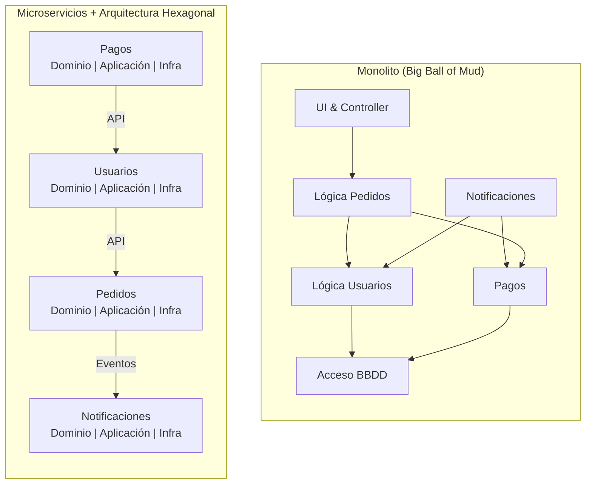
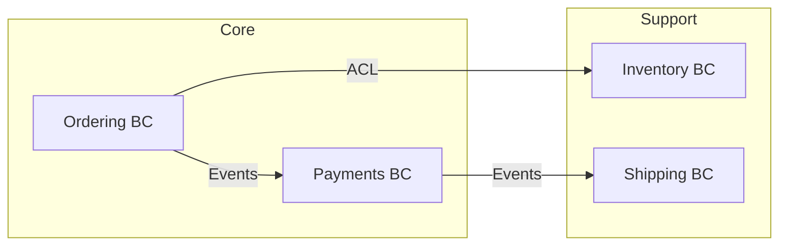
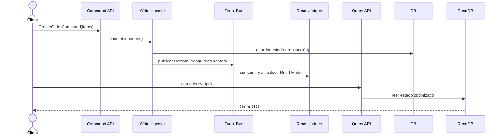

# Sesión 1 · Conceptos — Introducción a DDD, Arquitectura Hexagonal, CQRS y EDA

## 1. El desafío de la complejidad en sistemas modernos

La experiencia muestra que, en aplicaciones monolíticas de gran tamaño, **hasta un 80% del tiempo del equipo se invierte en leer código y rastrear dependencias** antes de poder realizar un cambio seguro. Cada nueva funcionalidad incrementa la probabilidad de efectos colaterales, de modo que la evolución del producto se ralentiza y el _refactor_ pasa de ser una decisión técnica a convertirse en una cuestión política:

> *«¿Quién se atreve a tocar ese módulo crítico sin romper el *build* justo antes del despliegue?»*

Para visualizar el impacto, comparemos un monolito acoplado con un conjunto de microservicios estructurados en capas de dominio:



Mientras el monolito concentra responsabilidades y dependencias en un mismo espacio de memoria, el enfoque hexagonal distribuye la lógica en componentes aislados y explícitamente conectados.

---

## 2. Un enfoque arquitectónico estratégico

A lo largo del curso profundizaremos en cuatro pilares complementarios. A continuación se presenta una síntesis conceptual y sus compromisos.

### 2.1 Arquitectura Hexagonal (Ports & Adapters)

El propósito fundamental es **proteger el núcleo de dominio** de detalles tecnológicos que inevitablemente cambian.

- **Dónde encaja**: capa de dominio y casos de uso internos.
- **Resultado esperado**: adaptar o sustituir tecnología (BD, mensajería) sin reescribir reglas de negocio.

| Ventaja                                           | Coste / Disciplina requerida                                 |
| ------------------------------------------------- | ------------------------------------------------------------ |
| Dominio libre de frameworks                       | Mayor código de infraestructura inicial                      |
| Tests unitarios sin I/O                           | Definir contratos de puerto claros                           |
| Cambio de proveedor de base de datos en un sprint | Contener dependencias externas mediante inversión de control |

#### Ejemplo mínimo (TypeScript)

```ts
// domain/order.ts
/** Puerto de persistencia - la interfaz la define el dominio */
export interface OrderRepositoryPort {
  save(order: Order): Promise<void>;
  byId(id: string): Promise<Order | null>;
}

/** Entidad de dominio; no conoce frameworks ni librerías externas */
export class Order {
  constructor(
    public readonly id: string,
    private readonly items: OrderItem[]
  ) {}

  total(): number {
    return this.items.reduce((acc, it) => acc + it.price * it.qty, 0);
  }
}

/** Value Object protegido con invariantes */
export class OrderItem {
  constructor(
    readonly sku: string,
    readonly qty: number,
    readonly price: number
  ) {
    if (!Number.isInteger(qty) || qty <= 0)
      throw new Error("Cantidad inválida");
  }
}
```

```ts
// infrastructure/postgres/order-repository.postgres.ts
import { OrderRepositoryPort, Order } from "../../domain/order";
import { prisma } from "../prisma"; // infraestructura técnica

export class PostgresOrderRepository implements OrderRepositoryPort {
  async save(order: Order): Promise<void> {
    await prisma.order.upsert({
      where: { id: order.id },
      update: { total: order.total() },
      create: { id: order.id, total: order.total() },
    });
  }

  async byId(id: string): Promise<Order | null> {
    const row = await prisma.order.findUnique({ where: { id } });
    return row ? new Order(row.id, /* hydrate items… */ []) : null;
  }
}
```

> **Observación**: el _core_ no sabe que existe Prisma ni PostgreSQL.

---

### 2.2 Domain-Driven Design (DDD)

DDD parte de una premisa sencilla: **el software se mantiene alineado con la realidad del negocio cuando modela el lenguaje y las reglas que los expertos usan a diario**. Aplicarlo exige dos niveles:

| Nivel           | Objetivo                                                               | Artefactos                                                          |
| --------------- | ---------------------------------------------------------------------- | ------------------------------------------------------------------- |
| **Estratégico** | Domar la complejidad global dividiendo el dominio en zonas coherentes. | Subdominios, Bounded Contexts, Context Map                          |
| **Táctico**     | Expresar las reglas dentro de cada contexto.                           | Entities, Value Objects, Aggregates, Domain Events, Domain Services |

---

#### 2.2.1 Ejemplo estratégico — Context Map

Supongamos un comercio electrónico:



- **Ordering** y **Payments** son dominio _Core_: diferencian al negocio.
- **Inventory** y **Shipping** proveen soporte, pero no ventaja competitiva.

> _Decisión_: invertimos más esfuerzo DDD en los contextos core y aplicamos soluciones genéricas (o SaaS) en los de soporte.

---

#### 2.2.2 Ejemplo táctico — Entidad, Value Object y Aggregate

```ts
// domain/vo/money.ts
export class Money {
  // Constructor privado: fuerza el uso de static Factory para validar invariantes
  private constructor(private readonly cents: number) {}

  /**
   * Static Factory: crea un Money a partir de un número decimal
   * - Redondea a centavos
   * - Lanza si el valor es negativo
   */
  static of(amount: number) {
    if (amount < 0) throw new Error("Negative money");
    return new Money(Math.round(amount * 100));
  }

  /**
   * Suma otro Money devolviendo una nueva instancia (inmutabilidad)
   */
  plus(other: Money) {
    return new Money(this.cents + other.cents);
  }

  /**
   * Convierte los centavos al valor decimal original
   */
  toDecimal() {
    return this.cents / 100;
  }
}

const money = Money.of(100.5);
const other = Money.of(200.5);
const sum = money.plus(other);
console.log(sum.toDecimal()); // 301 - https://www.typescriptlang.org/play
```

```ts
// domain/entity/order-item.ts
import { Money } from "../vo/money";

export class OrderItem {
  /**
   * SKU, cantidad y precio se definen al construir.
   * Validamos que la cantidad sea un entero positivo.
   */
  constructor(
    readonly sku: string,
    readonly qty: number,
    readonly price: Money
  ) {
    if (!Number.isInteger(qty) || qty <= 0) {
      throw new Error("Invalid qty");
    }
  }

  /**
   * Calcula el subtotal de este item: qty × price.
   * Ejemplo: qty=3, price=100 → subtotal = 300
   */
  subtotal(): Money {
    // price.plus(Money.of(0)) es solo para encajar el ejemplo de plus()
    return this.price.plus(Money.of((this.qty - 1) * this.price.toDecimal()));
  }
}

const item = new OrderItem("SKU-123", 3, Money.of(100.5));
console.log(item.subtotal().toDecimal()); // 301.5 - https://www.typescriptlang.org/play
```

```ts
// domain/aggregate/order.ts
import { DomainEvent, AggregateRoot } from "../events";
import { OrderItem } from "../entity/order-item";
import { Money } from "../vo/money";

// El AggregateRoot provee manejo de eventos y un ID único
export class Order extends AggregateRoot {
  private items: OrderItem[] = []; // Lista de OrderItem
  private status: "PENDING" | "PAID" = "PENDING"; // Estado inicial

  /**
   * Añade un item al pedido. No valida stock aquí.
   */
  addItem(item: OrderItem) {
    this.items.push(item);
  }

  /**
   * Marca la orden como pagada:
   * - Verifica invariante (solo PENDING → PAID)
   * - Cambia estado
   * - Genera evento de dominio OrderPaid
   */
  pay() {
    if (this.status !== "PENDING") {
      throw new Error("Order cannot be paid twice");
    }
    this.status = "PAID";
    // Emite evento para que otros contextos reaccionen (EDA / CQRS)
    this.addEvent(new OrderPaid({ orderId: this.id, total: this.total() }));
  }

  /**
   * Suma el subtotal de cada OrderItem usando Money
   */
  total(): Money {
    return this.items.reduce((acc, it) => acc.plus(it.subtotal()), Money.of(0));
  }
}

/**
 * Evento de dominio que notifica a otros contextos que la orden fue pagada
 */
export class OrderPaid implements DomainEvent<"OrderPaid"> {
  readonly type = "OrderPaid" as const;
  readonly occurredAt = new Date();

  constructor(readonly payload: { orderId: string; total: Money }) {}
}
```

**Puntos clave**

1. **Invariantes encapsuladas**: no existe forma de dejar el agregado en estado ilegítimo sin lanzar excepción.
2. **Eventos de dominio**: el agregado comunica un cambio significativo (`OrderPaid`) sin acoplarse a infraestructura.
3. **Value Object `Money`** preserva exactitud y reglas monetarias (inmutabilidad, no valores negativos).

---

#### 2.2.3 Domain Service — regla que cruza aggregates

```ts
// domain/service/payment-service.ts
import { CreditPort } from "../ports/credit.port";
import { OrderRepositoryPort } from "../ports/order-repo.port";
import { OrderPaid } from "../aggregate/order";

export class PaymentService {
  constructor(
    private readonly creditPort: CreditPort, // Consulta crédito
    private readonly orderRepo: OrderRepositoryPort // Persistencia de órdenes
  ) {}

  /**
   * Proceso de pago completo:
   * 1. Recupera la orden
   * 2. Verifica crédito disponible
   * 3. Invoca pay() → genera evento
   * 4. Persiste cambios y eventos (Outbox pattern)
   */
  async payOrder(orderId: string): Promise<void> {
    // 1. Carga la orden o falla
    const order = await this.orderRepo.byId(orderId);
    if (!order) throw new Error("Order not found");

    // 2. Comprueba crédito externo
    const allowed = await this.creditPort.hasEnough(orderId, order.total());
    if (!allowed) throw new Error("Insufficient credit");

    // 3. Cambia estado + emite evento
    order.pay();

    // 4. Guarda la orden y sus eventos en transacción atómica
    await this.orderRepo.save(order);
  }
}
```

- La operación involucra el agregado **Order** y un sistema externo (_Credit Service_).
- Encapsularla en un _Domain Service_ mantiene a la entidad **Order** pura e independiente de APIs externas.

---

#### 2.2.4 Beneficios tangibles de aplicar DDD correctamente

| Métrica                       | “Modelo anémico”                      | DDD táctico                             |
| ----------------------------- | ------------------------------------- | --------------------------------------- |
| Cobertura tests (target)      | 20 - 30 %                             | 80 % (foco en dominio)                  |
| Tiempo medio de cambio (MTTR) | Alto – revisar capas front/backend/DB | Bajo – reglas localizadas en Aggregates |
| Comunicación negocio-equipo   | Glosario disperso                     | Lenguaje Ubicuo                         |

**Resultado final**: el costo de agregar reglas nuevas se aproxima al costo de escribir las reglas, no al costo de redescubrir el sistema.

#### 2.2.5 Ejercicio — Domain Model

Modelar el/los dominio(s) de https://www.eachlabs.ai/ - basado en su descripción.

---

### 2.3 CQRS (Command Query Responsibility Segregation)

**Idea principal**: separar la modificación de estado (Commands) de la consultación de datos (Queries), permitiendo que cada lado evolucione, escale y se optimice de manera independiente.

#### 2.3.1 Modelos independientes

- Write Model: contiene las reglas de negocio, las invariantes y las transacciones. Suele usar el modelo de dominio (Aggregates, Entities, Value Objects) junto a un ORM o repositorios transaccionales.
- Read Model: diseñado para consultas rápidas y específicas, a menudo desnormalizado en tablas o índices optimizados (por ejemplo, vistas materializadas, bases de datos NoSQL).

#### 2.3.2 Flujo típico



#### 2.3.3 Ejemplo de implementación mínima (TypeScript)

```ts
// application/commands/handlers/create-order.handler.ts
import { OrderRepositoryPort } from "../../domain/ports/order-repo.port";
import { CreateOrder } from "../commands/create-order";
export class CreateOrderHandler {
  constructor(private repo: OrderRepositoryPort) {}
  async execute(cmd: CreateOrder): Promise<string> {
    const order = Order.Factory.new(cmd.items);
    await this.repo.save(order);
    // opcional: publicar eventos de dominio
    return order.id;
  }
}

// application/queries/handlers/get-order.handler.ts
import { ReadOrderRepository } from "../read-models/order.read-repo";
import { GetOrder } from "../queries/get-order";
export class GetOrderHandler {
  constructor(private readRepo: ReadOrderRepository) {}
  async execute(qry: GetOrder): Promise<OrderDTO> {
    return this.readRepo.findById(qry.id);
  }
}
```

#### 2.3.4 Consideraciones

- Consistencia eventual: tras un comando, puede haber un pequeño retardo hasta que el Read Model refleje el cambio. Hay que diseñar UX y Sagas acordes.
- Idempotencia y resiliencia: al procesar eventos para actualizar el Read Model, los handlers deben ser idempotentes y capaces de reintentos seguros.
- Event Sourcing (opcional): si los eventos de dominio se convierten en la única fuente de verdad, el Write Model se reconstruye reaplicando la secuencia de eventos. Esto facilita auditoría y versionado, pero añade complejidad operacional.

#### 2.3.5 ¿Cuándo usarlo?

- Alta carga de lectura y escritura que requieren escalado independiente.
- Modelos de datos muy divergentes entre operaciones de lectura (dashboards, reportes) y escritura (flujos de negocio complejos).
- Equipo multidisciplinar, donde un grupo optimiza el Write Model y otro el Read Model sin interferirse.

---

### 2.4 Event-Driven Architecture (EDA)

**Idea principal**: articular el sistema en torno a la emisión y consumo de eventos de dominio a través de un broker asíncrono (RabbitMQ, Kafka, AWS SNS/SQS…), consiguiendo desacoplamiento, flexibilidad y resiliencia.

#### 2.4.1 Patrón de Publicación–Suscripción

- Productor: el Aggregate o el Application Service publica un evento (por ejemplo, OrderPaid, InventoryReserved).
- Consumidor: uno o varios microservicios o Read Updaters se suscriben al tópico correspondiente y reaccionan (actualizan proyecciones, envían notificaciones, disparan nuevas acciones).

#### 2.4.2 Esquema de evento

```ts
interface DomainEvent {
  type: string; // p.ej. 'OrderPaid'
  occurredAt: string; // timestamp ISO
  payload: Record<string, any>;
  version: number; // para compatibilidad de esquema
}
```

#### 2.4.3 Ejemplo mínimo de publicación y suscripción (Node.js + RabbitMQ)

```ts
// infrastructure/eda/event-bus.ts
import amqp from "amqplib";

export class RabbitEventBus {
  private conn = await amqp.connect(process.env.AMQP_URL);
  private channel = await this.conn.createChannel();

  async publish(event: DomainEvent) {
    const exchange = "domain_events";
    await this.channel.assertExchange(exchange, "topic", { durable: true });
    this.channel.publish(
      exchange,
      event.type,
      Buffer.from(JSON.stringify(event)),
      { persistent: true }
    );
  }

  async subscribe(
    eventType: string,
    handler: (event: DomainEvent) => Promise<void>
  ) {
    const exchange = "domain_events";
    const q = await this.channel.assertQueue("", { exclusive: true });
    await this.channel.bindQueue(q.queue, exchange, eventType);
    this.channel.consume(q.queue, (msg) => {
      if (!msg) return;
      const event = JSON.parse(msg.content.toString()) as DomainEvent;
      handler(event)
        .then(() => this.channel.ack(msg))
        .catch(() => this.channel.nack(msg, false, false)); // DLQ
    });
  }
}
```

#### 2.4.4 Patrones de fiabilidad

| Patrón            | Objetivo                                                                    |
| ----------------- | --------------------------------------------------------------------------- |
| Outbox            | Garantizar que el evento se guarda y publica en la misma transacción.       |
| Idempotencia      | Permitir reintentos sin efectos colaterales al procesar eventos duplicados. |
| Dead-Letter Queue | Aislar los mensajes que fallan repetidamente para revisión manual.          |
| Circuit Breaker   | Evitar que un consumidor defectuoso bloquee la cadena de procesamiento.     |

#### 2.4.5 Orquestación vs. Coreografía

- Coreografía: cada servicio reacciona a eventos de otros sin coordinador central. Máximo desacoplo, pero puede ser difícil razonar el flujo.
- Orquestación: un orquestador (por ejemplo, un Saga Manager) envía comandos o eventos en un flujo controlado. Más control, pero introduce un punto de coordinación que debe gestionarse.

#### 2.4.6 Anti-patrón

Eventos como RPC encubierto: esperar respuesta sincrónica (pub/sub sincrónico) rompe el desacoplamiento y reintroduce latencias, time-outs y complejidad.

---

## 3. ¿Por qué funciona bien en Node.js?

| Característica de Node                            | Beneficio para el enfoque del curso                                      |
| ------------------------------------------------- | ------------------------------------------------------------------------ |
| Modelo de ejecución **asíncrono y no bloqueante** | Manejo eficiente de brokers y bases de datos concurrentes                |
| Ecosistema npm extenso                            | Adapters disponibles para RabbitMQ, gRPC, OpenTelemetry, etc.            |
| **TypeScript** maduro                             | Expresión clara de Entities, Value Objects y puertos con tipos estáticos |
| Imágenes Docker ligeras                           | Facilita microservicios con arranque rápido y bajo consumo               |
| Herramientas de testing (Vitest, ts-mockito)      | Permite pruebas rápidas en memoria del núcleo de dominio                 |

Ejemplo de instrumentación OTel mínima:

```ts
import { NodeSDK } from "@opentelemetry/sdk-node";
import { OTLPTraceExporter } from "@opentelemetry/exporter-otlp-http";

new NodeSDK({
  traceExporter: new OTLPTraceExporter({
    url: "http://otel-collector:4318/v1/traces",
  }),
}).start();
```

---

## 4. Beneficios clave

- **Mantenibilidad:** cambio localizado sin efectos cascada.
- **Escalabilidad:** lectura y escritura crecen de forma independiente.
- **Time-to-Market:** incorporación de nuevos features con menor riesgo.
- **Observabilidad:** capas y eventos claramente delineados facilitan el trazado.
