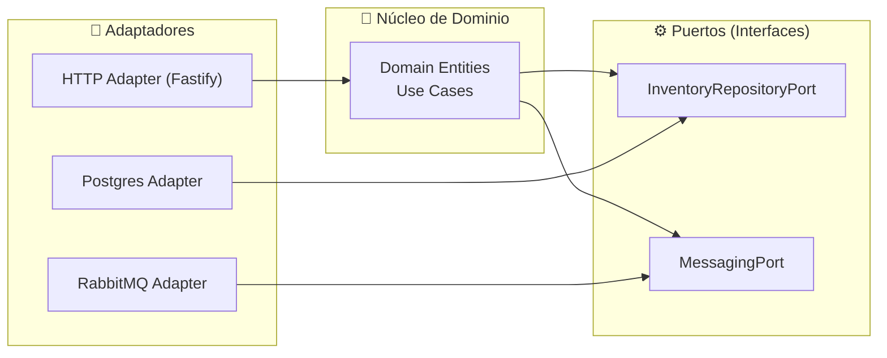

# Tema 3 (parte 1) — Arquitectura Hexagonal · Fundamentos y Beneficios

> **Objetivo:** comprender **por qué** y **cuándo** emplear el patrón, más allá del simple *how-to*.

---


## 1. Orígenes y motivación

La Arquitectura Hexagonal surge en 2005 de la mano de **Alistair Cockburn** como respuesta a un reto constante: las reglas de negocio cambian con menor frecuencia que las tecnologías que las soportan. En entornos tradicionales, un monolito o una aplicación estratificada veían cómo cada actualización de framework, controlador de BD o cliente HTTP obligaba a modificar el núcleo de la aplicación. Cockburn propuso aislar la lógica de negocio en un “hexágono” rodeado de **puertos** (interfaces) y **adaptadores** (implementaciones), de modo que:

- El **dominio** permanece limpio, enfocado únicamente en las invariantes y reglas de negocio.  
- Los **cambios tecnológicos** (nueva versión de la base de datos, migración de REST a gRPC, etc.) se implementan en adaptadores sin tocar el núcleo.  
- El equipo gana **confianza** para refactorizar, sabiendo que el dominio está desacoplado y cubierto por tests rápidos.

Este enfoque también se conoció como **“Ports & Adapters”** y ha inspirado arquitecturas como Onion y Clean Architecture. A diferencia de éstas, Hexagonal enfatiza la simetría entre entradas y salidas del dominio, definiendo claramente cómo fluye la información hacia dentro y hacia fuera.

**Lecturas clave**:  
- Cockburn, “Ports and Adapters Architecture” – https://alistair.cockburn.us/hexagonal-architecture/  
- Uncle Bob, “The Clean Architecture” – https://blog.cleancoder.com/uncle-bob/2012/08/13/the-clean-architecture.html  
- Martin Fowler, “Microservices and Hexagonal Architecture” – https://martinfowler.com/articles/microservices.html

**Diagrama Conceptual**:



---

## 2. Principios clave

| Principio                         | Qué significa                                                   | Beneficio práctico                                                     |
|-----------------------------------|-----------------------------------------------------------------|-------------------------------------------------------------------------|
| Independencia del dominio         | El código de negocio no importa módulos de infraestructura.     | Refactors de infra sin tocar reglas de negocio; tests muy rápidos.      |
| Puertos explícitos                | Interfaces que definen entradas y salidas del dominio.          | Contratos claros; evita acoplamientos ocultos.                         |
| Adaptadores intercambiables       | Múltiples implementaciones de un mismo puerto.                  | Cambiar Mongo→Postgres o HTTP→gRPC sin modificar el dominio.            |
| Inversión de dependencias (DIP)   | El dominio declara abstracciones; la capa externa las implementa. | El dominio dicta la lógica, no la tecnología.                          |

---

## 3. Comparativa de patrones

| Dimensión       | Hexagonal                    | Onion                          | Clean Architecture             |
|-----------------|------------------------------|--------------------------------|--------------------------------|
| Núcleo          | Dominio + Aplicación         | Solo Dominio                   | Entidades + Casos de Uso       |
| Estructura      | Asimétrica (Ports & Adapters)| Capas concéntricas             | Capas concéntricas + políticas |
| Enfoque         | Aislar tecnología            | Pureza de dominio              | Casos de uso bien definidos    |
| Curva de inicio | Moderada                     | Elevada                        | Elevada                        |
| Ideal para      | Microservicios flexibles     | Dominios muy ricos             | Sistemas monolito/multi-UI     |

---

## 4. Beneficios en Microservicios Node.js

1. **Evolutividad:** inyectar nuevos adaptadores (REST, gRPC, CLI) sin tocar el core.  
2. **Testabilidad:** la mayor parte de la lógica se prueba en memoria, sin arranque de contenedores.  
3. **Observabilidad clara:** logs y métricas se configuran en adaptadores, manteniendo el dominio “limpio”.  
4. **Despliegue incremental:** puedo desplegar un nuevo adapter sin downtime para el dominio.

---

## 5. Ejemplo práctico: arrancando un servicio hexagonal

A continuación un skeleton de inventory-service que ya respeta ports & adapters:

```text
project/services/inventory-service/
├── src/
│   ├── domain/
│   │   ├── model/
│   │   │   └── ProductInventory.ts
│   │   └── ports/
│   │       ├── InventoryRepositoryPort.ts
│   │       └── MessagingPort.ts
│   ├── application/
│   │   └── use-cases/
│   │       └── ReserveStockUseCase.ts
│   ├── infrastructure/
│   │   ├── http/
│   │   │   └── routes.ts
│   │   ├── postgres/
│   │   │   └── InventoryRepositoryPostgres.ts
│   │   └── rabbitmq/
│   │       └── RabbitMessagingAdapter.ts
│   └── main.ts
└── tsconfig.json
```

### 5.1 Definiendo un puerto

```typescript
// src/domain/ports/InventoryRepositoryPort.ts
import { ProductInventory } from '../model/ProductInventory';

export interface InventoryRepositoryPort {
  findBySku(sku: string): Promise<ProductInventory | null>;
  save(inventory: ProductInventory): Promise<void>;
}
```

### 5.2 Implementando un adapter Postgres

```typescript
// src/infrastructure/postgres/InventoryRepositoryPostgres.ts
import { InventoryRepositoryPort } from '../../domain/ports/InventoryRepositoryPort';
import { ProductInventory } from '../../domain/model/ProductInventory';
import { prisma } from '../prisma';

export class InventoryRepositoryPostgres implements InventoryRepositoryPort {
  async findBySku(sku: string): Promise<ProductInventory | null> {
    const row = await prisma.inventory.findUnique({ where: { sku } });
    return row
      ? new ProductInventory(row.sku, row.available)
      : null;
  }

  async save(inventory: ProductInventory): Promise<void> {
    await prisma.inventory.upsert({
      where: { sku: inventory.sku },
      update: { available: inventory.available },
      create: { sku: inventory.sku, available: inventory.available },
    });
  }
}
```

### 5.3 Contenedor de inyección (awilix)

```typescript
// src/application/container.ts

/**
 * Configuración del contenedor de inyección de dependencias
 * usando Awilix. Aquí definimos cómo se construyen y resuelven
 * las diferentes piezas de nuestra aplicación.
 */

import { createContainer, asClass } from 'awilix';

// Adaptador que implementa el puerto de persistencia en Postgres
import { InventoryRepositoryPostgres } from '../infrastructure/postgres/InventoryRepositoryPostgres';

// Caso de uso que encapsula la lógica de reservar stock
import { ReserveStockUseCase } from './use-cases/ReserveStockUseCase';

// Creamos una instancia del contenedor de Awilix
export const container = createContainer({
  // Modo de inyección: CLASSIC utiliza constructor injection
  injectionMode: 'CLASSIC'
});

container.register({
  // Registro del repositorio de inventario:
  // - Clave 'inventoryRepo' será la que use ReserveStockUseCase
  // - asClass indica que Awilix instanciará la clase
  // - scoped(): se crea una nueva instancia por resolución
  inventoryRepo: asClass(InventoryRepositoryPostgres).scoped(),

  // Registro del caso de uso:
  // - Clave 'reserveStockUseCase' para resolverlo en las rutas o tests
  // - Se inyectará el inventoryRepo automáticamente al constructor
  reserveStockUseCase: asClass(ReserveStockUseCase).scoped(),
});
```

### 5.4 Use Case y ruta HTTP

```typescript
// src/application/use-cases/ReserveStockUseCase.ts
import { InventoryRepositoryPort } from '../../domain/ports/InventoryRepositoryPort';

export class ReserveStockUseCase {
  constructor(private readonly repo: InventoryRepositoryPort) {}

  async execute(sku: string, qty: number): Promise<void> {
    const inv = await this.repo.findBySku(sku);
    if (!inv) throw new Error('Product not found');
    inv.reserve(qty);
    await this.repo.save(inv);
  }
}
```

```typescript
// src/infrastructure/http/routes.ts
import { FastifyInstance } from 'fastify';
import { container } from '../../application/container';
import { ReserveStockUseCase } from '../../application/use-cases/ReserveStockUseCase';

export async function registerRoutes(app: FastifyInstance) {
  const useCase = container.resolve<ReserveStockUseCase>('reserveStockUseCase');

  app.post('/inventory/:sku/reserve', async (req, reply) => {
    await useCase.execute(req.params.sku, req.body.qty);
    reply.status(204).send();
  });
}
```
---

## 6. Síntomas de mal implementación

- Adapters con lógica de negocio: rutas que validan reglas complejas o calculan totales.  
- Dominio importando librerías externas (axios, fs, etc.).  
- Tests de dominio que fallan si no hay una base de datos o broker disponible.  

> Regla de oro:  
> Si tu dominio necesita arrancar un contenedor para pasar un test, tu hexágono tiene fugas.  