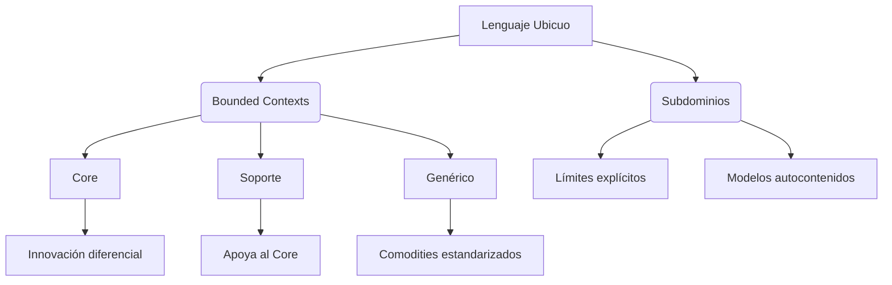
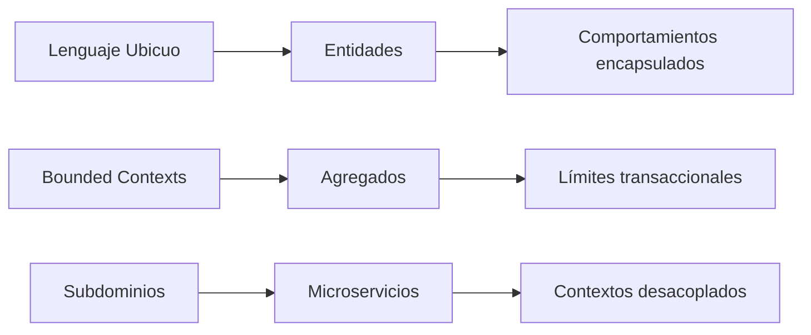
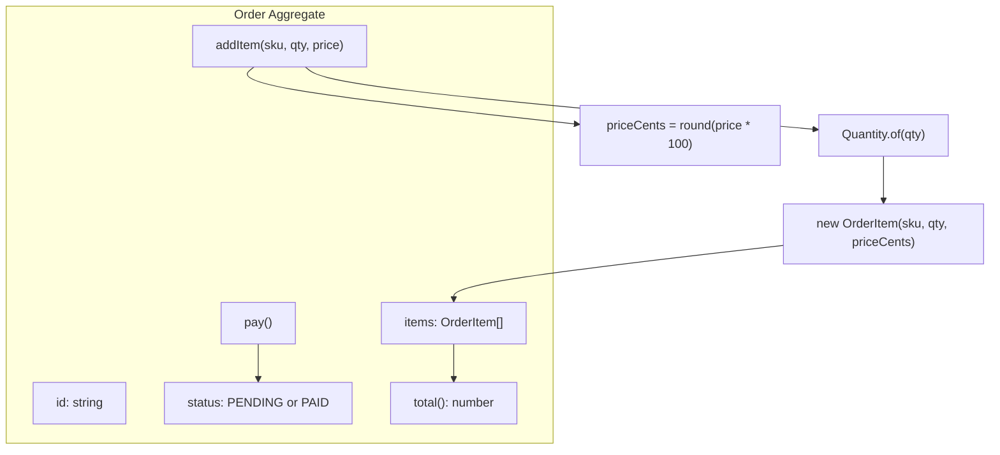

# Tema 4 — Fundamentos de DDD y transición al Modelo Rico

## Introducción a los pilares estratégicos de DDD

Antes de abordar los modelos de dominio, es crucial entender los cimientos que hacen posible el diseño guiado por el dominio:



## 1. Lenguaje Ubicuo: La columna vertebral de DDD

¿Qué es? Un vocabulario compartido entre expertos de negocio y desarrolladores

Patrones clave:
- Glosario de términos técnicos-negocio (ej: Pedido = Order agregado con Items)
- Diagramas que reflejan lenguaje de negocio (no solo UML técnico)
- Documentación viva en el código (tipos, métodos y tests con nombres de dominio)

## 2. Bounded Contexts: Mapeando la complejidad organizacional

| Tipo | Características | Ejemplo en e-commerce |
|------|----------------|----------------------|
| Core | Ventaja competitiva única | Sistema de recomendaciones AI |
| Soporte | Necesario pero no diferenciador | Gestión de inventario |
| Genérico | Problemas comunes ya resueltos | Pasarela de pagos |

## 3. Subdominios: Fronteras de significado

Principio: "Un término no puede significar dos cosas en el mismo contexto"

Implementación técnica:
- Microservicios con APIs bien definidas
- Módulos/librerías con responsabilidades acotadas
- Eventos de dominio con semántica contextual

## 4. Transición estratégica -> Táctico
Estos pilares estratégicos nos llevan naturalmente a implementaciones tácticas:



Flujo de diseño recomendado:
- Identificar subdominios clave con expertos de negocio.
- Delimitar Bounded Contexts para cada subdominio.
- Modelar agregados y entidades usando el Lenguaje Ubicuo.
- Implementar comportamientos ricos que reflejen reglas de negocio.

---

## 5. El problema del "Anemic Domain Model"

Objetivo: Comprender por qué el modelo anémico dificulta la evolución del software y cómo un dominio rico encapsula reglas, invariantes y comportamientos dentro de las entidades.


Ejemplo en `order-service`:

```ts
// anemic/orderModel.ts  
export interface OrderRow {  
  id: string  
  status: string             // 'PENDING' | 'PAID'  
  items: Array<{ sku: string; qty: number; price: number }>  
}  

export const saveOrder = async (db, row: OrderRow) => {  
  // Toda la lógica de estado y totales vive fuera de la entidad  
  return db.insert('orders', row)  
}
```

**Problemas principales:**  
- Imposible garantizar invariantes (ej. que qty > 0, status sólo permitido).  
- Tests caros (requieren base de datos o mocks de servicios).  
- Refactors que **conllevan** riesgos: si cambias la tabla o el DTO rompes toda la lógica.

Referencia: Martin Fowler, “Anemic Domain Model” – https://martinfowler.com/bliki/AnemicDomainModel.html

---

## 6. Refactor a un Domain Model Rico

Un **modelo rico** coloca la lógica de negocio dentro de las propias entidades y agregados. Así cada objeto sabe cómo validarse y comportarse.

### 6.1 Value Object: Quantity

```ts
// src/domain/value-objects/Quantity.ts  
/**  
 * Value Object que encapsula las reglas de cantidad  
 * - Entero positivo  
 * - Inmutable  
 */  
export class Quantity {  
  private constructor(private readonly qty: number) {}  

  static of(n: number): Quantity {  
    if (!Number.isInteger(n) || n <= 0) throw new Error('Quantity inválida: debe ser entero positivo')  
    return new Quantity(n)  
  }  

  get value(): number {  
    return this.qty  
  }  
}
```

### 6.2 Entity y Aggregate Root: Order

```ts
// src/domain/entities/OrderItem.ts  
import { Quantity } from '../value-objects/Quantity'  

export class OrderItem {  
  constructor(  
    readonly sku: string,  
    readonly quantity: Quantity,  
    readonly priceCents: number  // precio en centavos para evitar decimales  
  ) {  
    if (priceCents < 0) throw new Error('Price inválido: negativo')  
  }  

  // Comportamiento: calcula subtotal de este item  
  subtotal(): number {  
    return this.quantity.value * this.priceCents  
  }  
}
```

```ts
// src/domain/aggregates/Order.ts  
import { OrderItem } from '../entities/OrderItem'  
import { Quantity } from '../value-objects/Quantity'  

export class Order {  
  private items: OrderItem[] = []  
  private status: 'PENDING' | 'PAID' = 'PENDING'  

  constructor(readonly id: string) {}  

  // Agregar un ítem protege invariantes: qty > 0, precio válido  
  addItem(sku: string, qty: number, price: number) {  
    const quantity = Quantity.of(qty)  
    const priceCents = Math.round(price * 100)  
    this.items.push(new OrderItem(sku, quantity, priceCents))  
  }  

  // Transición de estado controlada  
  pay() {  
    if (this.status !== 'PENDING') throw new Error('El pedido ya fue pagado')  
    this.status = 'PAID'  
  }  

  // Lógica de negocio: cálculo del total en decimales  
  total(): number {  
    const sumCents = this.items.reduce((acc, it) => acc + it.subtotal(), 0)  
    return sumCents / 100  
  }  

  get currentStatus(): string {  
    return this.status  
  }  
}
```

### 6.3 Diagrama de flujo de comportamiento



---

## 7. Puerto de Persistencia

Para mantener el dominio independiente de la base de datos, definimos un puerto en `order-service`:

```ts
// src/domain/ports/OrderRepositoryPort.ts  
import { Order } from '../aggregates/Order'  

export interface OrderRepositoryPort {  
  save(order: Order): Promise<void>  
  findById(id: string): Promise<Order | null>  
}
```

Así la infraestructura (Postgres, Mongo, Redis) implementará este contrato sin contaminar el código de negocio.

---

## 8. Comparativa rápida

Métrica                 | Modelo anémico                 | Modelo rico  
------------------------|--------------------------------|---------------------------------  
Invariantes             | Fuera de la entidad, dispersos | Encapsulados en la entidad       
Tests                   | Integración lenta o mocks invasivos | Unitarios ágiles, sin infra pesada  
Refactor                | Riesgo alto (puede romper todo) | Riesgo moderado, cambios locales  
Legibilidad del código  | Bajo                            | Alto, código autoexplicativo    

---

## 9. Migración gradual y segura

1. **Paralelismo**: crea las nuevas clases (`Order`, `OrderItem`, `Quantity`) sin eliminar aún el código anémico.  
2. **Cobertura de tests**: añade tests unitarios para cada método crítico (`addItem`, `pay`, `total`).  
3. **Use Cases**: adapta los Application Services para instanciar y usar el dominio rico, sin tocar la infraestructura.  
4. **Verificación**: ejecuta el flujo completo (`order-service` + `order-api`) contra Postgres.  
5. **Descontaminación**: elimina el modelo anémico (`orderModel.ts`, `saveOrder`) cuando la cobertura de tests supere el 80%.

---

**Referencias**  
- Fowler, Martin. “Anemic Domain Model” – https://martinfowler.com/bliki/AnemicDomainModel.html  
- Evans, Eric. *Domain-Driven Design* (2003)  
- Vernon, Vaughn. *Implementing Domain-Driven Design* (2013)  