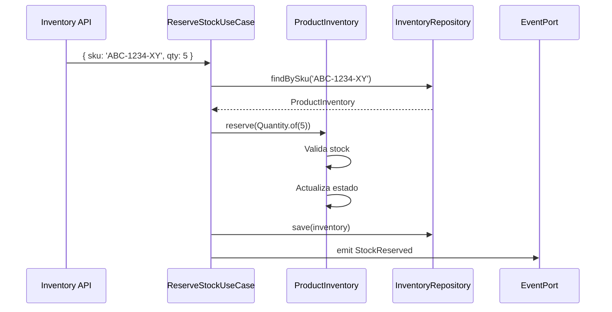

# 03-avance-proyecto · Inventory Service – Sesión 4

Objetivo: definir el dominio de inventario en términos de negocio, identificar conceptos clave y traducirlos a componentes DDD dentro de inventory-service.

---

## 1. Contexto de negocio

### 1.1 Descripción general  
Nuestro cliente es una plataforma de e-commerce que vende productos físicos. 
Necesita garantizar que cada pedido solo se acepte si hay suficiente stock, evitar sobreventa (overselling) y permitir reposición automática cuando el inventario sea bajo.

### 1.2 Necesidades críticas del cliente

- Disponibilidad en tiempo real: consultar existencias actualizadas al segundo.
- Reservas atómicas: bloquear unidades para un pedido sin reducir en falso.
- Reposición controlada: recibir órdenes de compra cuando el stock baje de un umbral.
- Auditoría de movimientos: registrar cada cambio de inventario para trazabilidad.

---

## 2. Lenguaje Ubicuo (Ubiquitous Language)

| Término                  | Definición clara                              |
| ------------------------ | --------------------------------------------- |
| Producto (SKU)           | Identificador único de un artículo vendible   |
| Stock Disponible         | Cantidad que puede asignarse a nuevos pedidos |
| Reserva de Stock         | Operación que bloquea unidades para un pedido |
| Reposición               | Añadir unidades tras recepción de mercancía   |
| Movimiento de Inventario | Evento que refleja cambio de cantidad         |

---

## 3. Subdominio y Bounded Context

| Subdominio | Rol                    | Ejemplo en nuestro sistema    |
| ---------- | ---------------------- | ----------------------------- |
| Soporte    | Gestión de inventario  | inventory-service             |
| Core       | Checkout y pagos       | order-service                 |
| Genérico   | Autenticación, logging | auth-service, logging-service |

El Inventory Context queda aislado dentro de inventory-service:

- Solo maneja productos y cantidades.
- Define sus propias entidades, puertos y eventos.
- No importa lógica de órdenes ni pagos.

---

## 4. Eventos de Dominio

| Evento           | Descripción                                    |
| ---------------- | ---------------------------------------------- |
| StockReserved    | Bloquea N unidades para un pedido (orderId)    |
| StockReleased    | Libera reserva (pedido cancelado)              |
| StockReplenished | Añade unidades al inventario (compra recibida) |

---

## 5. Entidades y Value Objects

 - ProductInventory (Aggregate Root)  
   Atributos: sku: string, available: number  
   Comportamientos: reserve(qty: Quantity), release(qty: Quantity), replenish(qty: Quantity)
 - Quantity (Value Object)  
   Regla: entero positivo  
   Método: static of(n: number): Quantity

---

## 6. Puertos (Ports)

- Mejorar InventoryProductPort
- Implementar InventoryEventPort

---

## 7. Casos de Uso (Use Cases)

| Use Case              | Descripción                                        |
| --------------------- | -------------------------------------------------- |
| ReserveStockUseCase   | Bloquea unidades si hay stock, emite StockReserved |
| ReleaseStockUseCase   | Libera reserva, emite StockReleased                |
| ReplenishStockUseCase | Añade unidades, emite StockReplenished             |
| GetInventoryUseCase   | Recupera cantidad actual para un SKU               |

ReserveStockUseCase:

---

## 8. Contrato de API (inventory-api)

| Método | Ruta                      | Entrada                          | Salida             |
| ------ | ------------------------- | -------------------------------- | ------------------ |
| GET    | /inventory/:sku           | sku en path                      | { sku, available } |
| POST   | /inventory/:sku/reserve   | { qty: number, orderId: string } | 204 No Content     |
| POST   | /inventory/:sku/release   | { qty: number, orderId: string } | 204 No Content     |
| POST   | /inventory/:sku/replenish | { qty: number }                  | 204 No Content     |

