# Tema 4 – Patrones Tácticos Avanzados en Domain-Driven Design

> **Propósito de la sesión** → alcanzar una comprensión rigurosa y operacional de los patrones tácticos fundamentales en DDD, con énfasis en su implementación idiomática en entornos Node.js. Se busca que el participante no solo internalice los conceptos, sino que sea capaz de articularlos como base arquitectónica duradera y evolutiva.

---

## Esquema General de Patrones Tácticos

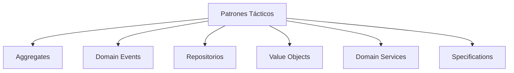

Este diagrama ilustra las principales abstracciones del modelo táctico en DDD, actuando como sistema conceptual que vertebra el diseño del dominio. Cada nodo representa un módulo semántico con fronteras y responsabilidades bien definidas.

---

## 1 · Aggregate Roots — Articulación de Invariantes y Consistencia Transaccional

Los *Aggregate Roots* constituyen las unidades de consistencia del modelo de dominio. No solo encapsulan el estado mutable, sino que lo gobiernan mediante una interfaz que impone invariantes semánticas. El diseño correcto de un agregado define los límites atómicos de modificación válida en el sistema.

### 1.1 Principios Fundamentales

* **Consistencia transaccional**: un agregado se guarda o se descarta en su totalidad, garantizando que todas las reglas internas permanezcan en un estado válido.
* **Encapsulamiento referencial**: los agregados nunca contienen referencias directas a otros agregados, interactuando a lo sumo mediante sus identificadores.
* **Protección de invariantes**: todas las operaciones externas válidas están mediadas por la API pública del agregado, que impide transiciones ilegales del estado interno.

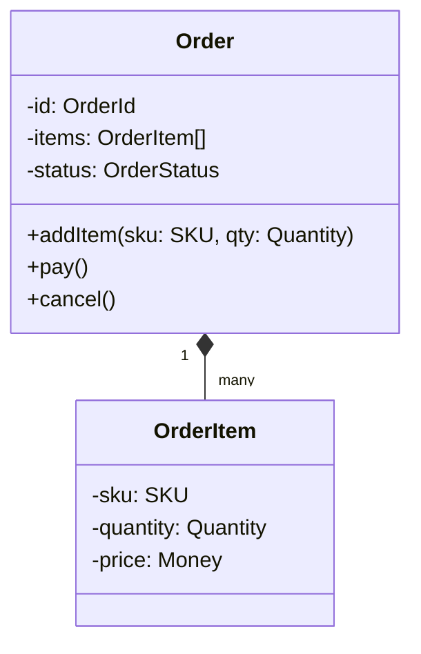

### 1.2 Interacción Arquetípica

```typescript
order.addItem(SKU.from("SKU‑123"), Quantity.of(2));
order.pay(paymentDetails);
repository.save(order);
```

El agregado garantiza que cualquier modificación pasa por una verificación estructural. Este enfoque reduce la carga de validación en capas superiores y evita acoplamientos innecesarios.

### 1.3 Diferencias con Use Cases

Un *Aggregate Root* representa una entidad del modelo de dominio con reglas de negocio y límites de consistencia bien definidos. En cambio, un *Use Case* (caso de uso) es un coordinador de aplicación: orquesta interacciones entre agregados, servicios de dominio y otras dependencias para cumplir un objetivo funcional.

* El **agregado** es parte del modelo del dominio.
* El **use case** es parte de la capa de aplicación.
* El **agregado** encapsula reglas, estado y comportamiento.
* El **use case** ejecuta un flujo, normalmente atómico y transaccional.

---

## 2 · Domain Events — Captura Semántica de Cambios Significativos

Los *Domain Events* representan manifestaciones explícitas de hechos relevantes ocurridos en el dominio. Su finalidad es doble: facilitar la reactualización eventual de otras vistas del sistema y modelar explícitamente la evolución histórica del estado del negocio.

### 2.1 Contrato Mínimo

```typescript
export interface DomainEvent<T extends string = string> {
  readonly type: T;
  readonly occurredAt: Date;
  readonly payload: unknown;
}
```

Estos eventos son inmutables, autocontenidos y nombrados siempre en pasado, reflejando una semántica narrativa del dominio.

### 2.2 Topología de Flujo

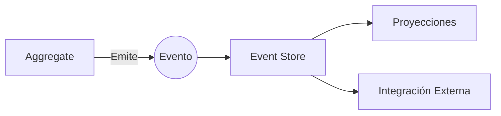

Esta arquitectura permite desacoplar la lógica de negocio de sus efectos colaterales, promoviendo un diseño reactivo y extensible.

### 2.3 Ejemplo Contextualizado

```typescript
// domain/events/domain-event.ts
/**
 * Base interface for all domain events
 * @template T - Type discriminator for event type
 */
export interface DomainEvent<T extends string = string> {
  readonly type: T;  // Unique event identifier
  readonly occurredAt: Date;  // Timestamp of event creation
  readonly payload: unknown;  // Event-specific data
}

/**
 * Abstract base class for aggregates with event sourcing capabilities
 */
export abstract class AggregateRoot {
  private changes: DomainEvent[] = [];  // Internal event buffer

  /**
   * Protected method to record new events
   * @param event - Domain event to record
   */
  protected recordEvent(event: DomainEvent): void {
    this.changes.push(event);
  }

  /**
   * Retrieves and clears recorded events
   * @returns Array of pending domain events
   */
  pullPendingEvents(): DomainEvent[] {
    return this.changes.splice(0, this.changes.length);
  }
}
```

```typescript
// domain/events/order-paid.event.ts
/**
 * Payload structure for OrderPaid event
 */
export type OrderPaidPayload = {
  orderId: string;
  totalAmount: number;
  currency: string;
  paymentMethod: string;
};

/**
 * Event emitted when an order is successfully paid
 */
export class OrderPaid implements DomainEvent<'OrderPaid'> {
  readonly type = 'OrderPaid' as const;
  readonly occurredAt: Date;
  
  constructor(public readonly payload: OrderPaidPayload) {
    this.occurredAt = new Date();  // Capture exact event time
  }
}
```

```typescript
// domain/order.aggregate.ts
import { AggregateRoot } from './events/domain-event';
import { OrderPaid } from './events/order-paid.event';

export class Order extends AggregateRoot {
  private status: 'PENDING' | 'PAID' | 'CANCELLED' = 'PENDING';
  
  constructor(
    public readonly id: string,
    private total: number
  ) {
    super();
  }

  /**
   * Process payment for the order
   * @param paymentDetails - Payment information
   * @throws {Error} If order is not in PENDING state
   */
  public processPayment(paymentDetails: PaymentDetails): void {
    if (this.status !== 'PENDING') {
      throw new Error(`Order ${this.id} cannot be paid in current state: ${this.status}`);
    }
    
    this.status = 'PAID';
    this.recordEvent(new OrderPaid({
      orderId: this.id,
      totalAmount: this.total,
      currency: paymentDetails.currency,
      paymentMethod: paymentDetails.method
    }));
  }
}
```

**Flujo de Eventos:**
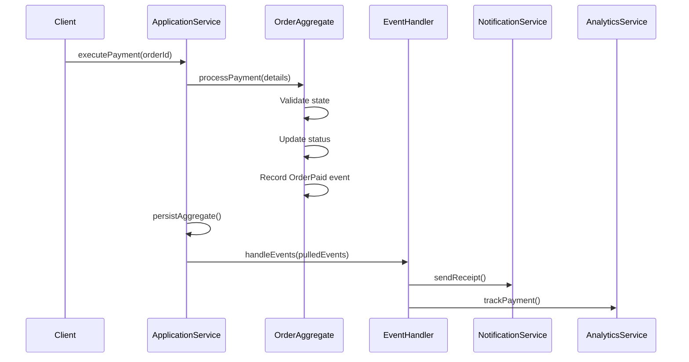

**Best Practices:**
- Mantener eventos inmutables
- Incluir suficiente contexto en el payload
- Usar timestamps precisos (UTC)
- Nombrar eventos en pasado verbal
- Separar eventos de dominio de eventos de integración

---

## 3 · Repositorios — Interfaces Contractuales de Persistencia Semántica

Los repositorios encapsulan el acceso a las representaciones persistidas del dominio, garantizando integridad transaccional y ocultando detalles tecnológicos subyacentes.

```typescript
interface Repository<T> {
    save(entity: T): Promise<void>;
    findById(id: string): Promise<T | null>;
    findByCriteria(criteria: Criteria): Promise<T[]>;
    nextIdentity(): string;
    lock(id: string): Promise<void>;
}
```

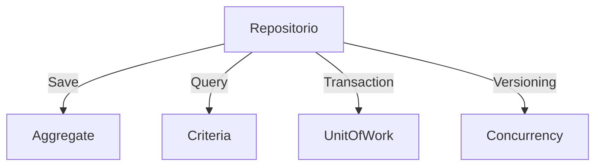

### Heurísticas de Diseño:

* Ausencia total de lógica de negocio.
* Operan exclusivamente sobre entidades completas (agregados).
* En entornos concurrentes, se integran con mecanismos de versionado optimista.
* Proveen identidad única bajo control del dominio.

---

## 4 · Value Objects — Modelado Declarativo de Conceptos Inmutables

Los Value Objects formalizan propiedades del dominio que no requieren identidad. Se definen por sus atributos y su comportamiento, y son conceptualmente iguales si sus valores lo son. Se utilizan para modelar conceptos puros como cantidades, ubicaciones, nombres o unidades de medida.

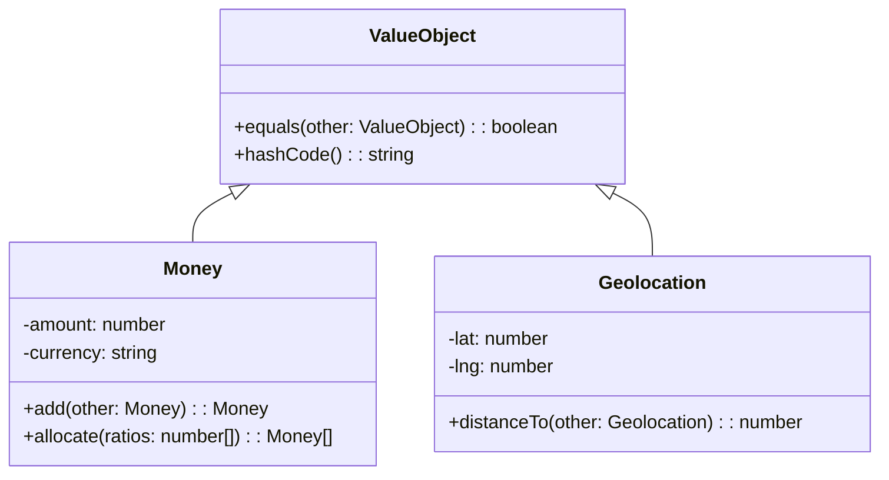

Los objetos de valor heredan de una interfaz común que asegura igualdad estructural (equals) y soporte para hashing determinista (hashCode).

- Money encapsula un valor monetario y su moneda, y permite operaciones como suma o distribución proporcional.
- Geolocation representa una coordenada geográfica y permite calcular distancias a otros puntos.

Este patrón mejora la expresividad, facilita la validación local y evita errores relacionados con comparaciones de referencia.

```typescript
const total = new Money(100, "USD");
const subtotal = new Money(40, "USD");
total.equals(subtotal); // false
```

---

## 5 · Domain Services — Abstracciones de Composición Interagregado

Los servicios de dominio modelan operaciones que involucran múltiples agregados o lógica que no puede residir naturalmente en ninguno de ellos.

```typescript
class RiskAssessmentService {
  constructor(private fraud: FraudPort, private scoring: CreditPort) {}
  async assess(order: Order): Promise<RiskLevel> {
    const fraudScore = await this.fraud.check(order);
    const credit = await this.scoring.get(order.customerId);
    return this.combine(fraudScore, credit);
  }
}
```

Este patrón evita la sobrecarga de responsabilidades dentro de los agregados y promueve una separación coherente de dominios semánticos.

---

## 6 · Specifications — Formalización de Reglas Componibles

El patrón *Specification* proporciona un mecanismo para articular, combinar y reutilizar reglas de negocio mediante una interfaz lógica expresiva. Este patrón favorece la separación de responsabilidades al extraer reglas complejas fuera de los objetos del dominio.

```typescript
interface Specification<T> {
  isSatisfiedBy(candidate: T): boolean;
  and(other: Specification<T>): Specification<T>;
}
```

### Composición y Reutilización

Permite operar con lógica booleana sobre las reglas:

### Arquitectura del Patrón
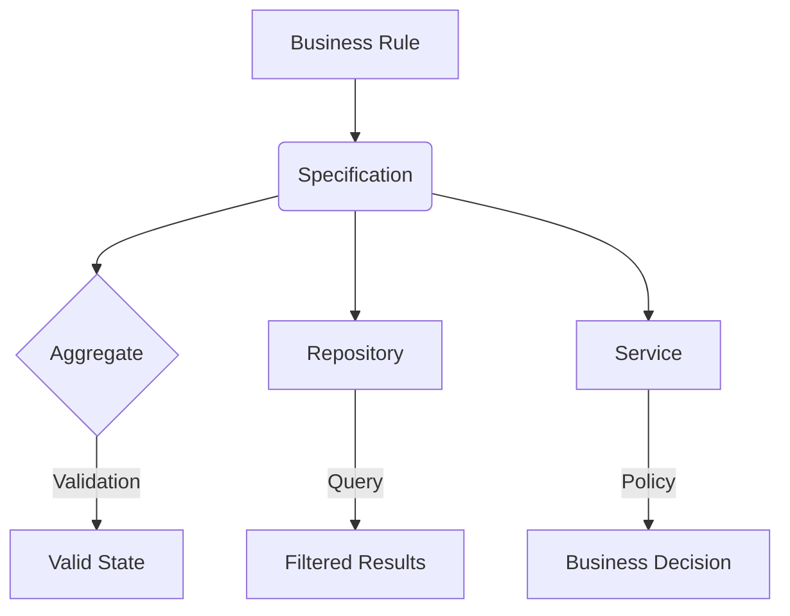

**Implementación Extendida:**
```typescript
// domain/specifications/specification.ts
export interface Specification<T> {
  isSatisfiedBy(candidate: T): boolean;
  and(other: Specification<T>): Specification<T>;
  or(other: Specification<T>): Specification<T>;
  not(): Specification<T>;
}

export abstract class CompositeSpec<T> implements Specification<T> {
  constructor(protected specs: Specification<T>[]) {}
  
  abstract isSatisfiedBy(candidate: T): boolean;
  
  and(other: Specification<T>): Specification<T> {
    return new AndSpec([...this.specs, other]);
  }

  or(other: Specification<T>): Specification<T> {
    return new OrSpec([...this.specs, other]);
  }

  not(): Specification<T> {
    return new NotSpec(this);
  }
}

// Implementación concreta
export class StockAvailableSpec extends CompositeSpec<OrderItem> {
  constructor(private stockRepo: StockRepository) {
    super([]);
  }

  isSatisfiedBy(item: OrderItem): boolean {
    return this.stockRepo.getStock(item.sku) >= item.quantity.value;
  }
}

// Uso en servicio de dominio
class OrderService {
  constructor(private spec: Specification<OrderItem>) {}

  validateOrder(items: OrderItem[]): ValidationResult {
    const results = items.map(item => ({
      item,
      valid: this.spec.isSatisfiedBy(item)
    }));
    
    return new ValidationResult(results);
  }
}
```

**Casos de Uso:**
1. **Validación Compleja:**
```typescript
const spec = new StockAvailableSpec(stockRepo)
  .and(new ProductActiveSpec(catalog))
  .not(new RestrictedCategorySpec(categories));
```

2. **Consultas Especializadas:**
```typescript
class ProductRepository {
  findSatisfying(spec: Specification<Product>): Product[] {
    return this.products.filter(p => spec.isSatisfiedBy(p));
  }
}
```

3. **Reglas de Decisión:**
```typescript
class DiscountCalculator {
  constructor(private eligibilitySpec: Specification<Customer>) {}
  
  calculateDiscount(customer: Customer): number {
    return this.eligibilitySpec.isSatisfiedBy(customer) ? 0.15 : 0;
  }
}
```

**Ventajas Clave:**
- Combina reglas mediante operadores lógicos
- Reutilizable en múltiples capas
- Fácil de testear aisladamente
- Documentación viva de reglas de negocio
- Separa criterios de implementación

Este enfoque permite construir sistemas mantenibles donde las reglas de negocio son ciudadanas de primera clase en el código.

---

## 7 · Versionado Optimista — Mecanismo de Concurrencia sin Bloqueo

El versionado optimista permite gestionar escrituras concurrentes sin mecanismos de exclusión mutua, reduciendo la contención a nivel de base de datos.

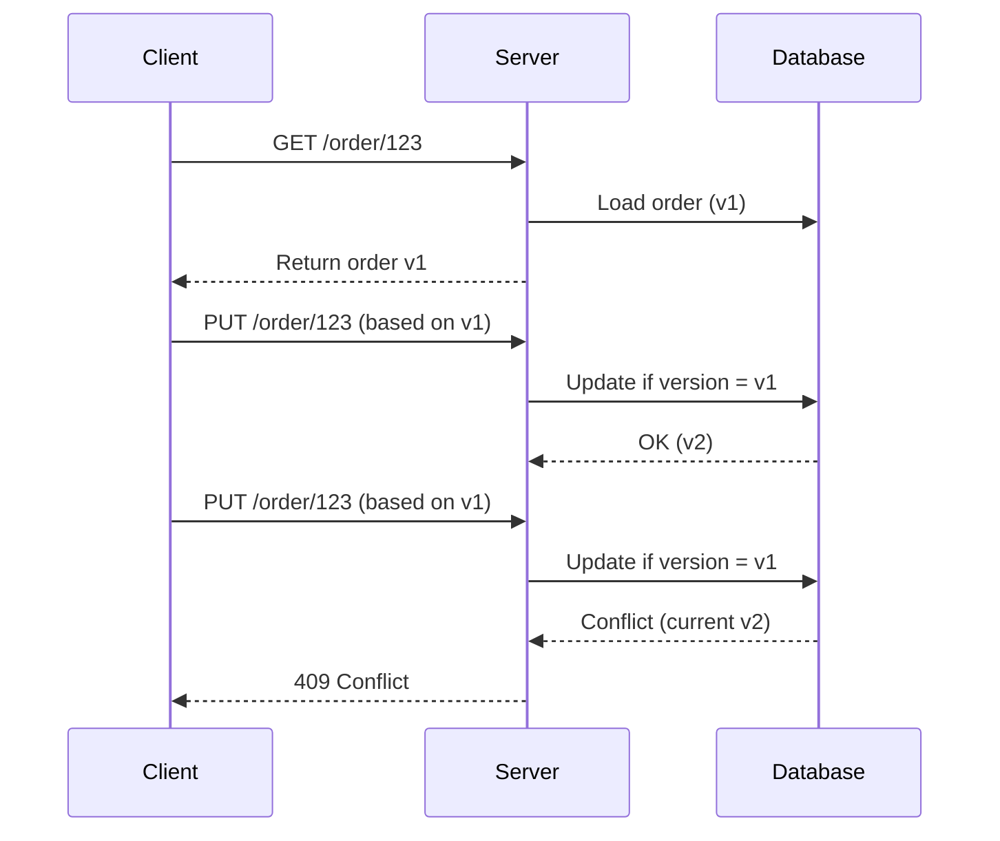

Este patrón es esencial en entornos distribuidos donde la consistencia eventual es aceptable.

---

## 8 · Anti-Patrones en el Diseño Táctico

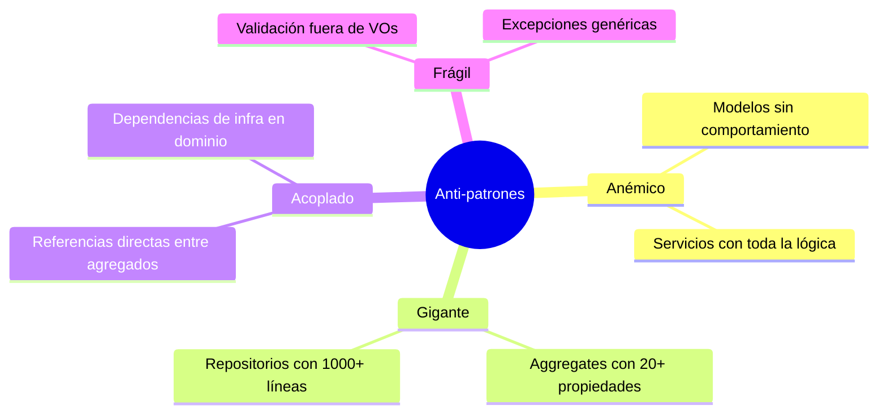

* **Modelo Anémico**: entidades desprovistas de comportamiento, con lógica desplazada a servicios transaccionales.
* **Agregado Gigante**: estructuras monolíticas que violan el principio de única responsabilidad.
* **Acoplamiento Intra-Dominio**: referencias rígidas entre agregados que impiden evolución independiente.
* **Modelo Frágil**: reglas de validación dispersas, sin encapsulamiento, con semántica débil en errores.

---

## 9 · Instrumento de Evaluación Táctica

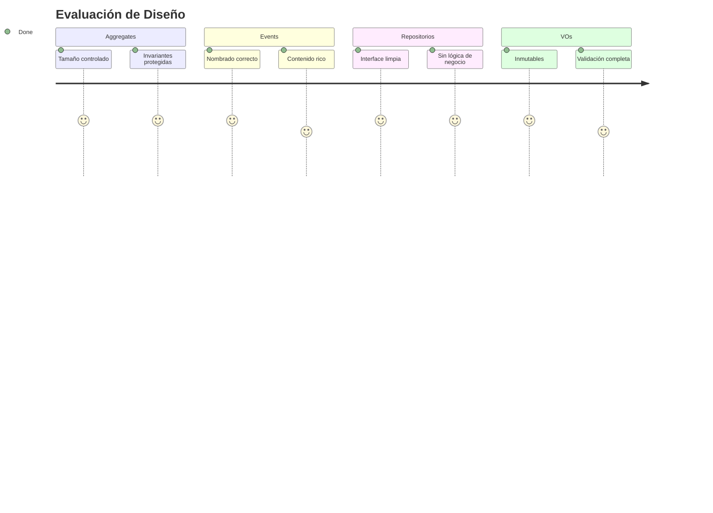

Este checklist facilita una evaluación crítica del diseño a nivel táctico antes de su integración en entornos productivos.

---

## 10 · Factory de Dominio — Orquestación Controlada de Creación

Las *Factories* encapsulan el proceso de construcción de agregados, especialmente cuando implica lógica compleja, reglas de validación cruzada o dependencias externas. Al emplear este patrón, se asegura que un agregado solo puede ser instanciado en un estado válido.

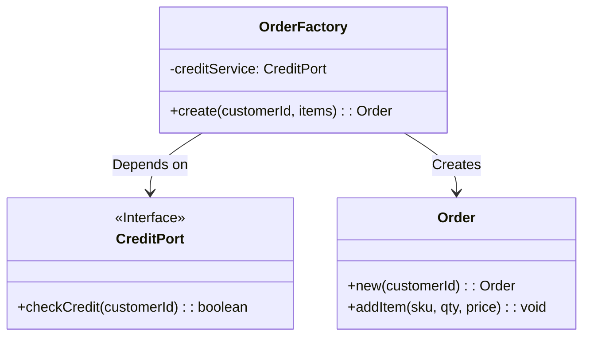

```typescript
// domain/factories/order-factory.ts
export class OrderFactory {
  constructor(
    private readonly creditService: CreditPort,
    private readonly catalogService: ProductCatalogPort
  ) {}

  /**
   * Creates a new order with validation
   * @throws {InsufficientCreditError} If credit check fails
   * @throws {InvalidProductError} If any item is invalid
   */
  async createOrder(customerId: string, items: OrderItemDTO[]): Promise<Order> {
    // 1. Validate business rules
    if (!await this.creditService.hasSufficientCredit(customerId)) {
      throw new InsufficientCreditError(customerId);
    }

    // 2. Create base aggregate
    const order = Order.create(customerId);
    
    // 3. Add validated items
    for (const item of items) {
      const product = await this.catalogService.getProduct(item.sku);
      if (!product.isAvailable()) {
        throw new InvalidProductError(item.sku);
      }
      order.addItem(
        SKU.create(item.sku),
        Quantity.create(item.quantity),
        Price.create(item.price)
      );
    }

    // 4. Validate final state
    if (order.items.length === 0) {
      throw new EmptyOrderError();
    }

    return order;
  }
}
```

**Características Clave:**
- Encapsula lógica compleja de creación
- Coordina múltiples servicios de dominio
- Realiza validaciones cruzadas
- Retorna un agregado completamente inicializado
- Maneja conversión de DTOs a objetos de dominio

**Uso Típico:**
```typescript
// application/use-cases/create-order.ts
class CreateOrderUseCase {
  constructor(
    private factory: OrderFactory,
    private repository: OrderRepository
  ) {}

  async execute(command: CreateOrderCommand): Promise<Order> {
    const order = await this.factory.createOrder(
      command.customerId,
      command.items
    );
    await this.repository.save(order);
    return order;
  }
}
```
