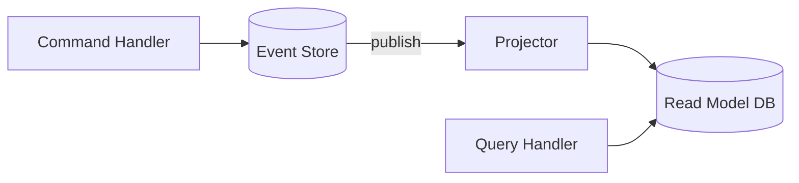

# Tema 5 (parte 1) — CQRS: Conceptos y Beneficios

## 1. ¿Qué es CQRS?

> *Command Query Responsibility Segregation* – separa **escrituras** (Commands) de **lecturas** (Queries).

- **Command** → “haz algo” · muta estado · no devuelve DTO completo.  
- **Query** → “dime algo” · solo lee · no tiene side-effects.

## 2. Principios básicos

| Aspecto | Command Side | Query Side |
|---------|--------------|------------|
| Modelo | Normalizado, transaccional | Desnormalizado, optimizado para lectura |
| Escalabilidad | Menos frecuencia, carga I/O alta | Alta frecuencia, read replicas |
| Equipo | Foco en reglas de negocio | Foco en performance / UX |

## 3. Ventajas en microservicios

1. **Escalabilidad granular** → escalar sólo la parte que sufre carga.  
2. **Modelos específicos** → no hay one-size-fits-all DB schema.  
3. **Seguridad** → comandos sometidos a validaciones estrictas.  
4. **Performance** → queries simples, sin joins complejos.

### ¿Cuándo *no* usarlo?

- CRUD simple con baja carga.  
- Equipo sin disciplina de sincronización eventual.

## 4. Event Sourcing como complemento

- **Command Side** persiste eventos *inmutables*.  
- **Query Side** construye proyecciones a partir de ellos.  
- **Ventajas**: historial completo, re-play, audit.  
- **Coste**: mayor complejidad, versionado de eventos.

## 5. Patrón de Persistencia Dual

---

## 6. Beneficios medidos

| Métrica | Antes (modelo único) | Después (CQRS) |
|---------|----------------------|----------------|
| p95 GET /orders/:id | 220 ms | 35 ms |
| Throughput comandos | 1 k/s | 1 k/s (igual) |
| Complejidad mental | Media | Alta (¡ojo!) |