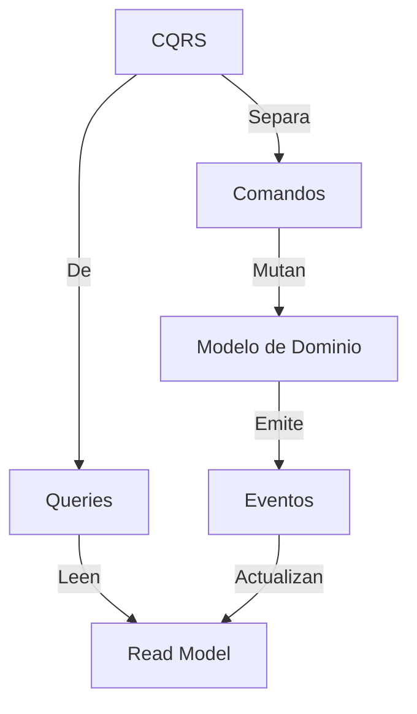
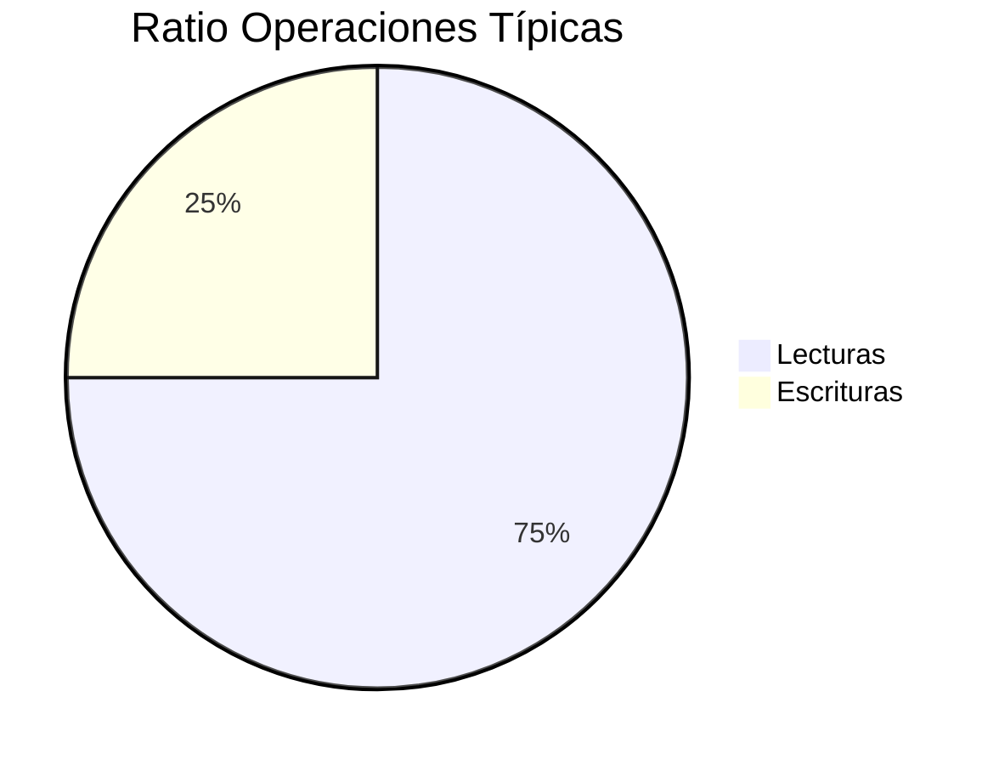
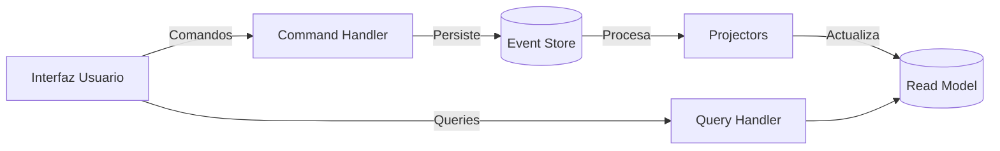
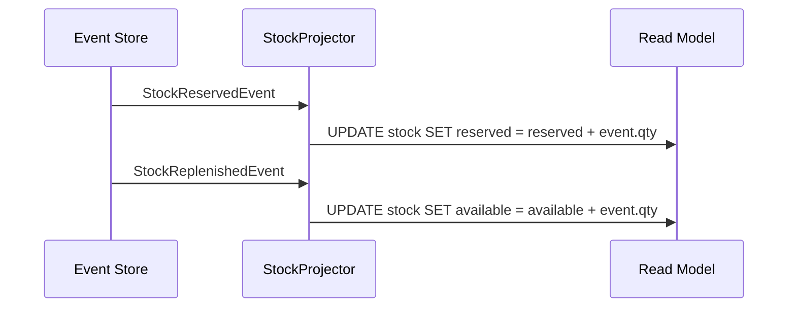

# Tema 5 (parte 1) — CQRS: Conceptos y Beneficios

En este primer bloque de **CQRS en Profundidad** nos centraremos en los fundamentos esenciales que toda arquitectura debe contemplar antes de incorporar patrones más avanzados. Sin rodeos, analizaremos por qué dividir lecturas y escrituras, cómo se relacionan sus componentes clave y cómo se materializa este enfoque en un ejemplo real de dominio.



> **Nota**: Los conceptos avanzados —como vistas materializadas automáticas, versionado de esquemas o patrones de consistencia— se explorarán en la sesión siguiente.

---

## 1. Fundamentos Conceptuales

Antes de sumergirnos en diagramas y código, hagámonos una pregunta básica: ¿realmente conviene usar un único modelo de datos para todo? A simple vista, un único esquema parece más sencillo, pero a medida que la aplicación crece, las necesidades de lectura y escritura divergen de forma inevitable.

### 1.1 ¿Por qué Separar Lecturas y Escrituras?

En entornos reales, las consultas suelen superar en número a las actualizaciones (hasta un 75 % vs. 25 % en aplicaciones típicas), y sus requisitos son muy distintos:



* **Conflictos de optimización**: Lo que acelera las escrituras (modelos normalizados, transacciones seguras) suele penalizar las consultas complejas.
* **Acoplamiento no deseado**: Validaciones o transformaciones para lecturas pueden contaminar la lógica de negocio, y viceversa.
* **Escalabilidad limitada**: Ajustar una única base de datos para ambos fines acaba siendo un ejercicio de malabares.

Separar estas responsabilidades permite adaptar el modelo de datos y las infraestructuras a cada carga de trabajo, sin concesiones.

### 1.2 Comparación Detallada

| **Aspecto**             | **Command Side**                       | **Query Side**                                             |
| ----------------------- | -------------------------------------- | ---------------------------------------------------------- |
| **Modelo de Datos**     | Normalizado, centrado en transacciones | Desnormalizado, pensado en rendimiento                     |
| **Patrón de Acceso**    | Por agregado (ID)                      | Por filtros complejos (consultas SQL, búsquedas textuales) |
| **Caso de Inventario**  | `reserveStock(command)`                | `getStockLevels(query)`                                    |
| **Tecnologías Típicas** | Event Store, bases SQL transaccionales | Elasticsearch, MongoDB, Redis                              |

---

## 2. Arquitectura de Referencia

Ahora que sabemos **por qué** debemos separar, veamos **cómo** encajar los distintos componentes de CQRS en un flujo coherente. Este diagrama muestra la interacción básica:



1. **Usuarios o sistemas externos** envían **comandos** y **consultas** a través de la misma interfaz.
2. Un **Command Handler** traduce cada comando en operaciones de dominio y registra uno o varios eventos en el **Event Store**.
3. Un conjunto de **Projectors** consume esos eventos y actualiza uno o varios **Read Models**, diseñados para consultas eficientes.
4. Las **Queries** se resuelven directamente contra el Read Model, sin afectar la lógica de escritura.

Este desacoplo no solo facilita la escalabilidad, sino que simplifica el mantenimiento y la evolución de cada camino de datos.

---

## 3. Ejemplo Práctico: Dominio *InventoryOrder*

Pongamos en práctica lo anterior con un caso común en e‑commerce: reservar stock para un pedido.

### 3.1 Command: `ReserveStockCommand`

```typescript
// command/reserve-stock.command.ts
export interface ReserveStockCommand {
  type: 'ReserveStock';
  payload: {
    orderId: string;
    items: Array<{ sku: string; quantity: number }>;
  };
}

// command/handler/reserve-stock.handler.ts
export const reserveStockHandler = (
  inventoryRepo: InventoryRepository,
  orderRepo: OrderRepository
) => async (command: ReserveStockCommand) => {
  // 1. Cargar los agregados relevantes
  const order = await orderRepo.findById(command.payload.orderId);
  const inventoryItems = await inventoryRepo.findBySkus(
    command.payload.items.map(i => i.sku)
  );

  // 2. Ejecutar la lógica de dominio de reserva
  order.reserveItems(inventoryItems, command.payload.items);

  // 3. Persistir cambios y generar eventos
  await orderRepo.save(order);
  await inventoryRepo.saveMultiple(inventoryItems);
};
```

Este handler demuestra cómo el Command Side se centra exclusivamente en mutar el modelo de dominio y generar eventos coherentes.

---

## 4. Proyección de Eventos a Read Model

El siguiente paso es asegurar que cualquier consulta refleje el estado resultante de los comandos. Para ello, definimos *projectors* que traduzcan eventos en actualizaciones sobre el Read Model.



```typescript
// projection/stock-projector.ts
export class StockProjector {
  constructor(private readModel: StockReadModel) {}

  async onStockReserved(event: StockReservedEvent) {
    await this.readModel.updateReserved(
      event.payload.sku,
      event.payload.quantity
    );
  }

  async onStockReplenished(event: StockReplenishedEvent) {
    await this.readModel.updateAvailable(
      event.payload.sku,
      event.payload.quantity
    );
  }
}
```

Con este flujo básico cubrimos el ciclo completo: **comando ➞ evento ➞ proyección ➞ consulta**, garantizando flexibilidad y claridad en cada fase.

---

> **Lo que sigue**: En la próxima sesión profundizaremos en patrones avanzados (materialized views automáticas, versionado de esquemas, sagas) y exploraremos cómo medir y optimizar el rendimiento en entornos de alta carga.
