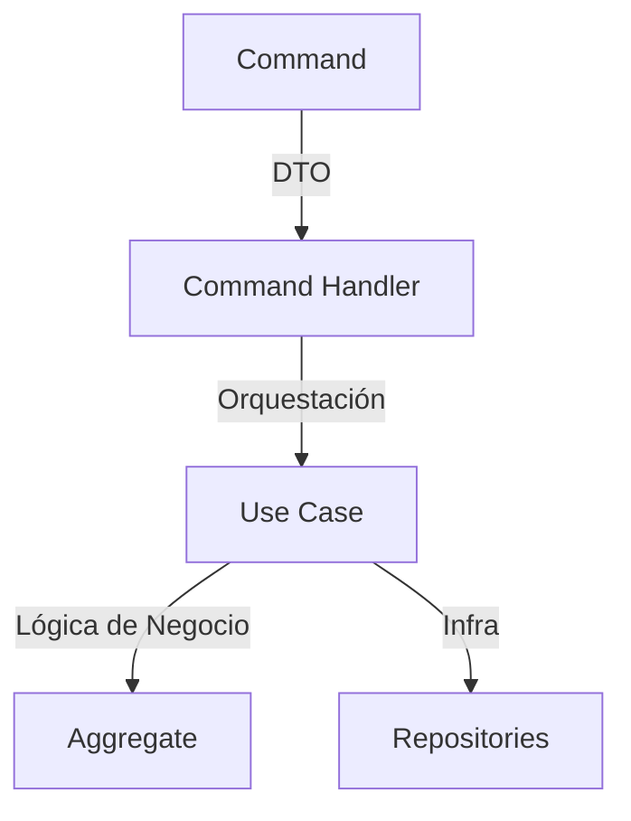
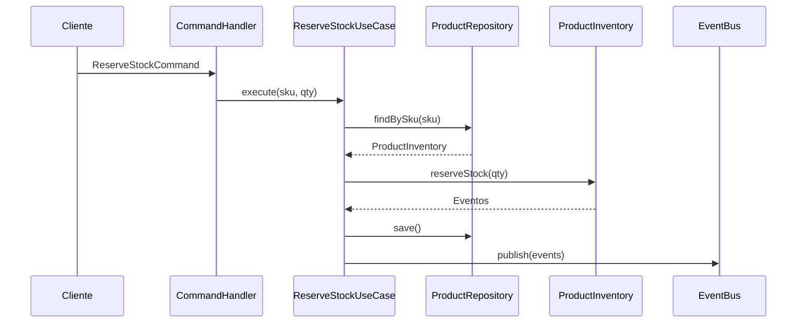

# Sesión 7 · 14-may-2025  
## Conceptos principales de la sesión anterior

- Identificar que problemas se pueden resolver con CQRS
  - Problemas de rendimiento
  - Problemas de escalabilidad
  - Problemas de mantenimiento

- Conceptos clave de CQRS
  - Separación entre lectura y escritura
  - Eventos como fuente de verdad
  - Read-model vs. Write-model
  - Uso de proyectores para mantener la read-model actualizada


## Repaso en profundidad para clarificar conceptos

Clarificación de las diferencias clave entre **Command**, **Command Handler**, y **Use Case** en una arquitectura DDD/CQRS.

---

## 1. Diagrama Conceptual de Responsabilidades


---

## 2. Diferencias Clave con Ejemplos

### 2.1 Command (DTO)
- **Qué es**: Simple contenedor de datos sin lógica.
- **Propósito**: Representar una intención de modificación.
```typescript
// application/commands/reserve-stock.command.ts
export class ReserveStockCommand {
  constructor(
    public readonly sku: string,
    public readonly quantity: number
  ) {}
}
```

### 2.2 Command Handler (Orquestador)
- **Qué es**: Coordina flujo técnico (transacciones, logging).
- **Propósito**: Preparar ejecución del caso de uso.
```typescript
// application/command-handlers/reserve-stock.handler.ts
export class ReserveStockHandler {
  constructor(private useCase: ReserveStockUseCase) {}

  async execute(command: ReserveStockCommand): Promise<void> {
    try {
      await this.useCase.execute(command.sku, command.quantity);
    } catch (error) {
      // Logging técnico, retries, etc.
    }
  }
}
```

### 2.3 Use Case (Lógica de Negocio)
- **Qué es**: Implementación concreta de reglas de negocio.
- **Propósito**: Manipular agregados y persistir cambios.
```typescript
// application/use-cases/reserve-stock.usecase.ts
export class ReserveStockUseCase {
  constructor(
    private productRepo: ProductRepository,
    private eventBus: EventBus
  ) {}

  async execute(sku: string, quantity: number): Promise<void> {
    const product = await this.productRepo.findBySku(sku);
    
    product.reserveStock(quantity); // Lógica de dominio
    
    await this.productRepo.save(product);
    await this.eventBus.publish(product.events);
  }
}
```

---

## 3. Comparación Detallada

| **Aspecto**          | **Command**                | **Command Handler**       | **Use Case**               |
|----------------------|----------------------------|---------------------------|----------------------------|
| **Responsabilidad**  | Datos de entrada           | Flujo técnico             | Reglas de negocio          |
| **Lógica**           | Ninguna                    | Técnica (retries, logs)   | De negocio pura            |
| **Dependencias**     | Ninguna                    | Frameworks (Ej: NestJS)   | Dominio + Repositorios     |
| **Testeo**           | Serialización              | Integración               | Unitario (dominio)         |
| **Ejemplo**          | `{ "sku": "A1", "qty":5 }` | Transacciones DB          | Validar stock y reservar   |

---

## 4. Ejemplo Completo de Flujo


---

## 5. Errores Comunes y Cómo Evitarlos

### 5.1 ❌ Command con lógica de negocio
```typescript
// Mal: Command haciendo validaciones
class BadCommand {
  constructor(sku: string) {
    if (!sku) throw new Error("SKU inválido"); // ❌
  }
}
```

### 5.2 ✅ Delegar al Use Case
```typescript
// Bien: Use Case maneja reglas
class GoodUseCase {
  execute(sku: string) {
    if (!this.validator.isValidSku(sku)) { // ✅
      throw new DomainError();
    }
  }
}
```

### 5.3 ❌ Handler haciendo lógica de dominio
```typescript
// Mal: Handler calculando stock
class BadHandler {
  execute(command) {
    const stock = command.qty * 2; // ❌
  }
}
```

---

## 6. Preguntas Clave para Definir Límites

1. **¿Es específico de un framework?** → Handler  
2. **¿Involucra transacciones externas?** → Handler  
3. **¿Implementa reglas del negocio?** → Use Case  
4. **¿Es un dato de entrada?** → Command  

---

## 7. Refactorización de Ejemplo Confuso

**Antes (Acoplado):**
```typescript
class ConfusingCommandHandler {
  async execute(command: ReserveStockCommand) {
    // Mezcla lógica técnica y de negocio
    const product = await this.repo.find(command.sku);
    if (product.stock < command.qty) {
      throw new Error("Stock insuficiente");
    }
    product.stock -= command.qty;
    await this.repo.save(product);
  }
}
```

**Después (Separado Claramente):**
```typescript
// Command (DTO)
class ReserveStockCommand { /* ... */ }

// Handler (Técnico)
class ReserveStockHandler {
  constructor(private useCase: ReserveStockUseCase) {}

  async execute(command: ReserveStockCommand) {
    await this.useCase.execute(command.sku, command.qty);
  }
}

// Use Case (Negocio)
class ReserveStockUseCase {
  async execute(sku: string, qty: number) {
    const product = await this.repo.find(sku);
    product.reserve(qty); // Lógica en el agregado
    await this.repo.save(product);
  }
}
```

---

**Conclusión**: La diferencia fundamental está en el **nivel de abstracción** y **responsabilidades**. Mientras el Command es solo un mensaje, el Use Case encapsula la narrativa de negocio, y el Handler maneja aspectos técnicos.