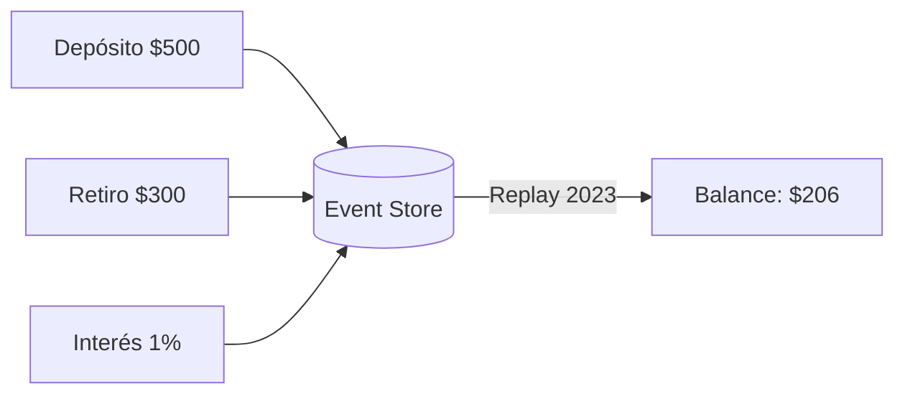
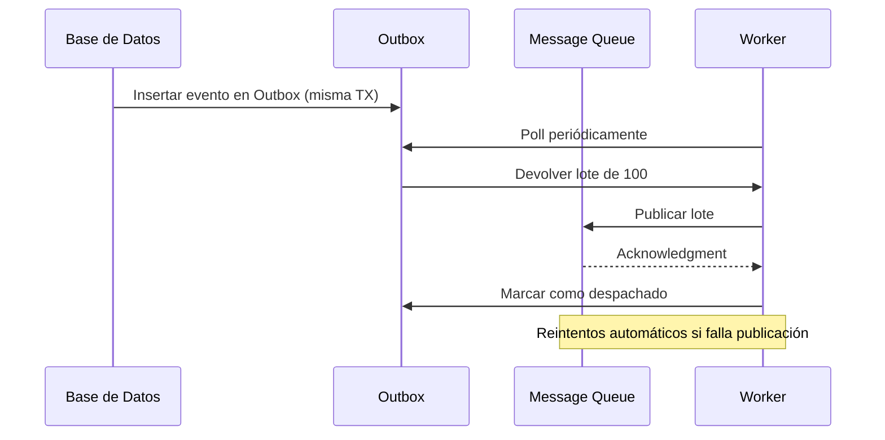

# Tema 5 - CQRS Avanzado

En esta segunda parte profundizaremos en los aspectos avanzados de Event Sourcing, comprendiendo por qué un modelo append-only es clave para auditoría y reconstrucción, cómo optimizar búsquedas en el event store, y qué estrategias seguir para versionar eventos sin perder compatibilidad.

## 1. Por Qué Append-Only: Caso del Mundo Real

El modelo append-only mantiene un registro inmutable de cada cambio, facilitando auditorías y la reconstrucción histórica de estados. Veremos cómo este enfoque nos protege de inconsistencias y permite detectar errores.

**Ejemplo de Sistema Bancario**:



En este diagrama se observa cómo cada operación (depósito, retiro, cálculo de interés) se graba secuencialmente. Al reproducir eventos hasta una fecha concreta, podemos verificar el balance preciso en cualquier momento.

**Ejercicio en Grupo**:

* **Escenario**: Un cliente reclama que su balance al 15/03/2023 era \$200, pero la aplicación reporta \$0. El cliente detalla que realizó un depósito de \$500 el 12/03/2023 y un retiro de \$300 el 14/03/2023.
* **Objetivo**: Aprender a usar el event store para rastrear el origen de la discrepancia.
* **Tarea**:

Reconstuir el estado histórico usando los eventos:

```ts
[
  { type: 'AccountOpened', balance: 0, date: '2023-03-10' },
  { type: 'Deposit', amount: 500, date: '2023-03-12' },
  { type: 'Withdrawal', amount: 300, date: '2023-03-14' },
  { type: 'FeeCharged', amount: 200, date: '2023-03-15' }
]
```

- ¿Por qué append only?
- ¿Por qué no usar un modelo relacional?
- ¿Qué parametros faltan para tener un evento completo?

---

## 2. Diseño de Event Store: Patrones de Optimización

Almacenar millones de eventos requiere estrategias de indexación y particionado que garanticen búsquedas eficaces. Analizaremos cómo aprovechar índices [GIN](https://www.postgresql.org/docs/current/indexes-types.html#:~:text=GIN%20indexes%20are%20%E2%80%9Cinverted%20indexes,presence%20of%20specific%20component%20values.) en PostgreSQL y cómo estructurar el schema para cargas variadas.

**correlationId**: En CQRS y Event Sourcing, correlationId es un identificador único que permite rastrear una operación a través de múltiples componentes del sistema distribuido, especialmente cuando una acción inicial (por ejemplo, un comando) genera múltiples eventos o desencadena otros procesos.

**aggregateId**: En CQRS y Event Sourcing, el aggregateId es el identificador único de una instancia de un Aggregate, por ejemplo el id de un usuario o de un pedido. Se diferencia de correlationId en que esta última es un identificador único que permite rastrear una operación a través de múltiples componentes del sistema distribuido, especialmente cuando una acción inicial (por ejemplo, un comando) genera múltiples eventos o desencadena otros procesos.


### 2.1 Modelado para Búsquedas

Un índice GIN sobre campos JSONB acelera consultas filtradas por propiedades específicas.

```sql
CREATE INDEX idx_event_properties ON event_store USING GIN (
    (payload->'user') jsonb_path_ops,
    (payload->'metadata'->'correlationId')
);

-- Ejemplo de consulta: Todos los eventos del usuario "u123" con correlationId "corr_abc"
SELECT *
  FROM event_store
 WHERE payload @> '{"user": "u123"}'
   AND payload->'metadata'->> 'correlationId' = 'corr_abc';
```

Este patrón reduce dramáticamente el tiempo de respuesta al buscar dentro de cargas JSON complejas.

### 2.2 Ejercicio de Diseño de Tabla

**Requisitos**:

1. Manejar múltiples tipos de agregados (Orders, Users, Payments).
2. Búsquedas rápidas por `correlationId` y `aggregateId`.
3. Compactación mensual de eventos antiguos para archivado. (Ejemplo [PostgreSQL](https://www.postgresql.org/docs/current/ddl-partitioning.html) partitioning)

**Tarea**:

1. Proponer un esquema ajustado que cumpla los requisitos.
2. Definir los índices necesarios y explicar su elección.
3. Escribir la consulta SQL para listar todas las órdenes fallidas con un `correlationId` dado.

```sql
-- TABLE
CREATE TABLE event_store (
    id UUID                 PRIMARY KEY,
    aggregate_type          TEXT NOT NULL, -- orders, users, payments
    aggregate_id            UUID NOT NULL,
    payload                 JSONB NOT NULL, -- contiene toda la información del evento, incluido el correlationId
    created_at              TIMESTAMP WITH TIMEZONE NOT NULL DEFAULT NOW()
) PARTITION BY RANGE (created_at);

-- IDX AGGREGATE_ID
CREATE INDEX idx_event_store_aggregate ON event_store (aggregate_id, aggregate_type);

-- IDX CREATED_AT
CREATE INDEX idx_event_store_created_at ON event_store (created_at DESC);

-- IDX CORRELATION_ID
CREATE INDEX idx_event_store_correlation_id ON event_store USING GIN ((payload->>'correlationId'))

-- QUERY, correlationId and type OrderFailed
SELECT * FROM event_store
WHERE payload->>'correlationId' = '123' AND payload->>'type' = 'OrderFailed';

-- COMPACT TABLE, puede gestionarse mediante cron jobs.
CREATE TABLE event_store_2025_01 PARTITION of event_store
FOR VALUES FROM ('2025-01-01') TO ('2025-01-31');

SELECT * FROM event_store
WHERE created_at >= '2025-01-01' AND created_at =< '2025-01-31';
```

---

## 3. Versionado de Eventos: Estrategia de Migración

Cuando evoluciona el negocio, los contratos de eventos cambian. Mantener compatibilidad requiere migradores y versiones. Veremos cómo diseñar migraciones seguras.

### 3.1 Caso Real: Cambio de Moneda

Al principio todos los totales se expresaban en USD. Tras globalizar la plataforma, necesitamos soportar múltiples monedas.

```ts
// Versión Original (v1)
interface OrderCreatedV1 {
  type: 'OrderCreated';
  total: number; // Siempre USD
}

// Versión Nueva (v2)
interface OrderCreatedV2 {
  type: 'OrderCreated';
  total: number;
  currency: string;      // Código ISO
  convertedAmount?: number;
}

// Función migradora
const migrateOrderCreated = (event: OrderCreatedV1): OrderCreatedV2 => ({
  ...event,
  currency: 'USD',
  convertedAmount: event.total
});
```

Al aplicar este migrador, todos los eventos v1 se actualizarán dinámicamente a la forma v2 al ser leídos.

### 3.2 Ejercicio de Migración

**Evento Obsoleto**:

```ts
interface UserAddressChangedV1 {
  type: 'UserAddressChanged';
  address: string; // "Street 123, City"
}
```

**Nuevos Requisitos**:

* Separar en campos: `street`, `city`, `postalCode`.
* Normalizar nombres de ciudades ("NYC" → "New York City").

**Tarea**:

1. Definir la interfaz `UserAddressChangedV2`.
2. Escribir la función migradora de v1 a v2, manejando casos sin coma (e.g. "Street123WithoutComma").
3. Discutir cómo registrar incidencias de datos inválidos para posterior corrección.

```ts
// Evento Original
interface UserAddressChangedV1 {
    type: 'UserAddressChanged';
    address: string; // "Street 123, City"
}

interface UserAddressChangedV2 {
    type: 'UserAddressChanged';
    street: string;
    city: string;
    postalCode?: string;
}

const cityMap: Record<string, string> = {
    'NYC': 'New York City',
}

function migrateUserAddressChanged(eventV1: UserAddressChangedV1): UserAddressChangedV2 {
    const data = eventV1.address.split(',').map(s => s.trim(''));
    let [street, city, postalCode] = data;
    
    return {
        type: eventV1.type,
        street,
        city: cityMap[city] || city,
        postalCode,
    }
}

// Como manejar datos invalidos
if (data.length < 2) {
    logger.error(`Dirección invalida para: '${eventV1.address}'`);
    incidentService.report({
        type: 'InvalidADdressForamt',
        rawValue: eventV1,
        correlationId: eventV1.correlationId,
        timestamp: new Date().UTC()
    })
    throw new Error("invalid address");
}

````

---

## 4. Outbox Pattern: Implementación Robusta

El patrón Outbox desacopla la transacción de la base de datos de la publicación de eventos, garantizando entrega exactly-once incluso ante fallos.

### 4.1 Diagrama de Secuencia con Fallos



Este flujo asegura que ningún evento quede sin publicar ni se duplique.

**Requisitos Clave**:

1. Entrega exactly-once.
2. Gestión de desconexiones de MQ.
3. Registro de métricas: eventos procesados, latencia.
4. Priorización basada en `payload.metadata.priority`.

---

## 5. Sagas y Process Managers

Los Sagas coordinan transacciones distribuidas garantizando consistencia eventual. Veremos patrones de circuit breaker, timeouts y cómo orquestar flujos complejos.

### 5.1 Patrón Circuit Breaker en Sagas

El circuit breaker previene escaladas de error. Ante fallos transitorios, ejecutamos reintentos; si persisten, lanzamos compensaciones.

### 5.2 Implementación con Retroceso

```ts
class PaymentSaga {
  async run(orderId: string) {
    try {
      await payOrder(orderId);
      await reserveStock(orderId);
    } catch (error) {
      if (isTransient(error)) {
        throw new SagaRetryError(); // Reintentar más tarde
      }
      await this.compensate(orderId); // Deshacer cambios
    }
  }
  private async compensate(orderId: string) {
    await cancelPayment(orderId);
    await releaseStock(orderId);
    await markOrderAsFailed(orderId);
  }
}
```

Este patrón asegura que, si la reserva de stock falla tras el pago, revertimos la transacción completa.

---

## 6. Process Managers: Caso Avanzado

Los Process Managers mantienen estado intermedio y gestionan timeouts, ideal en flujos con múltiples dependencias y plazos.

### 6.1 Estado Complejo con Timeouts

```ts
interface SagaState {
  id: string;
  steps: {
    payment: 'pending' | 'completed' | 'failed';
    inventory: 'pending' | 'reserved' | 'released';
    shipping: 'not_started' | 'scheduled';
  };
  expiresAt: Date;
  retries: number;
}

class SagaTimeoutHandler {
  async checkExpired() {
    const expired = await db.query(
      `UPDATE sagas SET status='expired' WHERE expires_at < NOW() AND status='running' RETURNING *`
    );
    expired.rows.forEach(saga => this.compensate(saga));
  }
}
```

Este componente detecta sagas que superaron su plazo y aplica compensaciones.
