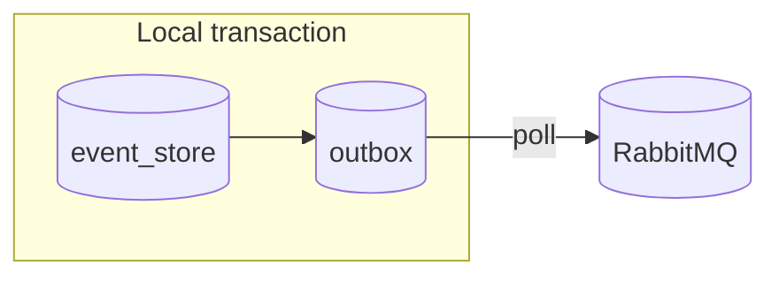

# Tema 5 (parte 3) — Event Sourcing Avanzado

## 1. Por qué append-only

- **Audit** inmutable → “qué, quién, cuándo”.  
- **Re-construcción** de Aggregates bajo nuevas reglas.  
- **Temporal queries** (“estado al 2024-12-31”).

## 2. Layout de tabla `event_store`

| Columna | Tipo | Índices |
|---------|------|---------|
| `id` | BIGSERIAL PK | PK |
| `aggregate_id` | UUID | BTREE |
| `aggregate_type` | TEXT | composite idx |
| `seq` | INT | UNIQUE (agg_id, seq) |
| `type` | TEXT | — |
| `ts` | TIMESTAMPTZ | — |
| `payload` | JSONB | GIN |

```sql
ALTER TABLE event_store
  ADD UNIQUE(aggregate_id, seq);
```

## 3. Reconstruir Aggregate

```ts
async function rehydrate(id: string): Promise<Order> {
  const rows = await db.select('SELECT * FROM event_store WHERE aggregate_id=$1 ORDER BY seq', [id]);
  return rows.reduce((agg, r) => agg.apply(JSON.parse(r.payload)), Order.blank(id));
}
```

## 4. Versionado de eventos

```ts
type OrderCreatedV1 = { type: 'OrderCreated'; v: 1; id: string; total: number };

type OrderCreatedV2 = { type: 'OrderCreated'; v: 2; id: string; total: number; currency: string };

export const upgrade = (evt: OrderCreatedV1): OrderCreatedV2 => ({
  ...evt,
  v: 2,
  currency: 'COP',
});
```

Mantén **migradores puros**; nunca edites eventos históricos.

## 5. Outbox Pattern



- `event_store` y `outbox` en la **misma** transacción DB.  
- Worker lee `outbox`, publica a MQ y marca `dispatched_at`.

### Código del poller

```ts
const BATCH = 100;
setInterval(async () => {
  const rows = await db.query(`DELETE FROM outbox WHERE dispatched_at IS NULL LIMIT $1 RETURNING *`, [BATCH]);
  for (const row of rows.rows) {
    await mq.publish('domain', row.type, Buffer.from(row.payload));
    await db.query('UPDATE outbox SET dispatched_at=now() WHERE id=$1', [row.id]);
  }
}, 500);
```

Exactly-once garantizado: DELETE + RETURNING es transaccional.

## 6. Testing – Golden Master

- Reproduce eventos de producción en pre-prod y compara proyecciones (`sha256`).  
- Asegura que migraciones de eventos no rompen queries.