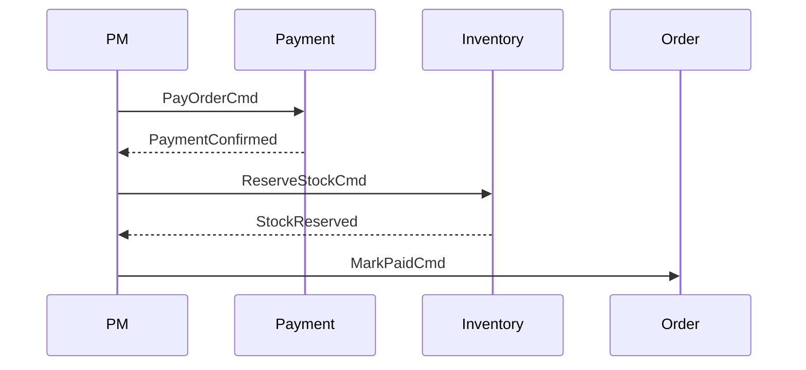

# Tema 5 (parte 4) — Sagas y Process Managers

## 1. Problema

`Order` requiere **pago** + **reserva de stock**. ¿Cómo coordinar sin transacción distribuida?

## 2. Saga de coreografía

```mermaid
sequenceDiagram
  Order --OrderCreated--> Payment
  Payment --PaymentConfirmed--> Inventory
  Inventory --StockReserved--> Order
```

- Servicios publican eventos; nadie “manda”.

## 3. Saga de orquestación (Process Manager)



- **Process Manager** mantiene estado (tabla `saga_order_pay`).

### Estado simplificado

| `saga_id` | `order_id` | `status` | `step` |
|-----------|------------|----------|--------|
| UUID | UUID | RUNNING | WAIT_PAYMENT |

### Código de un PM

```ts
export const onOrderCreated = async (e: OrderCreated) => {
  await sagaRepo.start(e.payload.orderId);
  await bus.sendCommand({ type: 'PayOrder', payload: { orderId: e.payload.orderId } });
};

export const onPaymentConfirmed = async (e: PaymentConfirmed) => {
  await sagaRepo.advance(e.payload.orderId, 'WAIT_STOCK');
  await bus.sendCommand({ type: 'ReserveStock', payload: { orderId: e.payload.orderId } });
};
```

## 4. Cuándo usar uno u otro

| Factor | Coreografía | Orquestación |
|--------|-------------|-------------|
| Pasos | 2-3, simples | 3+ o condicionales |
| Visibilidad | Difusa | Centralizada |
| Acoplamiento | Bajo | Moderado |
| Debug | difícil (event-storm) | más sencillo (tabla saga) |

## 5. Ejercicio breve (25 min)

1. Crear tabla `saga_order_pay` (columns como arriba).  
2. Process Manager en `payment-service` que orqueste pasos.  
3. Publicar `OrderCompleted` cuando ambos pasos terminen.  

Commit: `feat(order): saga process manager`.