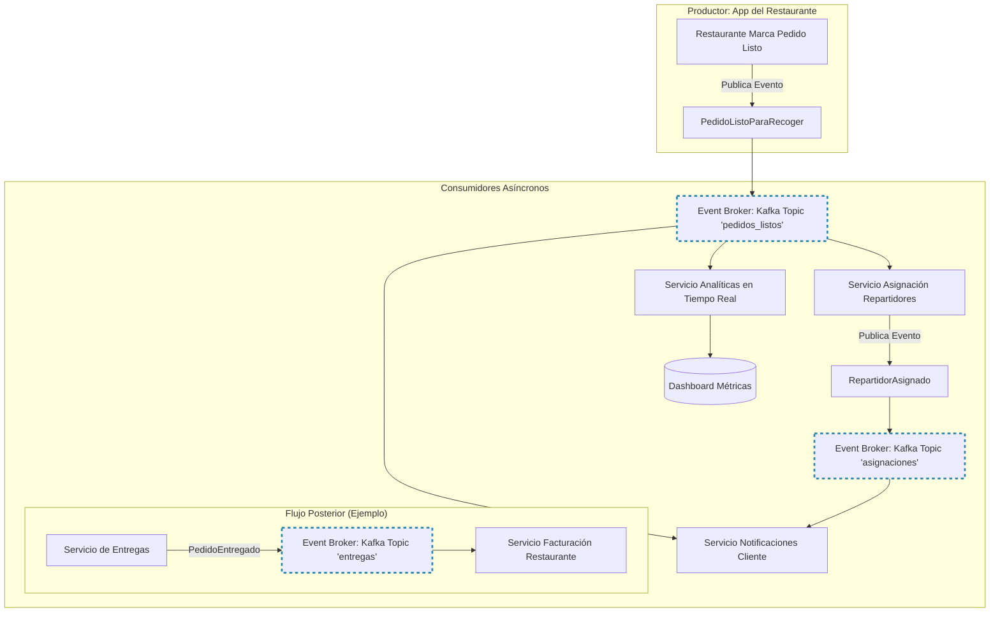
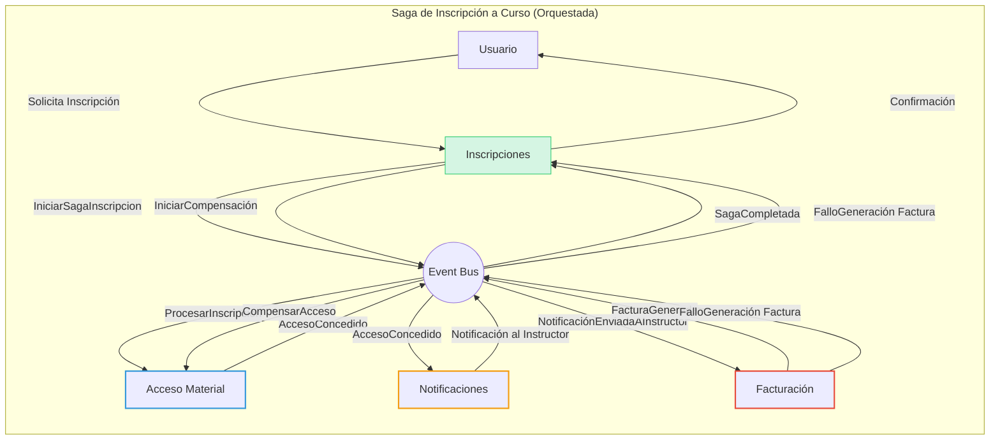
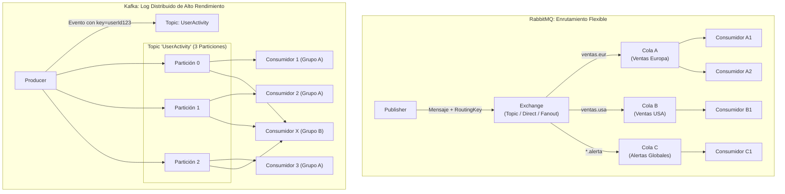
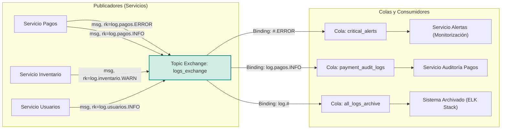
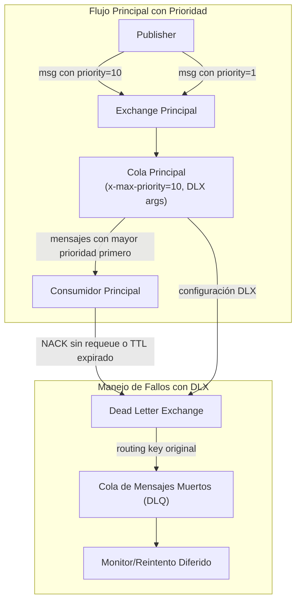
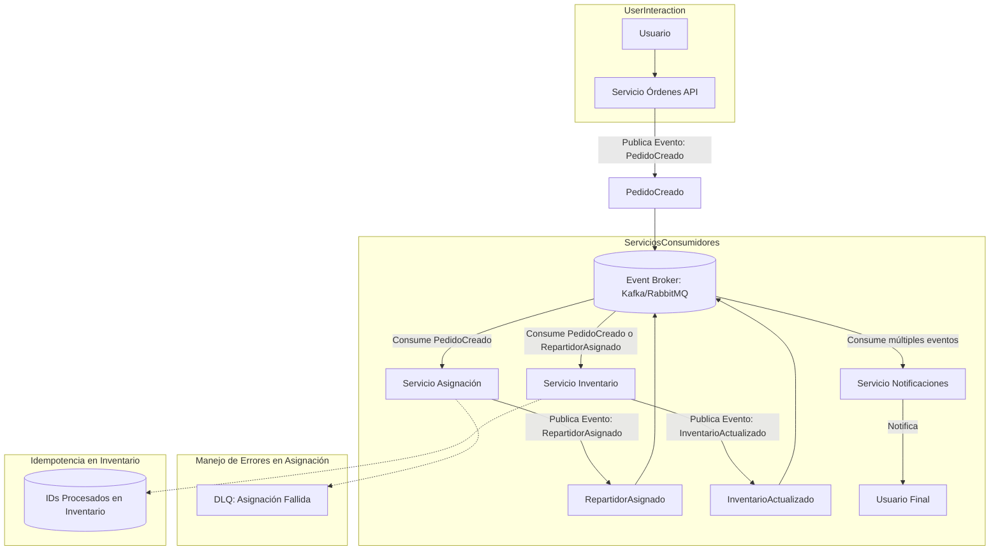

# Event-Driven Architecture (EDA) Fundamentos

## **Parte I: Fundamentos de Event-Driven Architecture**

### Del Monolito a los Eventos

**Introducción:** "Bienvenidos a esta introducción a la Arquitectura Orientada a Eventos. Antes de sumergirnos en los 'cómo', exploremos el 'porqué'. Muchos hemos trabajado con, o al menos oído hablar de, sistemas monolíticos. Son como ese chef increíblemente talentoso que intenta cocinar todos los platos de un banquete de bodas él solo en una única cocina gigante. Al principio, para un restaurante pequeño, funciona. Pero, ¿qué pasa cuando el restaurante se vuelve mundialmente famoso y tiene miles de pedidos por segundo?"

**El Desafío del Crecimiento:** "Empresas icónicas como Netflix, Uber o Amazon se enfrentaron a este 'éxito problemático'. Sus sistemas monolíticos, que alguna vez fueron la base de su operación, se convirtieron en gigantes lentos, difíciles de escalar y frágiles ante los fallos. Un error en el módulo de pagos podía detener las recomendaciones de películas. La solución no fue 'optimizar el monolito', sino repensar fundamentalmente cómo interactúan las partes de un sistema. Así nació la adopción masiva de microservicios y, crucialmente, de la EDA."

**Referencia Clave:** "Para profundizar en esta transición, 'Building Event-Driven Microservices' de Adam Bellemare (O’Reilly) es una lectura esencial, aunque hoy sentaremos las bases."

**Escenario y Métricas Reales:** "Imaginemos 'RapidCart', nuestro gigante de e-commerce ficticio. Hace un año, con 10,000 usuarios/día, su monolito gestionaba pedidos, inventario, pagos y notificaciones. Hoy, con 500,000 usuarios/día y promociones flash, experimenta:

- Errores en cascada: Un 25% de los fallos en el sistema de inventario impactan directamente la toma de pedidos.

- Latencia crítica: Actualizar el catálogo de productos tarda hasta 5 segundos en horas pico.

- Despliegues de alto riesgo: Cualquier cambio, por pequeño que sea, requiere desplegar todo el sistema, con ventanas de mantenimiento cada vez más largas."

**Diagrama Comparativo Interactivo:**

Diferencia conceptual entre un flujo en 'RapidCart' monolítico y uno orientado a eventos:

```mermaid
graph TD

%% Estilos
classDef mono fill:#f9f,stroke:#333,stroke-width:2px;
classDef eda fill:#ccf,stroke:#333,stroke-width:2px;

%% Monolito
subgraph Monolito["RapidCart v1 (Monolito)"]
    class Monolito mono
    U[Usuario Web] --> API[API Gateway]
    API --> OS[Servicio Órdenes]
    OS --> IS[Servicio Inventario]
    IS --> PS[Servicio Pagos]
    PS --> NS[Servicio Notificaciones]
    OS -.-> DB[(Base de Datos Centralizada)]
    IS -.-> DB
    PS -.-> DB
    NS -.-> DB

    subgraph Problemas["Problemas Comunes"]
        P1[Acoplamiento Fuerte]
        P2[Escalabilidad Limitada]
        P3[Punto Único de Fallo]
    end

    OS --> P1
    IS --> P2
    DB --> P3
end

%% EDA
subgraph EDA["RapidCart v2 (EDA)"]
    class EDA eda
    U2[Usuario Web] --> API2[API Gateway]
    API2 -- PedidoCreado --> EB[Event Bus: Kafka/RabbitMQ]

    subgraph Ordenes["Microservicio Órdenes"]
        API2 --> OC[Controller Órdenes]
        OC -- Publica Evento --> EB
    end

    subgraph Inventario["Microservicio Inventario"]
        EB -- PedidoCreado --> SI[Consumidor Inventario]
        SI -- InventarioActualizado --> EB
    end

    subgraph Pagos["Microservicio Pagos"]
        EB -- PedidoCreado --> SP[Consumidor Pagos]
        SP -- PagoProcesado --> EB
    end

    subgraph Notificaciones["Microservicio Notificaciones"]
        EB -- Eventos Relevantes --> SN[Consumidor Notificaciones]
    end

    subgraph Beneficios["Beneficios Clave"]
        B1[Desacoplamiento]
        B2[Escalabilidad Independiente]
        B3[Resiliencia]
    end

    SI --> B1
    SP --> B2
    SN --> B3
end

```



**Preguntas y Discusión:**

1. Si el servicio de notificaciones falla en el monolito, ¿qué ocurre con los nuevos pedidos? ¿Y en el modelo EDA?

2. Si necesitamos escalar solo la parte de procesamiento de pagos debido a una campaña, ¿cómo se aborda en cada arquitectura?

3. ¿Qué nuevos desafíos creen que introduce la EDA en términos de desarrollo y operaciones? Intentemos rellenar la tabla de abajo.

| **Ventaja** | **Desafío** |
| ----------- | ----------- |
| Escalabilidad Independiente | Trazabilidad            |
| Resiliencia ante fallos            | Consistencia Eventual            |
| Time to market            | Coordinación de eventos            |
---

### 1. Anatomía de un Sistema EDA

#### Introducción y Flujo End-to-End con Caso Real (Uber Eats / Plataforma de Streaming)

En una EDA, los componentes no se llaman directamente entre sí. En lugar de eso, 'gritan' al mundo (publican eventos) cuando algo importante sucede, y otros componentes 'escuchan' (se suscriben a eventos) y reaccionan cuando algo de su interés ocurre. El 'megáfono' y los 'auriculares' son gestionados por un sistema central llamado Event Broker o Message Bus.

**Ejemplo Uber Eats**

Pensemos en Uber Eats. Cuando un restaurante marca un pedido como 'Listo para recoger':

1. Productor (Restaurante App): El servicio del restaurante publica un evento PedidoListoParaRecoger. Este evento contiene datos como orderId, restaurantId, pickupLocation.

2. **Event Broker (ej. Kafka):** Recibe este evento y lo almacena de forma duradera en un 'topic' llamado pedidos_listos.

3. **Consumidores:**

- **Servicio de Asignación de Repartidores:** Está suscrito a pedidos_listos. Al recibir el evento, busca repartidores cercanos y disponibles. Una vez asignado, podría publicar un evento RepartidorAsignado.

- **Servicio de Notificaciones al Cliente:** También escucha PedidoListoParaRecoger (o RepartidorAsignado) para informar al cliente.

- **Servicio de Facturación:** Podría escuchar PedidoEntregado (otro evento posterior) para procesar el pago final al restaurante.

- **Dashboard de Analíticas:** Agrega datos de múltiples eventos para mostrar métricas en tiempo real (pedidos por hora, tiempos de entrega promedio)."

* **Diagrama Mermaid (Uber Eats):**



### 2. Componentes Clave

- **Evento:** Un hecho inmutable que ocurrió en el pasado. (Ej: PedidoPagado).

- **Productor (Publisher/Source):** Aplicación que origina el evento.

- **Consumidor (Subscriber/Sink/Handler):** Aplicación que se suscribe y reacciona a eventos.

- **Event Broker (Message Broker/Event Bus):** Intermediario que recibe eventos de productores y los distribuye a consumidores interesados. Garantiza el desacoplamiento.

- **Tópico/Canal (Topic/Channel):** Categoría o "tema" al que se publican los eventos. Los consumidores se suscriben a tópicos específicos.

### **2.1 Tipos de Eventos y Diseño de Esquemas**

No todos los eventos son iguales. Clasificarlos nos ayuda a diseñar mejor nuestros sistemas. Pensemos en su propósito y contenido.

**Eventos de Dominio (Domain Events):** Representan hechos significativos dentro de un contexto de negocio (Bounded Context en DDD). Son el corazón de tu lógica de negocio.

```typescript
// --- Evento de Dominio (Core Business de un E-commerce) ---
// Describe un hecho fundamental: un cliente ha realizado un pedido.
interface OrderPlaced {
  readonly eventType: "OrderPlaced"; // Identificador único del tipo de evento
  readonly eventId: string; // UUID único para esta instancia del evento (para idempotencia/trazabilidad)
  readonly timestamp: string; // ISO 8601: Cuándo ocurrió el evento
  readonly aggregateId: string; // ID de la orden (la entidad principal afectada)
  readonly source: "OrderService"; // Quién originó el evento
  readonly version: "1.0"; // Versión del esquema del evento
  readonly payload: {
    orderId: string;
    customerId: string;
    items: { productId: string; quantity: number; unitPrice: number }[];
    totalAmount: number;
    currency: "USD" | "EUR";
    shippingAddress: {
      /* ... */
    };
    correlationId: string; // Para rastrear el flujo de eventos
  };
}
```

- _Ejemplo:_ ReservaDeVueloConfirmada, ProductoAñadidoAlCarrito.

- _Características:_ Ricos en información, lenguaje ubicuo del dominio.

**Eventos de Notificación (Notification Events o Thin Events):** Indican que algo sucedió, pero con mínima información. El consumidor a menudo necesita consultar al servicio de origen para obtener más detalles.

```typescript
// --- Evento de Notificación (Indicando un cambio, pocos datos) ---
// Usado para invalidar cachés o disparar re-cálculos ligeros.
interface ProductPriceChanged {
  readonly eventType: "ProductPriceChanged";
  readonly eventId: string;
  readonly timestamp: string;
  readonly source: "PricingService";
  readonly version: "1.0";
  readonly payload: {
    productId: string;
    newPrice: number; // Podría incluir el precio anterior también
    currency: "USD" | "EUR";
  };
}
```

- _Ejemplo:_ ClienteActualizado (solo con clienteId).

- _Ventaja:_ Pequeños, rápidos de transmitir.

- _Desventaja:_ Pueden generar llamadas de vuelta (request-response) al productor si el consumidor necesita más datos.

**Eventos de Estado Transferido (Event-Carried State Transfer):** Llevan suficiente información para que el consumidor no necesite consultar al productor.

- _Ejemplo:_ PerfilDeUsuarioActualizado (con userId, nombre, email, preferenciasNuevas).

- _Ventaja:_ Autocontenidos, reducen la carga al productor.

- _Desventaja:_ Más grandes, riesgo de acoplamiento si muchos datos cambian.

**Eventos de Integración (Integration Events):** Facilitan la comunicación entre diferentes Bounded Contexts o sistemas externos.

```typescript
// --- Evento de Integración (Comunicación entre Bounded Contexts o con sistemas externos) ---
// Un sistema de CRM reacciona cuando un nuevo usuario se registra en la plataforma principal.
interface NewUserRegisteredForCRM {
  readonly eventType: "NewUserRegisteredForCRM";
  readonly eventId: string;
  readonly timestamp: string;
  readonly source: "AuthService"; // Originado por el servicio de autenticación/usuarios
  readonly version: "1.1";
  readonly payload: {
    readonly email: string;
    readonly fullName?: string; // Opcional, el CRM podría tener que enriquecerlo
    readonly registrationDate: string;
  };
}
```

- _Ejemplo:_ StockDeAlmacenBajoNotificado (desde el sistema de inventario al sistema de compras).

---

### 2.2 Ejercicio de Diseño de Eventos

**Escenario:**
Un sistema de gestión de bibliotecas online.

**Tarea:**

1. Identifiquemos 3 eventos cruciales (ej: LibroPrestado, DevolucionRegistrada, NuevoMiembroInscrito).

2. Para UNO de esos eventos, escribir estructura en TypeScript (similar al ejemplo). Pensar en:

- ¿Qué información es _esencial_ que lleve el evento?
- ¿Quién sería el productor? ¿Quiénes podrían ser los consumidores?
- ¿Sería un evento de dominio, notificación o de estado transferido? ¿Por qué?

---

### 3. Patrones Clave en EDA

La EDA no es solo publicar y suscribir. Existen patrones de diseño probados que nos ayudan a resolver problemas comunes de forma elegante y robusta. Veremos algunos de los más influyentes.

**Tabla Comparativa:**

|                                                     |                                                                                                                                                |                                                                                 |                                                                            |                                                            |                                                     |                                                          |
| --------------------------------------------------- | ---------------------------------------------------------------------------------------------------------------------------------------------- | ------------------------------------------------------------------------------- | -------------------------------------------------------------------------- | ---------------------------------------------------------- | --------------------------------------------------- | -------------------------------------------------------- |
| **Patrón**                                          | **Descripción Breve**                                                                                                                          | **Caso de Uso Principal**                                                       | **Ejemplo Real**                                                           | **Tech Típica**                                            | **Ventaja Clave**                                   | **Desafío Común**                                        |
| **Event Sourcing**                                  | Persistir todos los cambios al estado de una aplicación como una secuencia de eventos.                                                         | Auditoría completa, reconstrucción de estado, debugging.                        | Sistema bancario (historial de transacciones), Git (historial de commits). | EventStoreDB, Axon Framework, Kafka (como log)             | Trazabilidad total, capacidad de análisis temporal. | Complejidad en consultas de estado actual.               |
| **CQRS (Command Query Responsibility Segregation)** | Separar los modelos y almacenamientos para operaciones de escritura (Commands) y lectura (Queries).                                            | Sistemas con alta carga de lectura y/o escritura, modelos de datos complejos.   | Dashboards analíticos vs. procesamiento de transacciones en e-commerce.    | Kafka + Elasticsearch, RDBMS (escritura) + NoSQL (lectura) | Optimización independiente de lecturas/escrituras.  | Consistencia eventual, duplicación de datos.             |
| **Saga Pattern**                                    | Gestionar transacciones distribuidas que abarcan múltiples servicios mediante una secuencia de transacciones locales y eventos compensatorios. | Reservas de viajes (vuelo+hotel+coche), proceso de checkout en e-commerce.      | Orquestación de microservicios para un pedido complejo.                    | Temporal.io, AWS Step Functions, NServiceBus, Axon Saga    | Mantiene consistencia en sistemas distribuidos.     | Complejidad en diseño y manejo de fallos/compensaciones. |
| **Event-Carried State Transfer**                    | Los eventos llevan todos los datos necesarios para que el consumidor actúe, evitando llamadas de vuelta al productor.                          | Replicación de datos entre servicios, reducción de latencia para el consumidor. | Servicio de catálogo de productos actualiza caché de servicio de búsqueda. | Kafka, RabbitMQ (con eventos "ricos")                      | Autonomía del consumidor, menor carga al productor. | Eventos más grandes, posible acoplamiento de datos.      |
| **Outbox Pattern**                                  | Garantizar que un evento se publique si, y solo si, la transacción de negocio principal se completa con éxito.                                 | Evitar inconsistencias entre la BD del servicio y el broker de eventos.         | Publicar PedidoCreado solo si el pedido se guarda en la BD.                | Debezium + Kafka, Transacciones locales (BD+tabla outbox)  | Entrega de eventos más fiable.                      | Requiere un proceso que lea del outbox y publique.       |

**Profundización (Párrafos por patrón):**

**Event Sourcing:** "Imagina que en lugar de guardar el saldo actual de una cuenta, guardas cada depósito y retiro. Ese es el espíritu de Event Sourcing. El estado actual se deriva reproduciendo los eventos. Esto es oro para auditorías y para entender _cómo_ llegamos a un estado. El reto es que obtener el estado actual puede requerir procesar muchos eventos, aunque se usan 'snapshots' para optimizar."

**CQRS:** "Piensa en un periódico: una redacción optimizada para escribir noticias (Commands) y una imprenta optimizada para distribuirlas masivamente (Queries). CQRS aplica esto a los datos. Puedes tener una base de datos relacional súper normalizada para las escrituras y una base de datos NoSQL desnormalizada y optimizada para búsquedas rápidas para las lecturas. La 'magia' está en cómo sincronizas ambas, a menudo usando eventos."

**Saga:** "¿Cómo reservas un paquete de vuelo + hotel si son servicios distintos y uno puede fallar? La Saga lo maneja. Si el vuelo se reserva (evento: VueloReservado), se intenta reservar el hotel. Si el hotel falla (evento: FalloReservaHotel), se dispara una acción compensatoria (evento: CancelarVueloReservado). Hay dos tipos: _Coreografía_ (servicios se escuchan y reaccionan) y _Orquestación_ (un coordinador central dirige el flujo)."

**Event-Carried State Transfer:** "Cuando un servicio publica un evento ProductoActualizado, ¿debe el consumidor llamar de vuelta al servicio de productos para obtener los detalles? Con este patrón, el evento ya lleva nombre, precio, descripción. Esto hace al consumidor más autónomo y rápido, pero cuidado con enviar 'demasiada' información o información que cambia muy frecuentemente, podría acoplar los servicios."

**Outbox Pattern:** "Es crucial: ¿Qué pasa si guardas el pedido en tu base de datos, pero justo antes de publicar el evento PedidoCreado en Kafka, tu servicio se cae? El pedido existe pero nadie se entera. El Outbox Pattern resuelve esto: guardas el pedido Y el evento en la misma transacción de base de datos (en una tabla 'outbox'). Otro proceso (como Debezium) lee esta tabla y publica los eventos de forma fiable al broker."

---

### 3.1 Ejercicio de Diseño de Patrones

**Escenario:**
Una plataforma de e-learning "EduStream" quiere implementar nuevas funcionalidades:

1. **Inscripción a Curso:** Un estudiante se inscribe, se le da acceso al material, se notifica al instructor y se genera una factura. Esto debe ser una transacción consistente.

2. **Progreso del Estudiante:** Se necesita un dashboard para instructores que muestre el progreso casi en tiempo real de los estudiantes en sus cursos (videos vistos, quizzes completados). Las escrituras de progreso son frecuentes.

3. **Certificados:** Al completar un curso, se debe generar un certificado inmutable y auditable.

**Tarea:**

1. Para cada funcionalidad (Inscripción, Progreso, Certificados), discutir y seleccionar **UN patrón principal** de los vistos que consideren más adecuado.

2. Justificar brevemente su elección para cada uno.

**Ejemplo de Diagrama para "Inscripción a Curso" (usando Saga):**



---

### 4. Deep Dive: Brokers de Eventos (Kafka vs. RabbitMQ)

**Introducción y Arquitectura Interna Comparada:**

El corazón de cualquier EDA es el broker de eventos. Actúa como la oficina de correos central para todos los mensajes. Dos de los jugadores más dominantes son RabbitMQ y Apache Kafka. Aunque ambos mueven mensajes, están diseñados con filosofías y fortalezas diferentes.

### 4.1 RabbitMQ (El Cartero Inteligente):

Piensen en RabbitMQ como un sistema de correo muy sofisticado con carteros inteligentes (exchanges) que saben exactamente cómo enrutar cada carta (mensaje) a buzones específicos (colas) basados en reglas complejas (bindings y routing keys).

**Componentes Clave:**

- **Publisher:** Envía mensajes.

- **Exchange:** Recibe mensajes de publishers y los enruta a colas. Tipos: Direct, Topic, Fanout, Headers.

- **Queue:** Almacena mensajes hasta que un consumidor los procesa.

- **Binding:** Regla que conecta un exchange a una cola (a menudo con un routing key o patrón).

- **Consumer:** Lee mensajes de las colas.

* **Fortalezas:** Enrutamiento flexible y complejo, priorización de mensajes, confirmaciones de entrega (acknowledgements), ideal para RPC sobre mensajería, buena interfaz de gestión.

* **Ideal para:** Escenarios de work queues, enrutamiento complejo de mensajes, cuando necesitas control granular sobre el flujo de mensajes.

### 4.2 Apache Kafka (El Diario Distribuido de Alto Rendimiento):

"Kafka es más como un 'log de commits' o un diario distribuido, inmutable y de altísimo rendimiento. Los eventos se escriben en 'topics' (como categorías en el diario) y se almacenan durante un tiempo configurable. Los consumidores leen de estos topics a su propio ritmo, manteniendo un 'puntero' (offset) de dónde se quedaron."

**Componentes Clave:**

- **Producer:** Escribe eventos en topics.

- **Topic:** Categoría o feed de eventos. Un topic se divide en particiones.

- **Partition:** Un log ordenado e inmutable. Los eventos dentro de una partición tienen un orden garantizado. Permite paralelismo.

- **Offset:** Posición de un mensaje dentro de una partición.

- **Consumer Group:** Uno o más consumidores que conjuntamente consumen un topic. Cada partición es asignada a un solo consumidor dentro del grupo, permitiendo escalar el consumo.

- **Broker:** Un servidor Kafka. Un clúster de Kafka tiene varios brokers.

- **ZooKeeper/KRaft:** Gestiona metadatos del clúster (aunque ZooKeeper está siendo reemplazado por KRaft).

* **Fortalezas:** Rendimiento extremo (throughput muy alto), escalabilidad horizontal masiva, durabilidad de mensajes (actúa como almacenamiento), stream processing (con Kafka Streams/ksqlDB).

* **Ideal para:** Ingesta de grandes volúmenes de datos (logs, métricas, IoT), event sourcing, stream processing, cuando la durabilidad y el replay de eventos son cruciales.



---

### 4.3 Ejercicio de Configuración y Elección

**Escenario 1: Sistema de Notificaciones Críticas.**

Requisitos: Se deben enviar notificaciones (email, SMS, push) a usuarios. Algunas notificaciones son más urgentes que otras (ej: "Alerta de Fraude" vs "Newsletter Semanal"). Se necesita garantizar que cada notificación se procese al menos una vez. El volumen es moderado (miles/hora).

**Tarea:**

1. ¿Qué broker elegirían (RabbitMQ o Kafka)? ¿Por qué?

2. Si eligen RabbitMQ, ¿qué tipo de Exchange usarían para permitir enrutar por tipo de notificación (ej: sms.urgente, email.informativo)?

3. ¿Cómo implementarían la priorización?

**Escenario 2: Plataforma de Analítica de Clicks en Web.**

Requisitos: Recolectar cada click de millones de usuarios en un sitio web (potencialmente 1 millón de eventos/minuto en pico). Los datos deben almacenarse por lo menos 7 días para análisis y re-procesamiento. El orden de los clicks _por usuario_ es importante.

**Tarea:**

1. ¿Qué broker elegirían? ¿Por qué?

2. Si eligen Kafka, ¿cómo configurarían el Topic (nombre, número de particiones)? ¿Cómo asegurarían el orden por usuario?

3. ¿Qué estrategia de retención de mensajes usarían?

Para el Escenario 2, si usamos Kafka, la creación de un topic con particiones podría verse así en Node.js con kafkajs:

```typescript
  // KafkaJS Productor y Creación de Topic (Ejemplo para Escenario 2)
  import { Kafka, CompressionTypes, logLevel } from 'kafkajs';

  const kafka = new Kafka({
    clientId: 'clickstream-producer-app',
    brokers: ['kafka-broker1:9092', 'kafka-broker2:9092'], // Lista de tus brokers Kafka
    logLevel: logLevel.WARN, // Ajusta el nivel de log según necesidad
  });

  const producer = kafka.producer({
    allowAutoTopicCreation: false, // Es mejor crear topics explícitamente en producción
    idempotent: true, // Habilita la producción idempotente para evitar duplicados por reintentos del productor
    maxInFlightRequests: 5, // Controla el número de requests que pueden estar "en vuelo"
  });

  const admin = kafka.admin();

  async function setupClickstreamTopic() {
    await admin.connect();
    const topicName = 'website-clicks';
    const existingTopics = await admin.listTopics();

    if (!existingTopics.includes(topicName)) {
      await admin.createTopics({
        validateOnly: false,
        waitForLeaders: true,
        topics: [
          {
            topic: topicName,
            numPartitions: 12, // Un buen número de particiones para paralelizar el consumo
                              // Podría ser #CPUs en el cluster de consumidores o más
            replicationFactor: 3, // Para alta disponibilidad (requiere al menos 3 brokers)
            configEntries: [
              { name: 'retention.ms', value: (7 * 24 * 60 * 60 * 1000).toString() }, // 7 días en milisegundos
              { name: 'min.insync.replicas', value: '2' }, // Asegura que al menos 2 réplicas estén sincronizadas para ACKs
              // Podrías añadir 'message.timestamp.type': 'LogAppendTime' o 'CreateTime'
            ]
          }
        ]
      });
      console.log(`Topic ${topicName} creado con éxito.`);
    } else {
      console.log(`Topic ${topicName} ya existe.`);
    }\
    await admin.disconnect();
  }

  async function sendClickEvent(userId: string, eventData: object) {
    // Para asegurar el orden por usuario, usar userId como 'key' del mensaje.
    // Kafka usará esta clave para enviar consistentemente mensajes del mismo usuario a la misma partición.
    await producer.send({
      topic: 'website-clicks',
      messages: [
        {
          key: userId, // Clave para el particionamiento
          value: JSON.stringify(eventData),
          headers: { // Cabeceras opcionales para metadatos
              'event-source': 'web-client',
              'correlation-id': crypto.randomUUID()
          }
        }
      ]
      compression: CompressionTypes.GZIP, // Comprimir para ahorrar ancho de banda y almacenamiento
    });
  }

  // Uso (ejemplo simplificado):
  // async function main() {
  //   await setupClickstreamTopic();
  //   await producer.connect();
  //   await sendClickEvent('user-123', { page: '/home', timestamp: Date.now() });
  //   // ... enviar más eventos
  //   await producer.disconnect();
  // }\
  // main().catch(console.error);
```

---

### 5. Implementación Práctica y Consideraciones Avanzadas

#### 5.1 Configuración Avanzada RabbitMQ: Exchanges y Bindings

**Introducción y Escenario:**

Hemos visto que RabbitMQ es excelente para enrutamiento. Vamos a explorar cómo los 'Topic Exchanges' nos dan un poder increíble para filtrar y dirigir mensajes a las colas correctas. Imaginen un sistema de logging centralizado para una aplicación grande con múltiples servicios (pagos, inventario, usuarios).

**Objetivo:** Queremos que los logs de ERROR de cualquier servicio vayan a una cola de "Alertas Críticas". Los logs de INFO del servicio de pagos vayan a una cola específica para auditoría de pagos. Todos los logs (INFO, WARN, ERROR) de todos los servicios también deben ir a una cola genérica para archivado.

**Diagrama de Topología (Topic Exchange):**



---

#### 5.2 Explicación de Routing Keys y Patrones de Binding

**log.pagos.ERROR:** Routing key específica.

- Comodín que sustituye cero o más palabras. log.# captura todo lo que empiece con log.

- \*: Comodín que sustituye exactamente una palabra. log.\*.ERROR capturaría log.pagos.ERROR y log.inventario.ERROR, pero no log.pagos.detalle.ERROR.

- critical_alerts se suscribe a #.ERROR (o log.\*.ERROR si todos los logs siguen el patrón log.servicio.nivel).

- payment_audit_logs se suscribe a log.pagos.INFO.

- all_logs_archive se suscribe a log.#.

#### 5.3 Ejercicio de Depuración y Diseño de Bindings

**Problema 1 (Depuración):**

Los mensajes de log.inventario.WARN no están llegando a la cola critical_alerts. Viendo el diagrama y los bindings, ¿cuál podría ser el problema y cómo lo solucionarían?

> _Pista:_ El binding actual de critical_alerts es #.ERROR.

Solución esperada:

Cambiar el binding a algo como #.WARN o #.ERROR si se quieren ambos, o un binding más general y filtrar en el consumidor, o añadir un binding específico log.inventario.WARN si solo esa combinación es crítica. O mejor, log.#.WARN y log.#.ERROR si se quiere capturar todos los WARN y ERROR.

**Problema 2 (Diseño):** "Necesitamos una nueva cola user_activity_feed que reciba todos los logs (INFO, WARN, ERROR) SOLO del Servicio Usuarios y también los logs de INFO del Servicio Pagos. ¿Qué bindings necesitaría esta nueva cola al logs_exchange?"

Solución esperada:

1. log.usuarios.# (para todos los logs del servicio de usuarios)

2. log.pagos.INFO (para los logs INFO de pagos)

- Snippet de Código (amqplib en Node.js - Declaración y Binding):

"Así se vería la declaración de una cola y su binding en Node.js con amqplib:"

```typescript
// RabbitMQ: Declaración de Exchange, Cola y Binding con amqplib
import amqp from "amqplib";

async function setupRabbitMQLogTopology() {
  const connection = await amqp.connect("amqp://localhost"); // o tu URL de RabbitMQ
  const channel = await connection.createChannel();

  const exchangeName = "logs_exchange";
  const criticalQueueName = "critical_alerts";
  const paymentsAuditQueueName = "payment_audit_logs";
  const userActivityQueueName = "user_activity_feed"; // Nueva cola del ejercicio

  await channel.assertExchange(exchangeName, "topic", { durable: true }); // 2. Declarar Colas (idempotentes)

  await channel.assertQueue(criticalQueueName, { durable: true });
  await channel.assertQueue(paymentsAuditQueueName, { durable: true });
  await channel.assertQueue(userActivityQueueName, { durable: true }); // Nueva // 3. Crear Bindings // Para critical_alerts: todos los errores y warnings

  await channel.bindQueue(criticalQueueName, exchangeName, "*.ERROR"); // Captura log.servicio.ERROR
  await channel.bindQueue(criticalQueueName, exchangeName, "*.WARN"); // Captura log.servicio.WARN // O de forma más general si el nivel es siempre la última palabra: #.ERROR, #.WARN // Para payment_audit_logs: solo INFO de pagos
  await channel.bindQueue(
    paymentsAuditQueueName,
    exchangeName,
    "log.pagos.INFO"
  ); // Para user_activity_feed (solución al ejercicio de diseño)

  await channel.bindQueue(
    userActivityQueueName,
    exchangeName,
    "log.usuarios.#"
  );
  await channel.bindQueue(
    userActivityQueueName,
    exchangeName,
    "log.pagos.INFO"
  ); // Sí, una cola puede tener múltiples bindings

  console.log("Topología de logging en RabbitMQ configurada."); // Ejemplo de publicación (desde un servicio) // channel.publish(exchangeName, 'log.inventario.ERROR', Buffer.from('Fallo crítico en inventario!')); // channel.publish(exchangeName, 'log.usuarios.INFO', Buffer.from('Usuario X actualizó perfil.')); // Cerrar canal y conexión (en una app real, se mantienen abiertos) // await channel.close(); // await connection.close();
}

// setupRabbitMQLogTopology().catch(console.error);
```

---

#### 5.4 Patrones de Consumo: Prioridades y Manejo de Errores

**Introducción:**

No todos los mensajes tienen la misma urgencia. RabbitMQ permite colas con prioridad. Además, ¿qué pasa si un consumidor falla procesando un mensaje? No queremos perderlo. Necesitamos estrategias de reintento y 'Dead Letter Exchanges' (DLX).

- Colas con Prioridad: Se declaran con x-max-priority. Los publishers envían mensajes con una propiedad priority. Los mensajes con mayor prioridad son consumidos primero (dentro de lo posible, no es una garantía absoluta de orden estricto si hay muchos consumidores).

Manejo de Errores:

- Ack/Nack: El consumidor debe confirmar (ack) el mensaje si lo procesó bien. Si falla, puede rechazarlo (nack).

- Requeue: Al hacer nack, se puede pedir a RabbitMQ que lo vuelva a encolar (¡cuidado con bucles infinitos de errores!).

- Dead Letter Exchange (DLX): Configurar una cola para que, si un mensaje es rechazado (nack sin requeue) o expira (TTL), se envíe a un DLX. Este exchange puede enrutarlo a una "cola de mensajes muertos" (Dead Letter Queue, DLQ) para análisis manual o re-procesamiento.

* Diagrama DLX y Prioridades:



Ejercicio Práctico y Snippet:

Escenario: Tenemos una cola task_queue que procesa tareas. Algunas tareas son "críticas" y deben procesarse antes. Si una tarea falla 3 veces, debe ir a una DLQ.

Tarea:

1. ¿Cómo declararían task_queue para soportar prioridades y un DLX? (Conceptual)

2. Esbocen el código del consumidor para:
   - Publicar mensajes con diferentes prioridades.
   - Procesar mensajes.
   - Si hay un error "transitorio" (ej: servicio externo no disponible), hacer nack con requeue (pero con cuidado, quizás limitado).
   - Si hay un error "permanente" o demasiados reintentos, hacer nack sin requeue para que vaya al DLX. (El conteo de reintentos se puede manejar en la cabecera del mensaje o en un sistema externo).

Snippet TypeScript (Consumidor con Prioridad y DLX básico):

```typescript
// RabbitMQ: Consumidor con manejo de errores y DLX (conceptual)
import amqp from "amqplib";

const TASK_QUEUE = "task_queue";
const DLX_EXCHANGE = "tasks_dlx";
const DLQ_QUEUE = "task_dlq";

async function setupQueuesAndDLX(channel: amqp.Channel) {
  // 1. Declarar el DLX (suele ser un fanout o direct)
  await channel.assertExchange(DLX_EXCHANGE, "direct", { durable: true }); // 2. Declarar la DLQ y bindearla al DLX

  await channel.assertQueue(DLQ_QUEUE, { durable: true });
  await channel.bindQueue(DLQ_QUEUE, DLX_EXCHANGE, "dead-letter"); // Routing key para DLQ // 3. Declarar la cola principal con argumentos para prioridad y DLX

  await channel.assertQueue(TASK_QUEUE, {
    durable: true,
    maxPriority: 10, // Soportar prioridades de 0 a 10
    deadLetterExchange: DLX_EXCHANGE,
    deadLetterRoutingKey: "dead-letter", // Mensajes nack'eados irán aquí
  });
  console.log("Colas con prioridad y DLX configuradas.");
}

async function consumeTasks(channel: amqp.Channel) {
  console.log(
    `[*] Esperando tareas en ${TASK_QUEUE}. Para salir presiona CTRL+C`
  );

  channel.consume(
    TASK_QUEUE,
    async (msg) => {
      if (msg !== null) {
        const task = JSON.parse(msg.content.toString());
        const priority = msg.properties.priority || 0;
        let attempt =
          (msg.properties.headers && msg.properties.headers["x-attempt"]) || 1;

        console.log(
          `[x] Recibido (Prio: ${priority}, Intento: ${attempt}):`,
          task
        );

        try {
          // Simular procesamiento
          if (task.type === "critical" && Math.random() < 0.3 && attempt < 3) {
            // Falla a veces
            throw new Error("Error transitorio simulado");
          }
          if (task.type === "bad_task") {
            throw new Error("Error permanente, tarea malformada");
          }
          console.log(`[v] Tarea procesada: ${task.id}`);
          channel.ack(msg); // Confirmar mensaje
        } catch (error: any) {
          console.error(
            `[!] Error procesando tarea ${task.id}: ${error.message}`
          );
          if (error.message.includes("transitorio") && attempt < 3) {
            console.log(`    Reencolando tarea (intento ${attempt + 1})`); // Para reencolar con reintento, es mejor republicar con delay y x-attempt aumentado // Nack(requeue=true) puede ser peligroso. Una mejor estrategia es republicar a una cola de espera. // Por simplicidad aquí, vamos a nack(requeue=false) y dejar que DLX actúe o republicar con delay. // Para este ejemplo, si es transitorio y < 3 intentos, lo mandamos a DLX y podría ser reprocesado desde ahí. // O una estrategia más avanzada: republicar a una cola de reintentos con delay. // Aquí, simplemente lo nackeamos para que vaya a DLX si no es requeue. // Si queremos reintentar ANTES de DLX: // channel.nack(msg, false, true); // ¡CUIDADO CON BUCLES! // Mejor:
            setTimeout(() => {
              msg.properties.headers = {
                ...msg.properties.headers,
                "x-attempt": attempt + 1,
              };
              channel.publish(
                msg.fields.exchange,
                msg.fields.routingKey,
                msg.content,
                msg.properties
              );
              channel.ack(msg); // Ack el original, ya que lo republicamos manualmente.
              console.log(
                `    Tarea ${
                  task.id
                } republicada para reintento (nuevo intento ${attempt + 1})`
              );
            }, 1000 * attempt); // Delay exponencial simple
          } else {
            console.log(
              `    Enviando tarea ${task.id} a DLQ (demasiados intentos o error permanente).`
            );
            channel.nack(msg, false, false); // No reencolar, enviar a DLX/DLQ
          }
        }
      }
    },
    { noAck: false }
  ); // Asegurarse que noAck es false para control manual
}

// Ejemplo de publicación con prioridad
// async function publishTasks(channel: amqp.Channel) {
//   await channel.sendToQueue(TASK_QUEUE, Buffer.from(JSON.stringify({id:1, type:'normal'})), {priority: 1});
//   await channel.sendToQueue(TASK_QUEUE, Buffer.from(JSON.stringify({id:2, type:'critical'})), {priority: 10});
//   await channel.sendToQueue(TASK_QUEUE, Buffer.from(JSON.stringify({id:3, type:'bad_task'})), {priority: 5});
// }

// async function main() {
//   const connection = await amqp.connect('amqp://localhost');
//   const channel = await connection.createChannel();
//   await setupQueuesAndDLX(channel);
//   // await publishTasks(channel); // Descomentar para poblar la cola
//   await consumeTasks(channel);
// // No cerrar conexión aquí para que el consumidor siga corriendo
// }
// main().catch(console.error);
```

- Discusión: "El manejo de reintentos puede ser complejo. Estrategias comunes incluyen 'backoff exponencial' y limitar el número de reintentos antes de enviar a una DLQ. La DLQ no es un basurero, es una oportunidad para investigar fallos."

---

#### 5.5 Idempotencia y Semántica "Exactly-Once"

En sistemas distribuidos, los mensajes pueden duplicarse (ej: un publicador reintenta tras un timeout de red, pero el mensaje original sí llegó). Si procesar un mensaje dos veces tiene efectos secundarios (ej: cobrar a un cliente dos veces), ¡tenemos un problema! La **idempotencia** significa que procesar el mismo mensaje múltiples veces tiene el mismo efecto que procesarlo una sola vez.

Exactly-Once Semantics (EOS): El santo grial. Garantizar que cada mensaje se procese _efectivamente_ una sola vez. Es difícil de lograr end-to-end. Kafka ofrece EOS en ciertos escenarios (productor idempotente + transacciones entre topics). RabbitMQ se enfoca más en 'at-least-once' o 'at-most-once' por defecto, pero la idempotencia se implementa en el consumidor.

¿Por qué ocurren duplicados?
- Reintentos del productor.
- Reentregas del broker (ej: consumidor falla después de recibir pero antes de hacer ack).
- Fallos de red.

---

Técnicas para Lograr Idempotencia en el Consumidor:

**5.5.1 Clave de Idempotencia Única:**

- El productor incluye un ID único en cada mensaje/evento (ej: eventId, transactionId).
- El consumidor mantiene un registro de los IDs ya procesados.

Implementación:

Base de Datos: Guardar el ID en una tabla. Antes de procesar, verificar si existe. Usar una transacción para procesar y guardar el ID.

- _Pros:_ Persistente, transaccional.
- _Contras:_ Puede ser más lento, carga a la BD.

**5.5.2 Caché Distribuida (Redis): Usar SETNX (SET if Not eXists) con el ID y un TTL.**

- _Pros:_ Muy rápido.
- _Contras:_ Posible pérdida si Redis cae y no es persistente (depende de config), TTL debe ser mayor que el tiempo máximo de procesamiento + ventana de duplicados.

**5.5.3 Bloom Filter**:

Estructura de datos probabilística para chequear si un elemento _podría_ haber sido visto. Si dice "no", seguro no ha sido visto. Si dice "sí", _podría_ ser (falso positivo), entonces chequear en BD. Reduce la carga a la BD.

- _Pros:_ Eficiente en espacio y tiempo para el chequeo inicial.
- _Contras:_ Falsos positivos, requiere fallback.

**5.5.4 Operaciones de Negocio Idempotentes por Diseño:**

Si la operación en sí misma es idempotente, no necesitas rastrear IDs.

- Ejemplo: SET user_status = 'ACTIVE'. Llamarlo múltiples veces no cambia el resultado después de la primera vez.

- Ejemplo: Crear un recurso si no existe (UPSERT con chequeo).

Referencia: "Para una inmersión profunda en EOS con Kafka, busquen 'Exactly-once Semantics in Apache Kafka' por Confluent."

---

#### 5.6 Ejercicio de Diseño: Sistema de Logística

Escenario: Un servicio de procesamiento de pagos recibe eventos ProcesarPago de Kafka. Cada evento tiene un pagoId único. El procesamiento implica llamar a una pasarela de pago externa.

Preguntas para Discusión:

1. ¿Por qué es crítica la idempotencia aquí?
2. Compara usar Redis (SETNX) vs. una tabla PagosProcesados (pagoId PK, estado) en una BD SQL para la detección de duplicados. ¿Pros y contras de cada uno en este contexto?
3. ¿Cómo manejarían un fallo de red al llamar a la pasarela de pago _después_ de haber marcado el pagoId como "en proceso" en su sistema de idempotencia, pero _antes_ de obtener la respuesta final de la pasarela?



---
