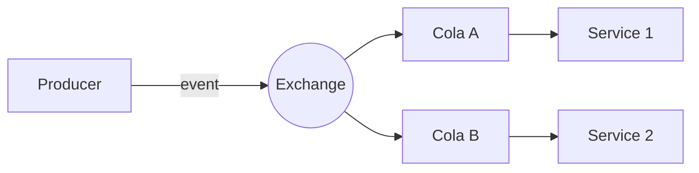

# Tema VI (parte 1) — Fundamentos de Event-Driven Architecture

## 1. ¿Qué es EDA?

- Paradigma donde **eventos** son la unidad de comunicación.  
- Productor emite → Broker almacena/rutea → Consumidores reaccionan.

## 2. Beneficios clave

| Beneficio | Impacto |
|-----------|---------|
| **Escalabilidad** | Consumidores se replican sin cambiar productor |
| **Resiliencia** | Productores no dependen de disponibilidad de consumidores |
| **Flexibilidad** | Nuevos servicios se suscriben sin tocar código legado |

## 3. Patrones EDA

| Patrón | Uso | Tool típico |
|--------|-----|------------|
| **Event Sourcing** | Historial completo | Postgres, Kafka |
| **Event Streams** | Telemetría / IoT | Kafka, Kinesis |
| **Event Broker** | Integración microservicios | RabbitMQ, AmazonMQ |

## 4. Brokers comparados

| Criterio | RabbitMQ | Kafka |
|----------|----------|-------|
| Latencia | < 5 ms | ~ 10-20 ms |
| Orden por cola | Garantizada | Por partición |
| Retención | Opcional (TTL) | Configurable días |
| Semántica | Message queue | Log append-only |
| Ideal | Work queues, RPC async | Event streaming heavy |

## 5. Versionado de eventos

- Añade campo `v` entero.  
- Consumidor ignora campos desconocidos.  
- Usar *up-casters* en ES para re-hidratar Aggregates.