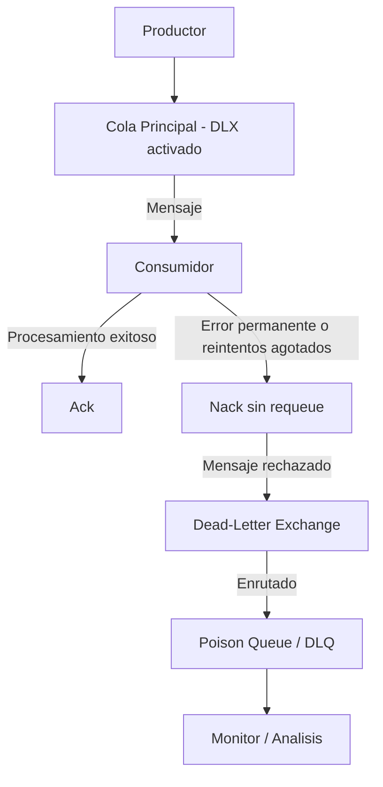
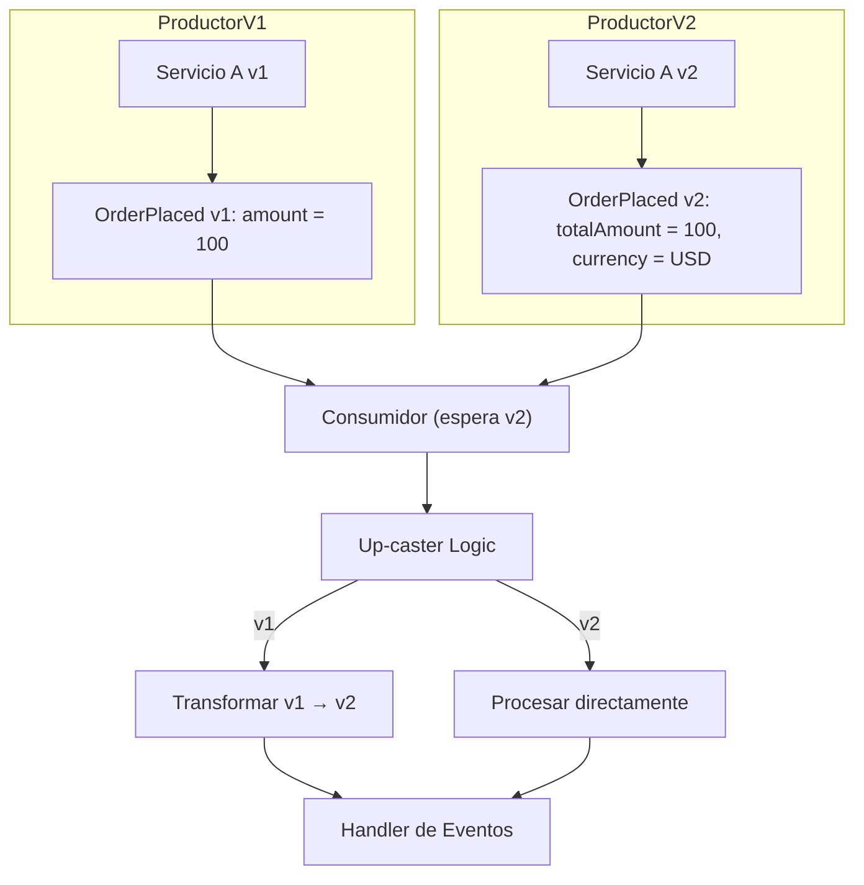

# Día 2: Construyendo Sistemas EDA Robustos y Observables con RabbitMQ

Hoy, nos centramos en la **robustez y la observabilidad** de estos sistemas, utilizando **RabbitMQ con Node.js**. ¿Qué pasa cuando las cosas fallan? ¿Cómo evolucionamos nuestros eventos sin romper todo? ¿Y cómo sabemos qué está pasando dentro de nuestro flujo de eventos?

**Configuración del Entorno Práctico (10 min):**

1. Asegúrense de tener Docker y Node.js (v20+ recomendado) instalados.
2. Clonen el repositorio base para los ejercicios de hoy: `git clone [URL_DEL_REPO_DIA_2]`.
3. Dentro del repositorio, ejecuten `docker-compose up -d` para iniciar RabbitMQ en un contenedor. Esto nos dará una instancia limpia y lista para usar.

**`docker-compose.yml`:**

```yaml
services:
  rabbitmq:
    image: rabbitmq:4.1-management # Usamos una versión con interfaz de gestión
    container_name: eda_rabbitmq_dia2
    ports:
      - "5672:5672" # Puerto AMQP para la aplicación
      - "15672:15672" # Puerto para la interfaz de gestión web
    environment:
      - RABBITMQ_DEFAULT_USER=user
      - RABBITMQ_DEFAULT_PASS=password
    volumes:
      - rabbitmq_data:/var/lib/rabbitmq/
volumes:
  rabbitmq_data:
```

1. Crear una nueva carpeta e iniciar proyecto Node.js: `npm init -y`.
2. Instalar las dependencias del proyecto Node.js: `npm install amqplib`.
3. Pueden acceder a la interfaz de gestión de RabbitMQ en `http://localhost:15672` (user: `user`, pass: `password`) para ver exchanges, colas y mensajes.

---

## Módulo 1: Manejo Avanzado de Errores y Retries en RabbitMQ

En un mundo ideal, los mensajes siempre se procesan correctamente. En la realidad, las redes fallan, los servicios externos no responden, los datos pueden ser inesperados. Necesitamos estrategias para manejar estos fallos con gracia.

Distinguiremos dos tipos principales de fallos:

- **Transitorios:** Errores temporales (ej. timeout de red, bloqueo momentáneo de BD). Estos suelen resolverse con reintentos.
- **Permanentes:** Errores que no se resolverán reintentando con el mismo mensaje (ej. evento con formato corrupto, bug en el código del consumidor que no maneja un caso específico). Estos mensajes deben apartarse para no bloquear el procesamiento de otros.

### 1.1 Poison Queues / Dead-Letter Exchanges (DLX):

- Cuando un mensaje no puede ser procesado después de ciertos intentos, o debido a un error permanente, no queremos que se pierda ni que atasque la cola principal. RabbitMQ nos ofrece el concepto de 'Dead-Letter Exchange' (DLX).
- Una cola puede configurarse para enviar mensajes 'muertos' (rechazados o expirados) a un DLX. Este DLX, a su vez, puede enrutar estos mensajes a una cola específica, comúnmente llamada 'Poison Queue' o 'Dead-Letter Queue' (DLQ).
- Estos mensajes en la DLQ pueden ser inspeccionados manualmente, re-procesados después de una corrección, o archivados.

**Diagrama de Flujo DLX:**



**Ejercicio: Configurando una DLX:**

Crear un productor que envíe un mensaje, y un consumidor que lo rechace sistemáticamente, enviándolo a una DLQ.

**Pasos:**

1. En el proyecto base, modificar o crear un script (`ejercicios/ej1-dlx/setup_dlx.ts`) para declarar mediante `amqplib`:
   - Un exchange principal: `main_exchange` (tipo `direct`).
   - Una cola de trabajo: `work_queue`, bindeada a `main_exchange` con routing key `work`.
   - Un DLX: `dlx_exchange` (tipo `fanout` es simple para esto).
   - Una DLQ: `dead_letter_queue`, bindeada a `dlx_exchange`.
   - Configurar `work_queue` para que use `dlx_exchange` como su `deadLetterExchange`.

**Snippet de ayuda para la configuración de la cola:**

```typescript
// En la declaración de work_queue
await channel.assertQueue("work_queue", {
  durable: true,
  deadLetterExchange: "dlx_exchange",
  // deadLetterRoutingKey: 'opcional_si_dlx_es_fanout_o_direct_sin_rk_especifico'
});
```

**Ejercicio:**

1. Modificar el consumidor (`ejercicios/ej1-dlx/consumer.ts`) para que siempre rechace el mensaje sin reencolarlo (`channel.nack(msg, false, false)`).
2. Usar el productor base para enviar un mensaje a `main_exchange` con routing key `work`.
3. Ejecutar el consumidor y verificar en la interfaz de gestión de RabbitMQ (`http://localhost:15672`) que el mensaje termina en `dead_letter_queue`.

### 1.2 Estrategias de Retry (Exponencial con Límite):

Para fallos transitorios, reintentar es una buena estrategia. Pero reintentar inmediatamente puede no ser útil y puede sobrecargar el sistema o el recurso que falló.

Un 'backoff exponencial' es una técnica común: el tiempo de espera entre reintentos aumenta exponencialmente (ej. 1s, 2s, 4s, 8s...). Esto da tiempo a que el problema transitorio se resuelva.

También es crucial tener un límite de reintentos para evitar bucles infinitos y, eventualmente, mover el mensaje a una DLQ si sigue fallando.

En RabbitMQ, una forma de implementar retries con delay es usando una combinación de TTL en mensajes y DLXs, o mediante plugins como `rabbitmq_delayed_message_exchange`. Para simplificar hoy, simularemos el delay y el conteo de reintentos en las cabeceras del mensaje, republicando a una cola de reintentos o, para este ejercicio, controlando directamente en el consumidor y usando `nack` para enviar a DLX después de N intentos.

El código provisto en el prompt inicial es una buena base:

```typescript
const MAX_RETRIES = 5;
// Función para calcular el delay (es conceptual)
const calculateDelay = (attempt: number) =>
  Math.min(Math.pow(2, attempt) * 1000, 120000); // Max 2 min

// Esta función sirve para decidir si reintentar o enviar a DLQ
function handleNackWithRetry(
  channel: amqplib.Channel,
  msg: amqplib.ConsumeMessage
) {
  const headers = msg.properties.headers || {};
  const attempt = (headers["x-attempt"] || 0) + 1;

  if (attempt > MAX_RETRIES) {
    console.log(`[Consumer] Max retries reached for message. Sending to DLX.`);
    channel.nack(msg, false, false); // false, false -> no requeue, enviar a DLX si está configurado
  } else {
    console.log(
      `[Consumer] NACKing message, attempt ${attempt}. It should be retried if queue setup allows or manually re-published with delay.`
    );
    // Para este ejercicio, si la cola principal tiene DLX, este nack también lo enviará a DLX
    // Para un sistema de reintento real con delays, necesitaríamos una cola de espera o un plugin.
    // Aquí, la lógica de "reintento" es conceptual: si no fuera por DLX, se reencolaría y volvería.
    // Con DLX, si nackeamos N veces y la N+1 es el nack final, ese es el que va a DLX.
    // Para este ejercicio práctico, vamos a simular que el consumidor falla 'N' veces y luego
    // lo manda a DLX.
    // Para el ejercicio, el consumidor *simulará* que falla y decide.
    // En un retry real con delay, se republicaría el mensaje con un x-delay header
    // a un exchange de tipo 'x-delayed-message'.
    // O se republica a una cola de "espera" con TTL, que luego lo devuelve a la cola principal vía DLX.
    // Simplificaremos para el ejercicio: el consumidor decide basado en 'x-attempt'.
    headers["x-attempt"] = attempt;
    // No podemos simplemente nack y esperar que se reintente mágicamente con delay sin infraestructura adicional.
    // Lo que haremos: el consumidor fallará, incrementará el contador y, si no es el máximo,
    // *simulará* un reintento (en un caso real, esto implicaría una lógica más compleja o un plugin).
    // Para el ejercicio, solo necesitamos que el NACK final lo envíe al DLX.
    // Entonces, si no es el intento final, podríamos hacer un nack(msg, false, true) para reencolarlo
    // inmediatamente y probar el contador. PERO esto puede causar bucles rápidos.
    // Mejor: Simular fallo y si no es MAX_RETRIES, ack para quitarlo (y loguear que se reintentaría).
    // Si es MAX_RETRIES, entonces nack(msg, false, false) para que vaya al DLX.
    // Este enfoque es más para ilustrar la *decisión* de reintento.

    // Corrección para el ejercicio:
    // El consumidor fallará 'X' veces. En cada fallo, incrementa 'x-attempt'.
    // Si 'x-attempt' < MAX_RETRIES, hacemos nack(msg, false, true) para forzar un re-enqueue inmediato
    // (¡solo para este ejercicio, en producción se necesita un delay!).
    // Si 'x-attempt' === MAX_RETRIES, hacemos nack(msg, false, false) para enviarlo a la DLX.

    console.log(
      `[Consumer] Simulating retry attempt ${attempt} (re-queueing for demo).`
    );
    channel.nack(msg, false, true); // ¡PELIGROSO EN PRODUCCIÓN SIN DELAY! SOLO PARA DEMO DE CONTEO.
    // En un caso real, el mensaje se volvería a publicar en una cola de reintento con retardo.
    // O mejor, para ESTE ejercicio, simplemente modificamos el consumidor para que
    // falle N veces y a la N+1 vez, lo mande al DLX.
  }
}
```

**Nota importante para el ejercicio:** Para simular reintentos sin un sistema de delay complejo, haremos que el consumidor falle algunas veces y use `nack(msg, false, true)` para reencolar inmediatamente. Esto _no_ es una buena práctica en producción por el riesgo de bucles rápidos, pero nos permitirá ver el contador de intentos. El último intento usará `nack(msg, false, false)` para enviarlo a la DLX configurada.

**Ejercicio: Implementando Consumidor con Reintentos y DLX:**

Modificar el consumidor para que simule fallos transitorios, reintente un número limitado de veces, y luego envíe el mensaje a la DLQ.

**Pasos:**

1. Asegurarse de tener la `work_queue` y la `dlx_exchange`/`dead_letter_queue` del ejercicio anterior configuradas.
2. En un nuevo archivo (`ejercicios/ej2-retry/consumer_retry.ts`), implementen un consumidor para `work_queue`.
3. Dentro del callback del consumidor:

- Obtengan el número de intento actual de `msg.properties.headers['x-attempt']` (inicien en 1 si no existe).
- Simulen un fallo (ej. `throw new Error('Simulated transient error')`).
- Si `attempt < MAX_RETRIES` (ej. `MAX_RETRIES = 3`):
  - Incrementen `x-attempt` en las cabeceras.
  - Hagan `channel.basicPublish(msg.fields.exchange, msg.fields.routingKey, msg.content, { headers: msg.properties.headers })` para republicar el mensaje con el intento actualizado.
  - Luego, hagan `channel.ack(msg)` para confirmar el mensaje original (ya que lo hemos republicado).
  - "Esto simula un sistema de reintento donde el mensaje se vuelve a encolar para ser procesado más tarde (idealmente con delay)."
- Si `attempt >= MAX_RETRIES`:
  - Impriman un mensaje de "Máximos reintentos alcanzados".
  - Hagan `channel.nack(msg, false, false)` para enviar el mensaje a la DLX.

4. Envíen un mensaje a `work_queue`.
5. Observen los logs del consumidor y cómo el mensaje eventualmente llega a `dead_letter_queue` después de los reintentos.

**Snippet de ayuda (consumidor):**

```typescript
// ejercicios/ej2-retry/consumer_retry.ts
// ... (conexión amqplib) ...
const MAX_RETRIES = 3;
const WORK_QUEUE = "work_queue"; // Asegúrate que esta cola tiene DLX configurado

channel.consume(
  WORK_QUEUE,
  async (msg) => {
    if (msg) {
      let headers = msg.properties.headers || {};
      let attempt = (headers["x-attempt"] || 0) + 1;
      console.log(
        `Processing message, attempt ${attempt}`,
        msg.content.toString()
      );

      try {
        if (attempt <= MAX_RETRIES) {
          // Simulamos fallo para los primeros MAX_RETRIES intentos
          throw new Error(`Simulated processing error on attempt ${attempt}`);
        }
        // Si attempt > MAX_RETRIES, se supone que se procesaría correctamente
        // pero para este ejercicio, lo que queremos es que después de MAX_RETRIES intentos fallidos
        // el mensaje vaya a la DLQ.
        // La lógica de reintento está en el catch.
        // Si llegamos aquí sin error (ej. si modificamos para que el intento 4 sí funcione):
        console.log("Message processed successfully after retries (if any)!");
        channel.ack(msg);
      } catch (error) {
        console.error(error.message);
        if (attempt < MAX_RETRIES) {
          console.log(`Re-publishing message for attempt ${attempt + 1}`);
          headers["x-attempt"] = attempt; // El próximo intento será attempt+1
          // El header se setea con el intento actual que falló.
          // El consumidor que reciba el mensaje republicado verá 'x-attempt'
          // y lo incrementará.
          // En una implementación real con delay, se publicaría a un exchange de delay
          // channel.publish('delayed_retry_exchange', msg.fields.routingKey, msg.content, {headers});
          // Para este ejercicio, vamos a simplificar:
          // Simplemente re-publicamos a la misma cola, asumiendo que se procesará de nuevo.
          // Esto no tiene delay.
          // La lógica de abajo es más realista para enviar a DLX después de N fallos directos.

          // Corrección para el ejercicio de reintentos directos antes de DLX:
          // Aquí la idea es que el propio consumidor decide no reintentar más y lo manda a DLX
          // No vamos a republicar. El consumidor actual decide.
          // Entonces, si la condición de fallo se mantiene:
          headers = msg.properties.headers || {}; // Recargar por si acaso
          attempt = (headers["x-attempt-consumer"] || 0) + 1; // Usar un header diferente para no confundir

          if (attempt < MAX_RETRIES) {
            console.log(
              `Consumer: Failed attempt ${attempt}. NACKing to re-queue (simulated).`
            );
            msg.properties.headers["x-attempt-consumer"] = attempt;
            // Para que se reintente, necesitamos un mecanismo. O la cola lo devuelve
            // o lo republicamos. Si la cola está configurada sin DLX y hacemos nack(requeue=true)
            // volvería. Si tiene DLX, nack(requeue=true) puede tener comportamientos complejos.
            // Para el flujo del ejercicio: el consumidor *decide* que es un fallo y lo nackea
            // y la cola lo manda a DLX si es nack(requeue=false)
            // Entonces, si queremos simular varios intentos ANTES de DLX, el consumidor DEBE
            // controlar esto.
            // La forma más simple es:
            // NACK (requeue=true) para los primeros N-1 intentos (SIN DLX EN ESTA COLA INICIAL)
            // y luego transferir a una cola que SÍ TENGA DLX para el último intento.
            // O, si la cola SIEMPRE tiene DLX:
            // El consumidor procesa, si falla y no es el último intento, debe de alguna forma
            // hacer que el mensaje vuelva *sin* pasar por DLX, lo cual es complejo.
            // La opción del prompt original de republicar con 'x-delay' es la más robusta.
            // Dado que no tenemos plugin de delay:
            // El consumidor tratará N veces. Si falla N veces, lo mandará a DLQ.
            // Esto significa que el mensaje es consumido N veces.
            channel.nack(msg, false, true); // Reencolar para reintento inmediato (demo)
          } else {
            console.log(
              `Consumer: Max retries (${MAX_RETRIES}) reached. Sending to DLX.`
            );
            channel.nack(msg, false, false); // Enviar a DLX
          }
        } else {
          // Error permanente o error después de MAX_RETRIES intentos
          console.log(
            `Consumer: Non-retryable error or max retries exceeded. Sending to DLX.`
          );
          channel.nack(msg, false, false); // Enviar a DLX
        }
      }
    }
  },
  { noAck: false }
);
```

---

## Módulo 2: Versionado Evolutivo de Eventos

Los sistemas evolucionan, y con ellos, los esquemas de nuestros eventos. Publicar una nueva versión de un evento no puede significar que todos los consumidores de versiones antiguas dejen de funcionar. Necesitamos estrategias para un versionado evolutivo.

Principales estrategias:

### 2.1 Tolerant Reader (Lector Tolerante):

Los consumidores ignoran campos que no conocen. Si añades nuevos campos opcionales a un evento, los consumidores antiguos seguirán funcionando.
  - _Cuándo usar:_ Adición de campos no críticos, cambios retrocompatibles.
  - _Ventaja:_ Simple de implementar.

### 2.2 Up-caster (Transformador Ascendente):

Cuando tienes un cambio estructural en el evento (ej. renombrar un campo, cambiar su estructura) que rompería a los consumidores antiguos, pero puedes transformar la versión antigua del evento a la nueva.

El consumidor, al recibir un evento, primero verifica su versión. Si es una versión antigua, un 'up-caster' transforma el payload del evento al formato de la versión más reciente (o la que el consumidor espera) antes de procesarlo.

  - _Cuándo usar:_ Cambios estructurales donde la transformación es posible y lógica.
  - _Ventaja:_ Los consumidores solo necesitan conocer el esquema más reciente (o el que soportan).




### 2.3 Parallel Topic / Parallel Stream (Tópico Paralelo):

Para cambios mayores o incompatibles donde un up-caster es demasiado complejo o no tiene sentido, puedes introducir una nueva versión del evento en un tópico/stream completamente nuevo (ej. `OrderCompleted.v1` y `OrderCompleted.v2` en topics diferentes).

Los productores empiezan a publicar en el nuevo tópico. Los consumidores migran a su propio ritmo para consumir del nuevo tópico. Los consumidores antiguos siguen consumiendo del tópico antiguo hasta que puedan ser deprecados.

- _Cuándo usar:_ Rupturas mayores, rediseño completo del evento.
- _Ventaja:_ Aislamiento claro, migración gradual. Desventaja: Gestión de múltiples tópicos/versiones.

---

**Deep Dive en Up-casters:**

- **Explicación y Ejemplo de Códig:**

    - "Un up-caster es una función simple que toma el payload de un evento antiguo y lo transforma al nuevo. Puede haber una cadena de up-casters si hay múltiples versiones intermedias (v1-\>v2, v2-\>v3)."
    - "Revisemos el ejemplo del prompt:"

```typescript
// Evento V1 implícito: { id: "order123|cust456", v: 1, items: [...] }
// Evento V2 esperado: { orderId: "order123", customerId: "cust456", v: 2, items: [...] }

interface OrderCompletedV1 {
  id: string; // "orderId|customerId"
  v: 1;
  items: any[];
  // otros campos de v1
}

interface OrderCompletedV2 {
  orderId: string;
  customerId: string;
  v: 2;
  items: any[];
  // otros campos, posiblemente nuevos o modificados
}

// Función Up-caster
export const upcastOrderCompleted = (rawEvent: any): OrderCompletedV2 | any => {
  // Primero, asegurar que tenemos un objeto y que tiene una propiedad 'v' o alguna forma de identificar la versión
  if (typeof rawEvent !== "object" || rawEvent === null) return rawEvent; // o lanzar error

  if (rawEvent.v === 1 && typeof rawEvent.id === "string") {
    const [orderId, customerId] = rawEvent.id.split("|");
    // Se crea un nuevo objeto para V2, copiando campos comunes y transformando/añadiendo los necesarios
    const { id, v, ...restOfV1 } = rawEvent; // Quitar id y v de V1
    return {
      ...restOfV1, // Mantener otros campos de V1 si son compatibles
      orderId,
      customerId,
      v: 2, // Establecer la nueva versión
    } as OrderCompletedV2;
  }
  // Si ya es v2 o una versión que no conocemos cómo upcastear desde v1, lo pasamos tal cual
  // Un consumidor más robusto podría tener upcasters para v2 -> v3, etc.
  return rawEvent;
};
```

En el pipeline del consumidor, antes de pasar el evento al handler principal, se pasa por el up-caster.

---

**Ejercicio Práctico 3: Implementando un Consumidor con Up-caster:**

Crear un consumidor que pueda procesar dos versiones de un evento `TaskAssigned`, donde V2 añade un campo `priority`.

**Pasos:**

1. Definan interfaces para `TaskAssignedV1 { taskId: string, assignedTo: string, version: 1 }` y `TaskAssignedV2 { taskId: string, assignedTo: string, priority: 'high' | 'low', version: 2 }`.
2. Creen una función up-caster `upcastTaskAssigned(event: any): TaskAssignedV2` que transforme un V1 a V2 (asumiendo una `priority: 'low'` por defecto para V1).
3. En `ejercicios/ej3-upcaster/consumer_upcast.ts`, creen un consumidor.
4. Dentro del consumidor, parseen el mensaje, apliquen el up-caster, y luego procesen el evento V2 (ej. impriman sus campos).
5. Usen el productor para enviar instancias de `TaskAssignedV1` y `TaskAssignedV2` (como JSON strings).
6. Verifiquen que el consumidor procesa ambas versiones correctamente, mostrando la prioridad (ya sea la por defecto o la especificada).

**Snippet de ayuda (up-caster):**

```typescript
// ejercicios/ej3-upcaster/upcasters.ts
interface TaskAssignedV1 {
  taskId: string;
  assignedTo: string;
  version: 1;
  details?: string;
}
interface TaskAssignedV2 {
  taskId: string;
  assignedTo: string;
  priority: "high" | "medium" | "low";
  version: 2;
  details?: string;
}

export function upcastTaskAssigned(eventData: any): TaskAssignedV2 {
  if (eventData.version === 1) {
    // Transform V1 to V2
    return {
      taskId: eventData.taskId,
      assignedTo: eventData.assignedTo,
      priority: "low", // Default priority for V1 events
      details: eventData.details,
      version: 2,
    };
  }
  // Si ya es V2 (o una versión desconocida que no podemos upcastear desde V1), la devolvemos
  return eventData as TaskAssignedV2;
}

// ejercicios/ej3-upcaster/consumer_upcast.ts
// ... (consumidor amqplib)
// const rawEvent = JSON.parse(msg.content.toString());
// const eventV2 = upcastTaskAssigned(rawEvent);
// console.log('Processed event (V2 logic):', eventV2);
// channel.ack(msg);
```

---

**Módulo 3: Trazabilidad y Observabilidad Básica con OpenTelemetry**

- **Narrativa y Conceptos:**

  - "A medida que nuestros sistemas EDA crecen, entender el flujo de un evento a través de múltiples servicios se vuelve complejo. ¿Dónde se originó un problema? ¿Cuánto tiempo tarda cada paso?"
  - "La **observabilidad** nos da las herramientas para responder esto. Tres pilares clave:"
    - **Logs:** Ya los conocemos. Útiles, pero a veces insuficientes para seguir flujos.
    - **Métricas:** Agregaciones numéricas sobre el tiempo (ej. `eventos_procesados_por_segundo`, `latencia_p95_consumo`).
    - **Trazas Distribuidas:** Siguen una solicitud/evento a medida que viaja por diferentes servicios, mostrando la relación causal y los tiempos.
  - "**OpenTelemetry (OTel)** es un estándar abierto y un conjunto de herramientas para instrumentar nuestras aplicaciones y generar telemetría (trazas, métricas, logs)."

- **Introducción a OpenTelemetry con RabbitMQ (Node.js):**

  - **Instrumentación Básica:**

    - "OTel proporciona SDKs e instrumentaciones automáticas para bibliotecas comunes. Para Node.js, `instrumentation-amqplib` puede capturar automáticamente operaciones de RabbitMQ (publicar, consumir) como 'spans' (unidades de trabajo en una traza)."
    - "Necesitaremos un 'exporter' para enviar esta telemetría a un backend de observabilidad (ej. Jaeger, Zipkin, Prometheus, o un colector OTel que luego enruta)."

```typescript
// Snippet: Configuración básica de OpenTelemetry SDK (conceptual)
// En un archivo otel-setup.ts o similar
import { NodeSDK } from '@opentelemetry/sdk-node';
import { OTLPTraceExporter } from '@opentelemetry/exporter-trace-otlp-http'; // o grpc
import { AmqplibInstrumentation } from '@opentelemetry/instrumentation-amqplib';
import { HttpInstrumentation } from '@opentelemetry/instrumentation-http'; // Útil si los servicios hacen llamadas HTTP
import { ExpressInstrumentation } // si usan Express

// Configura el exportador (ej. a un colector OTel corriendo localmente en Docker)
const traceExporter = new OTLPTraceExporter({
  url: 'http://localhost:4318/v1/traces', // Puerto estándar para OTLP HTTP
});

const sdk = new NodeSDK({
  traceExporter,
  instrumentations: [
    new AmqplibInstrumentation(), // Para RabbitMQ
    new HttpInstrumentation(),    // Para llamadas HTTP salientes/entrantes
    // otras instrumentaciones...
  ],
  // serviceName: 'my-event-processor-service' // ¡Importante para identificar el servicio!
});

// sdk.start(); // Iniciar el SDK al arrancar la aplicación
// console.log('OpenTelemetry SDK started.');

// // Para apagarlo correctamente:
// // process.on('SIGTERM', () => {
// //   sdk.shutdown().then(() => console.log('Tracing terminated')).catch(err => console.error('Error shutting down tracing', err));
// // });
```

Para este módulo, podemos añadir un colector OpenTelemetry a nuestro `docker-compose.yml`."

**Docker Compose (añadir OTel Collector):**

```yaml
# ... (rabbitmq service) ...
otel-collector:
  image: otel/opentelemetry-collector-contrib:latest # Imagen con más componentes
  container_name: eda_otel_collector
  command: ["--config=/etc/otel-collector-config.yaml"]
  volumes:
    - ./otel-collector-config.yaml:/etc/otel-collector-config.yaml # Necesitarás este archivo
  ports:
    - "4317:4317" # OTLP gRPC
    - "4318:4318" # OTLP HTTP
    - "13133:13133" # Health check
  depends_on:
    - rabbitmq
```

`otel-collector-config.yaml` (ejemplo muy básico):

```yaml
receivers:
  otlp:
    protocols:
      grpc:
      http:
processors:
  batch:
exporters:
  logging: # Exporta a la consola del colector (para debugging)
    loglevel: debug
  # podrías añadir jaeger, zipkin, etc. aquí
  # jaeger:
  #   endpoint: "jaeger-all-in-one:14250" # Si tienes Jaeger en Docker
  #   tls:
  #     insecure: true
service:
  pipelines:
    traces:
      receivers: [otlp]
      processors: [batch]
      exporters: [logging] # , jaeger]
```

- **Propagación de Contexto:**

  - "Para que una traza abarque múltiples servicios (productor -\> broker -\> consumidor), el 'contexto de la traza' (trace ID, span ID) debe propagarse. Generalmente se hace a través de cabeceras de mensajes (ej. `traceparent` del estándar W3C Trace Context)."
  - "La instrumentación de `amqplib` a menudo intenta hacer esto automáticamente. Al publicar, inyecta cabeceras. Al consumir, las extrae."

    ```typescript
    // Productor (la instrumentación puede hacer esto automáticamente)
    // Si se necesita manual con opentelemetry/api:
    // import { propagation, context, trace } from '@opentelemetry/api';
    // const activeContext = context.active();
    // const headers = {};
    // propagation.inject(activeContext, headers); // Inyecta traceparent, etc. en headers
    // channel.publish(exchange, routingKey, content, { headers });

    // Consumidor (la instrumentación puede hacer esto automáticamente)
    // Si se necesita manual:
    // const parentContext = propagation.extract(context.active(), msg.properties.headers);
    // const span = trace.getTracer('my-consumer-tracer').startSpan('processMyEvent', undefined, parentContext);
    // context.with(trace.setSpan(context.active(), span), () => {
    //   // Lógica del handler
    //   span.end();
    // });
    ```

  - "La idea es que el `span` del consumidor sea hijo del `span` del productor, formando una traza completa."

- **Demostración/Ejercicio Ligero Opcional:**

  - **Objetivo:** (Si el tiempo y la configuración lo permiten) Ver una traza simple de un mensaje RabbitMQ.
  - **Pasos:**
    1.  "Asegúrense de que el `otel-collector` esté configurado en Docker Compose y corriendo."
    2.  "En el proyecto, creen un archivo `otel-setup.ts` con la configuración del SDK (como el snippet anterior). Asegúrense de llamar a `sdk.start()` al inicio de su productor y consumidor."
    3.  "Añadan un `service.name` en la configuración del SDK para identificar sus servicios."
    4.  "Ejecuten el productor para enviar un mensaje, y luego el consumidor para procesarlo."
    5.  "Observen los logs del `otel-collector`. Deberían ver la telemetría (trazas) siendo exportada (al `logging` exporter)."
    6.  (Avanzado si hay tiempo y un backend como Jaeger) "Si tienen Jaeger configurado, busquen la traza allí."
  - **Nota:** "Este ejercicio puede ser más una demostración guiada por el instructor debido al tiempo y la complejidad de la configuración inicial de OTel."

- **Ideas para Dashboards y Alertas:**

  - "Una vez que tenemos métricas y trazas, podemos visualizarlas."
  - **Métricas Clave para EDA:**
    - Throughput de mensajes (por tipo de evento, por cola).
    - Latencia de procesamiento del consumidor (p50, p90, p95, p99).
    - Número de mensajes en colas (especialmente DLQs).
    - Tasa de errores/reintentos.
  - "El prompt original mencionaba ejemplos de paneles para Grafana y alertas:"
    - **Panel 1:** Throughput de mensajes por tipo de evento.
    - **Panel 2:** Latencia P95 por consumidor.
    - **Panel 3:** Tasa de reintentos por minuto.
    - **Panel 4:** Número de mensajes en la Poison Queue/DLQ.
    - **Alerta Ejemplo:** "Si la latencia P95 de un consumidor crítico supera los 500ms durante más de 5 minutos, enviar una alerta a Slack."
  - "La observabilidad es un viaje continuo. Empiecen simple y añadan más detalle a medida que lo necesiten."

---

**Conclusión y Próximos Pasos**

- **Narrativa del Instructor:**
  - "¡Felicidades por completar este segundo día intensivo\! Hoy hemos hecho nuestros sistemas EDA mucho más robustos y hemos sentado las bases para entender lo que sucede en ellos."
  - "Hemos aprendido a manejar errores con DLX, a implementar reintentos inteligentes, a evolucionar nuestros eventos con up-casters, y hemos tenido un primer vistazo a la crucial tarea de la observabilidad y trazabilidad con OpenTelemetry."
  - "Recuerden que la práctica constante es clave. Los animo a seguir experimentando con los ejercicios, a explorar más a fondo OpenTelemetry y a pensar cómo aplicar estos conceptos en sus propios proyectos."
- **Recursos Adicionales:**
  - Documentación de `amqplib`, RabbitMQ, OpenTelemetry.
  - Plugins de RabbitMQ como `rabbitmq_delayed_message_exchange`.
- **Q\&A Abierto.**

Este plan para el Día 2 intenta ser práctico, centrado en RabbitMQ con Node.js, y proporcionar una progresión lógica desde el manejo de errores hasta la observabilidad. ¡Espero que sea una excelente continuación para tu taller\!
