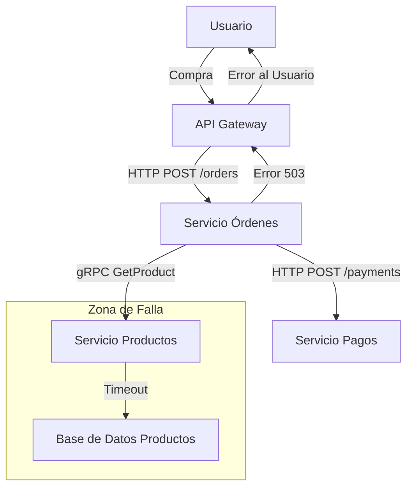
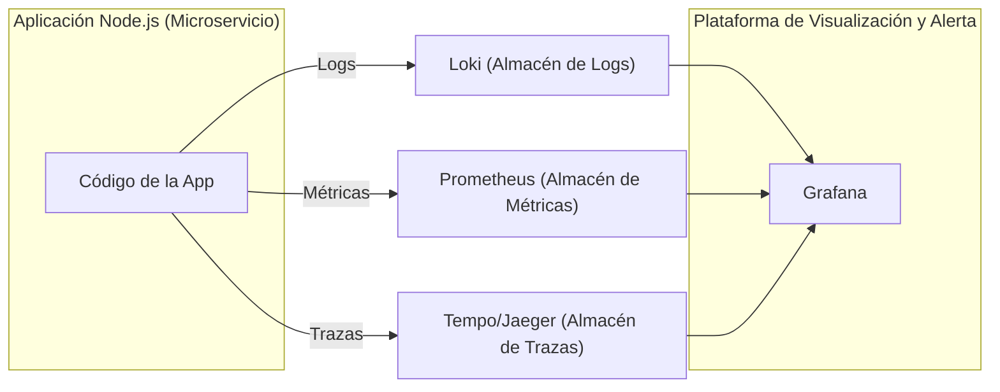
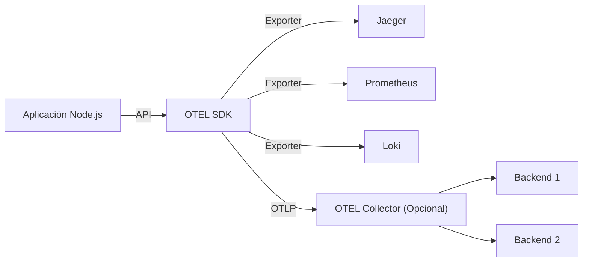
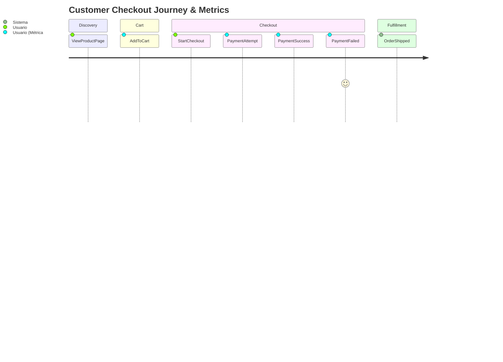

# Clase: Observabilidad en Node.js y Microservicios (2h 30m)

**Objetivo General:** Al finalizar esta clase queremos comprender los conceptos fundamentales de la observabilidad, cómo instrumentar aplicaciones Node.js con OpenTelemetry y utilizar herramientas como Grafana, Loki y Prometheus para monitorear, depurar y analizar el comportamiento de microservicios.

Requisitos Previos:

- Conocimientos básicos de Node.js y desarrollo de APIs.
- Conocimientos básicos de Docker y Docker Compose.
- Conocimientos básicos de Git.

## Parte 1: Fundamentos de la Observabilidad

### 1. Introducción a la Observabilidad

**¿Qué es la Observabilidad y por qué es crucial?**

- Diferencias clave entre **Monitoreo Clásico vs. Observabilidad Moderna**.
  - Monitoreo: Sabemos qué preguntas hacer (¿Está el servidor arriba?).
  - Observabilidad: Capacidad de hacer preguntas nuevas y desconocidas sobre el sistema sin necesidad de redeployar código (¿Por qué este usuario específico experimenta latencia solo en este endpoint?).
  - Desafíos en arquitecturas de microservicios: Complejidad, debugging distribuido, fallos en cascada, "unknown unknowns".
  - Beneficios: Reducción del MTTR (Mean Time To Resolution), mejora de la fiabilidad, comprensión proactiva del sistema.
- Caso real de estudio: El E-commerce en Black Friday.
  - Escenario: Picos de tráfico, errores intermitentes en el checkout, quejas de usuarios.
  - Pregunta: ¿Cómo correlacionamos un aumento en `http_server_requests_seconds_count{status="500"}` con las trazas específicas que fallaron y los logs detallados del error para identificar que un servicio de inventario aguas abajo estaba fallando por timeouts?



Explicación: Un timeout en la BD de Productos causa que el Servicio de Productos falle, lo que a su vez hace que el Servicio de Órdenes falle, impactando al usuario. Sin observabilidad, encontrar la causa raíz (D) es un desafío.

- Discusión Rápida:
  - ¿Habeis enfrentado problemas similares y cómo los resolvieron?
  - ¿Qué herramientas usan actualmente para monitorear sus aplicaciones?

### 2. Los Pilares de la Observabilidad: Logs, Métricas y Trazas

Introducción a los 3 Pilares: La base para entender el comportamiento del sistema.

**Logs (Registros):**

- ¿Qué son? Eventos discretos, inmutables y con marca de tiempo. Útiles para información detallada y errores específicos.
- Buenas prácticas: Logs estructurados (JSON), niveles de log (INFO, WARN, ERROR), incluir contexto relevante (IDs de correlación, IDs de usuario).
- Herramientas Comunes: Loki, ELK Stack (Elasticsearch, Logstash, Kibana).

**Métricas:**

- ¿Qué son? Agregaciones numéricas medibles en el tiempo (contadores, medidores, histogramas). Útiles para dashboards, alertas y entender tendencias.
- Tipos comunes: Tasa de errores, latencia (percentiles P95, P99), throughput (RPS), uso de CPU/memoria.
- Herramientas Comunes: Prometheus, DataDog, Dynatrace.

**Trazas (Tracing Distribuido):**

- ¿Qué son? Representan el flujo de una solicitud a través de múltiples servicios. Compuestas por "spans" (unidades de trabajo).
- Beneficios: Identificar cuellos de botella, entender dependencias entre servicios, depurar errores en sistemas distribuidos.
- Conceptos Clave: `traceId`, `spanId
- Herramientas Comunes: Jaeger, Tempo (parte de Grafana Stack), Zipkin, DataDog APM, Dynatrace.
- Correlación entre Pilares: La magia ocurre cuando se usan juntos. Ejemplo: Una alerta de **métrica** (alta latencia P99) te lleva a una **traza** específica, donde un span anómalo te permite ver los **logs** de ese servicio y span particular para encontrar el error.



_Explicación:_ La aplicación emite los tres tipos de señales, que son recolectadas por sus respectivos backends y luego visualizadas y correlacionadas en Grafana.

### Ejercicio Práctico: Preparando el Entorno con Docker

`docker-compose.yml`:

```yaml
version: "3.8"
services:
  loki:
    image: grafana/loki:2.9.0
    ports:
      - "3100:3100"
    command: -config.file=/etc/loki/local-config.yaml
  promtail: # Agente para enviar logs a Loki
    image: grafana/promtail:2.9.0
    volumes:
      - /var/log:/var/log # O el path de logs de tus contenedores
      - ./promtail-config.yml:/etc/promtail/config.yml
    command: -config.file=/etc/promtail/config.yml
  prometheus:
    image: prom/prometheus:v2.47.0
    ports:
      - "9090:9090"
    volumes:
      - ./prometheus.yml:/etc/prometheus/prometheus.yml
  grafana:
    image: grafana/grafana:10.0.0
    ports:
      - "3000:3000"
    environment:
      - GF_AUTH_ANONYMOUS_ENABLED=true
      - GF_AUTH_ANONYMOUS_ORG_ROLE=Admin
    volumes: # Para persistir dashboards y datasources
      - grafana-data:/var/lib/grafana
# --- Opcional: App Node.js simple para generar logs ---
#  my_node_app:
#    build: ./my-node-app # Directorio con Dockerfile y app.js
#    ports:
#      - "3001:3001"
#    logging: # Para que Promtail pueda acceder a los logs de Docker
#      driver: "json-file"
#      options:
#        max-size: "10m"
#        max-file: "3"
volumes:
  grafana-data:
```

1. Levantar el Stack:

```bash
docker-compose up -d
```

2.  Verificar Servicios:

- Grafana: `http://localhost:3000`
- Prometheus: `http://localhost:9090`
- Loki (API, no UI por defecto): `http://localhost:3100/ready` (debería dar "ready")

3.  Generar Logs de Ejemplo (si no tienes una app en el compose):

Puedes usar un script `server-error.js` como mencionaste, o simplemente hacer logs desde un contenedor existente. Si tienes una app Node.js en el `docker-compose.yml`:

```bash
docker exec -it <nombre_contenedor_node_app> node -e "console.log('INFO: Test log from app'); console.error('ERROR: Simulated error from app');"
```

4.  Explorar Logs en Grafana:

- Ir a Grafana (`http://localhost:3000`).
- Sección "Explore".
- Seleccionar "Loki" como datasource (puede requerir configuración inicial si no está auto-detectado: URL `http://loki:3100`).
  - Probar query: `{container_name="observability-node-workshop-my_node_app-1"} |= "ERROR"` o similar (el nombre del contenedor puede variar).

---

### 3. OpenTelemetry: El Estándar de la Trazabilidad Moderna

**¿Qué es OpenTelemetry (OTEL)?**

- Un conjunto de APIs, SDKs, herramientas y especificaciones **agnósticas al proveedor**.
- Objetivo: Estandarizar la forma en que se recolecta y exporta la telemetría (logs, métricas, trazas).
- Incubado por la CNCF (Cloud Native Computing Foundation).

**Componentes Clave de OTEL:**

- **API (Application Programming Interface):** Define cómo instrumentar el código (crear spans, registrar métricas). Tu código interactúa con la API.
- **SDK (Software Development Kit):** Implementación concreta de la API. Gestiona el muestreo (sampling), procesamiento y exportación de datos.
- **Exporters:** Envían datos a diferentes backends (Jaeger, Prometheus, Loki, OTLP Collector, DataDog, etc.).
- **Collector (Opcional pero recomendado):** Un proxy que recibe telemetría, la procesa/filtra y la reenvía a uno o más backends. Desacopla la app del backend.



**Instrumentación en Node.js:**

- **Automática:** Librerías que "parchean" módulos comunes (HTTP, Express, gRPC, clientes de BD) para generar spans y métricas automáticamente.
  - Ej: `@opentelemetry/auto-instrumentations-node`
- **Manual:** Crear spans y métricas explícitamente en tu código para lógica de negocio específica.
- **Demo en vivo (conceptual):** Mostrar una traza compleja en Jaeger o Tempo, explicando la jerarquía de spans, tags, logs en spans, y cómo ayuda a identificar cuellos de botella.

**Ejercicio Práctico: Instrumentación Básica con OTEL en Node.js (15m):**

_(Asumir una app Express simple en `ejercicio2-otel-node/app.js` dentro del repo clonado)._

1.  Navegar al directorio del ejercicio:

```bash
cd ../ejercicio2-otel-node
```

2.  Instalar dependencias de OTEL:

```bash
npm install @opentelemetry/api @opentelemetry/sdk-node \
@opentelemetry/auto-instrumentations-node \
@opentelemetry/exporter-trace-otlp-http \
# Opcional para exportar a Jaeger directamente: @opentelemetry/exporter-jaeger
# Opcional para exportar métricas a Prometheus: @opentelemetry/exporter-prometheus
```

3.  Crear archivo `tracing.ts` (o similar) para configurar el SDK:

```typescript
// src/tracing.ts
import { NodeSDK } from "@opentelemetry/sdk-node";
import { OTLPTraceExporter } from "@opentelemetry/exporter-trace-otlp-http";
// import { JaegerExporter } from '@opentelemetry/exporter-jaeger'; // Alternative
import { getNodeAutoInstrumentations } from "@opentelemetry/auto-instrumentations-node";
import { Resource } from "@opentelemetry/resources";
import { SemanticResourceAttributes } from "@opentelemetry/semantic-conventions";
import { diag, DiagConsoleLogger, DiagLogLevel } from "@opentelemetry/api";

// Para debugging de OTEL mismo (opcional)
// diag.setLogger(new DiagConsoleLogger(), DiagLogLevel.INFO);

// Configurar el exportador de trazas (OTLP HTTP para Tempo o Collector)
const traceExporter = new OTLPTraceExporter({
  url: "http://localhost:4318/v1/traces", // Puerto OTLP HTTP por defecto para Tempo/Collector
});
// Alternativa: Jaeger Exporter
// const traceExporter = new JaegerExporter({ endpoint: 'http://localhost:14268/api/traces' });

const sdk = new NodeSDK({
  resource: new Resource({
    [SemanticResourceAttributes.SERVICE_NAME]: "my-node-app-typescript", // Nombre de tu servicio
  }),
  traceExporter,
  instrumentations: [
    getNodeAutoInstrumentations(),
    // Opcional: Configurar instrumentaciones específicas
    // {
    //   '@opentelemetry/instrumentation-fs': {
    //     enabled: false, // ejemplo: deshabilitar instrumentación de 'fs'
    //   },
    // }
  ],
});

try {
  sdk.start();
  console.log("OpenTelemetry SDK started...");
} catch (error) {
  console.error("Error starting OpenTelemetry SDK:", error);
}

// Manejo elegante del cierre
process.on("SIGTERM", () => {
  sdk
    .shutdown()
    .then(() => console.log("Tracing terminated"))
    .catch((error) => console.log("Error terminating tracing", error))
    .finally(() => process.exit(0));
});

// Exportar el SDK puede ser útil si necesitas acceder a él en otras partes (raro para el SDK en sí)
// export default sdk; // No es común exportar el SDK directamente así
```

4.  Modificar `app.ts` para cargar `tracing.ts` al inicio:

```typescript
// src/app.ts

// Si no usas -r para precargar tracing.ts, impórtalo aquí al inicio.
// import './tracing'; // Asegúrate que tracing.ts se ejecute primero.
// Si tracing.ts se compila y se carga con -r, esta línea no es necesaria.

import express, { Request, Response, NextFunction } from "express";
import { trace, Span, Context, SpanStatusCode } from "@opentelemetry/api";

const app = express();
const port: number = 3002;

app.get("/", (req: Request, res: Response) => {
  res.send("Hello World with OTEL in TypeScript!");
});

app.get("/fast", (req: Request, res: Response) => {
  res.send("Fast response in TypeScript!");
});

app.get("/slow", async (req: Request, res: Response) => {
  // Obtener el tracer
  const tracer = trace.getTracer("my-custom-tracer-typescript");
  const parentSpan: Span | undefined = trace.getSpan(
    trace.getActiveSpanContext()
  );

  // Iniciar un nuevo span como hijo del span activo (si existe)
  // o como un nuevo span raíz si no hay contexto de span activo.
  const span: Span = tracer.startSpan(
    "complex-operation-typescript",
    undefined,
    parentSpan ? trace.setSpan(trace.getActiveContext(), parentSpan) : undefined
  );

  try {
    span.setAttribute("custom.attribute.ts", "exampleValueTS");
    await new Promise((resolve) => setTimeout(resolve, 100)); // Simula I/O
    span.addEvent("Sub-operation A (TS) complete");
    await new Promise((resolve) => setTimeout(resolve, 150)); // Simula más I/O

    // Simular un error en un span
    if (Math.random() < 0.2) {
      // 20% de probabilidad de error
      throw new Error("Simulated internal error in slow operation");
    }

    span.setStatus({ code: SpanStatusCode.OK });
    res.send("Slow response after complex TypeScript operation!");
  } catch (error: any) {
    span.setStatus({
      code: SpanStatusCode.ERROR,
      message: error.message,
    });
    span.recordException(error); // Registrar la excepción en el span
    res.status(500).send(`Error in slow operation: ${error.message}`);
  } finally {
    span.end(); // Siempre asegúrate de finalizar el span
  }
});

app.listen(port, () => {
  console.log(`App listening at http://localhost:${port}`);
});
```

5.  Añadir Tempo al `docker-compose.yml` (si no estaba):

```yaml
# ... (otros servicios)
tempo:
  image: grafana/tempo:1.5.0
  command: ["-config.file=/etc/tempo.yaml"]
  volumes:
    - ./tempo-config.yaml:/etc/tempo.yaml # Configuración básica de Tempo
  ports:
    - "3200:3200" # Tempo UI & API
    - "4317:4317" # OTLP gRPC
    - "4318:4318" # OTLP HTTP
    # - "14268:14268" # Jaeger HTTP (si se usa)
```

_Y un `tempo-config.yaml` simple:_

```yaml
server:
  http_listen_port: 3200
distributor:
  receivers:
    otlp:
      protocols:
        http:
          endpoint: 0.0.0.0:4318
        grpc:
          endpoint: 0.0.0.0:4317
ingester:
  trace_idle_period: 10s
storage:
  trace:
    backend: local
    local:
      path: /tmp/tempo/traces
```

6.  Reiniciar Docker Compose:

`docker-compose up -d --force-recreate`

7.  Ejecutar la app Node.js:

`node app.ts` (o configurar para que corra en Docker).

8.  Ver Trazas en Grafana/Tempo:

- En Grafana, ir a "Explore".
- Seleccionar "Tempo" como datasource (URL `http://tempo:3200`).
- En la pestaña "Search", buscar trazas (puede tardar unos segundos en aparecer). Puedes filtrar por `service.name="my-node-app"`.
- Analizar una traza, especialmente la de `/slow`.

---

## Parte 2: Implementación Práctica y Casos de Uso

### 4. Métricas de Aplicación y Negocio + Dashboards

**Más allá de las Métricas de Infraestructura:** No solo CPU/Memoria. Necesitamos métricas que reflejen la salud de la aplicación y el impacto en el negocio.

**Métricas GOLD (Google SRE):** Latency, Errors, Traffic, Saturation. Aplicables a servicios.

**Métricas de Negocio (KPIs):**

- Derivadas de eventos del dominio: `UserSignedUp`, `OrderCreated`, `PaymentProcessed`, `PaymentFailed`.
- Ejemplos: Tasa de conversión (ej. `PaymentSuccess / PaymentAttempt`), número de carritos abandonados, valor promedio de orden (AOV).
- ¿Cómo instrumentarlas? Contadores, Gauges.

**Diagrama Mermaid: Customer Journey y Métricas Relevantes**



_Explicación:_ Cada paso del journey puede generar métricas que ayudan a entender el embudo y los puntos de fricción.

**Ejercicio Práctico: Instrumentar Métricas Custom y Crear Dashboard (20m):**

1.  Instalar exportador de Prometheus para OTEL (si no se hizo):

```bash
npm install @opentelemetry/exporter-prometheus @opentelemetry/sdk-metrics
```

2.  Modificar `tracing.ts` para añadir el exportador de métricas:

```typescript
// src/tracing.ts
import { NodeSDK } from "@opentelemetry/sdk-node";
import { OTLPTraceExporter } from "@opentelemetry/exporter-trace-otlp-http";
import { getNodeAutoInstrumentations } from "@opentelemetry/auto-instrumentations-node";
import { Resource } from "@opentelemetry/resources";
import { SemanticResourceAttributes } from "@opentelemetry/semantic-conventions";
import { PrometheusExporter } from "@opentelemetry/exporter-prometheus";
import {
  MeterProvider,
  PeriodicExportingMetricReader,
} from "@opentelemetry/sdk-metrics"; // Actualizado
import { diag, DiagConsoleLogger, DiagLogLevel } from "@opentelemetry/api";

// diag.setLogger(new DiagConsoleLogger(), DiagLogLevel.DEBUG); // Para más detalle si es necesario

const serviceName = "my-node-app-typescript";

// Configurar el exportador de trazas
const traceExporter = new OTLPTraceExporter({
  url: "http://localhost:4318/v1/traces",
});

// Configurar el exportador de métricas para Prometheus
const prometheusExporter = new PrometheusExporter(
  {
    // port: PrometheusExporter.DEFAULT_OPTIONS.port, // 9464 por defecto
    // endpoint: PrometheusExporter.DEFAULT_OPTIONS.endpoint, // /metrics por defecto
  },
  () => {
    console.log(
      `Prometheus metrics server running on http://localhost:<span class="math-inline">\{PrometheusExporter\.DEFAULT\_OPTIONS\.port\}</span>{PrometheusExporter.DEFAULT_OPTIONS.endpoint}`
    );
  }
);
// Crear un MeterProvider
const meterProvider = new MeterProvider({
  resource: new Resource({
    [SemanticResourceAttributes.SERVICE_NAME]: serviceName,
  }),
});

// Registrar el MetricReader con el MeterProvider
// PeriodicExportingMetricReader es necesario si el exporter no es pull-based como Prometheus
// Para PrometheusExporter, que es pull-based, se registra directamente.
meterProvider.addMetricReader(prometheusExporter);

const sdk = new NodeSDK({
  resource: new Resource({
    [SemanticResourceAttributes.SERVICE_NAME]: serviceName,
  }),
  traceExporter,
  meterProvider, // Asociar el MeterProvider con el SDK
  instrumentations: [getNodeAutoInstrumentations()],
});

try {
  sdk.start();
  console.log("OpenTelemetry SDK with Metrics started...");
} catch (error) {
  console.error("Error starting OpenTelemetry SDK:", error);
}

process.on("SIGTERM", () => {
  sdk
    .shutdown()
    .then(() => console.log("Tracing and Metrics terminated"))
    .catch((error) => console.log("Error terminating OTEL SDK", error))
    .finally(() => process.exit(0));
});
```

_Nota:_ La configuración de métricas con OTEL puede ser un poco más compleja de integrar con `NodeSDK` que las trazas. Para el ejercicio, la configuración del `PrometheusExporter` y `MeterProvider` es clave. El `NodeSDK` debería idealmente manejar la inicialización del `MeterProvider`. Si no, el `MeterProvider` debe ser configurado y sus `Meter`s usados explícitamente.

1.  Instrumentar una métrica de negocio en `app.js`:

```javascript
// src/app.ts
// ... (imports de express, etc.)
import { trace, metrics, Counter, Attributes } from '@opentelemetry/api'; // Añadir metrics, Counter, Attributes
// ... (resto de imports y setup de Express)

const app = express();
const port: number = 3002;

// Obtener un Meter del MeterProvider configurado globalmente por el SDK
const meter = metrics.getMeter('my-node-app-business-metrics-ts');

const ordersCounter: Counter = meter.createCounter('orders.total.ts', {
    description: 'Total number of orders processed (TypeScript)',
    unit: '1',
});
const successfulPaymentsCounter: Counter = meter.createCounter('payments.successful.total.ts', {
    description: 'Total successful payments (TypeScript)',
});
const failedPaymentsCounter: Counter = meter.createCounter('payments.failed.total.ts', {
    description: 'Total failed payments (TypeScript)',
});

// Middleware para parsear JSON bodies si haces POST con JSON
app.use(express.json());
// Middleware para parsear URL-encoded bodies (para query params o form data)
app.use(express.urlencoded({ extended: true }));


app.get('/', (req: Request, res: Response) => {
    res.send('Hello World with OTEL and Metrics in TypeScript!');
});

// ... (otros endpoints como /fast, /slow)

app.post('/checkout', (req: Request, res: Response) => {
    // Para este ejemplo, tomaremos el estado del query param o del body
    const successQuery = req.query.success as string | undefined;
    const successBody = req.body.success as boolean | undefined;
    let isSuccess: boolean;

    if (successQuery !== undefined) {
        isSuccess = successQuery === 'true';
    } else if (successBody !== undefined) {
        isSuccess = successBody;
    } else {
        // Default a fallo si no se especifica
        isSuccess = false;
        console.warn("Checkout 'success' parameter not provided, defaulting to failure.");
    }

    const orderAttributes: Attributes = {
        'order.type': 'online_ts',
        'customer.tier': Math.random() > 0.5 ? 'gold' : 'silver', // Ejemplo de otro atributo
    };
    ordersCounter.add(1, orderAttributes);

    if (isSuccess) {
        successfulPaymentsCounter.add(1, { 'payment.currency': 'USD' });
        res.status(200).send('Checkout successful (TypeScript)!');
    } else {
        failedPaymentsCounter.add(1, { 'payment.currency': 'USD', 'failure.reason': 'simulated_decline_ts' });
        res.status(400).send('Checkout failed (TypeScript)!'); // Usar 400 para error de cliente
    }
});

// Endpoint para simular errores 5xx que serán capturados por la instrumentación HTTP automática
app.get('/error', (req: Request, res: Response) => {
    try {
        throw new Error("This is a simulated server error for alerts!");
    } catch (e: any) {
        // La instrumentación automática de HTTP debería capturar esto y marcarlo como error.
        // También puedes registrarlo en el span actual si lo deseas.
        const currentSpan = trace.getSpan(trace.getActiveSpanContext());
        if (currentSpan) {
            currentSpan.recordException(e);
            currentSpan.setStatus({ code: SpanStatusCode.ERROR, message: e.message });
        }
        res.status(500).send(`Simulated server error: ${e.message}`);
    }
});


app.listen(port, () => {
    console.log(`App listening at http://localhost:${port}`);
});
```

1.  Configurar Prometheus para scrapear la app Node.js:

- Añadir un nuevo job a `prometheus.yml` (del `ejercicio1-docker-stack` o crear uno nuevo). Asumiendo que la app Node.js está en la misma red Docker que Prometheus y se llama `my_node_app`:

```yaml
# prometheus.yml
# ... (global config, alertmanager config)
scrape_configs:
  - job_name: "prometheus" # Scrapea Prometheus mismo
    static_configs:
      - targets: ["localhost:9090"]
  - job_name: "my-node-app"
    static_configs:
      # Si Node.js corre localmente (fuera de Docker) y Prometheus en Docker:
      # - targets: ['host.docker.internal:9464']
      # Si Node.js corre en Docker en la misma red:
      - targets: ["my_node_app:9464"] # Asumiendo que el servicio Docker se llama my_node_app y expone el puerto 9464 internamente.
```

- **Importante:** Si la app Node.js corre fuera de Docker (ej. `node app.js` en tu host), y Prometheus dentro de Docker, `host.docker.internal` es el DNS para acceder al host desde un contenedor Docker (en Mac/Windows). Para Linux, sería la IP del `docker0` bridge o la IP principal del host. Si Node.js también está en un contenedor, usa el nombre del servicio y puerto interno.

3.  Reiniciar `docker-compose` y la app Node.js.

4.  Generar algunas órdenes:

```bash
curl -X POST "http://localhost:3002/checkout?success=true"
curl -X POST "http://localhost:3002/checkout?success=true"
curl -X POST "http://localhost:3002/checkout?success=false"
```

5.  Crear un Dashboard Básico en Grafana:

- Ir a Grafana (`http://localhost:3000`).
- Asegurar que Prometheus es un datasource (URL `http://prometheus:9090`).
  - Crear un nuevo Dashboard.
  - Añadir panel \> "Time series" o "Stat".
  - Query 1 (Total Órdenes): `sum(orders_total)` o `sum(rate(orders_total[5m]))` para tasa.
  - Query 2 (Tasa de Conversión de Pago): `sum(rate(payments_successful_total[1m])) / sum(rate(orders_total{order_type="online"}[1m])) * 100` (esto es un ejemplo, ajustar según las métricas exactas y labels).

---

### 5. Alertas Automatizadas y Notificaciones

**¿Por qué Alertas?** Notificación proactiva de problemas antes de que los usuarios los reporten (o a gran escala).

**Tipos de Alertas:**

- **Basadas en Métricas:** Umbrales (CPU \> 80%), tasas de error (errores 5xx \> 5%), anomalías. (Prometheus + Alertmanager).
- **Basadas en Logs:** Patrones de error específicos en logs (Loki puede generar alertas o Grafana sobre Loki).
- **Basadas en Trazas (Menos común para alertas directas):** Más para investigación, pero se pueden derivar métricas de trazas (ej. % de trazas con error).

**Buenas Prácticas para Alertas:**

- **Accionables:** Cada alerta debe llevar a una acción o investigación clara.
- **Evitar Fatiga por Alertas ("Alert Fatigue"):** No alertar por todo. Agrupar, usar severidades, definir bien los umbrales y duraciones (`for:` en Prometheus).
- **Documentación (Runbooks):** ¿Qué hacer cuando salta esta alerta?
- **Canales de Notificación:** Slack, PagerDuty, email, etc.

**Ejercicio Práctico: Configurar Alerta en Prometheus y Notificación (15m):**

1.  Configurar Alertmanager (si no está en `docker-compose.yml`):

```yaml
# docker-compose.yml
# ...
alertmanager:
  image: prom/alertmanager:v0.25.0
  ports:
    - "9093:9093"
  volumes:
    - ./alertmanager.yml:/etc/alertmanager/alertmanager.yml
  command: --config.file=/etc/alertmanager/alertmanager.yml
```

_Y un `alertmanager.yml` básico (para Slack, necesitarás un webhook URL real):_

```yaml
# alertmanager.yml
global:
  resolve_timeout: 5m
  slack_api_url: "<TU_SLACK_WEBHOOK_URL>" # ¡Reemplazar!

route:
  group_by: ["alertname", "job"]
  group_wait: 30s
  group_interval: 5m
  repeat_interval: 1h
  receiver: "slack-notifications"
receivers:
  - name: "slack-notifications"
    slack_configs:
      - channel: "#tu-canal-de-alertas" # ¡Reemplazar!
        send_resolved: true
        title: '[{{ .Status | toUpper }}{{ if eq .Status "firing" }}:{{ .Alerts.Firing | len }}{{ end }}] {{ .CommonLabels.alertname }} for {{ .CommonLabels.job }}'
        text: >-
          {{ range .Alerts }}
            *Alert:* {{ .Annotations.summary }} - `{{ .Labels.alertname }}`
            *Description:* {{ .Annotations.description }}
            *Details:*
            {{ range .Labels.SortedPairs }} • *{{ .Name }}:* `{{ .Value }}`
            {{ end }}
          {{ end }}
```

1.  Indicar a Prometheus dónde está Alertmanager (`prometheus.yml`):

```yaml
# prometheus.yml
# ...
alerting:
  alertmanagers:
    - static_configs:
        - targets: ["alertmanager:9093"] # Si está en la misma red Docker

rule_files:
  - "alert.rules.yml" # Archivo donde definiremos las alertas
```

3.  Crear archivo `alert.rules.yml`:

```yaml
# alert.rules.yml
groups:
  - name: NodeAppAlerts
    rules:
      - alert: HighErrorRateMyNodeApp
        expr: sum(rate(http_server_requests_seconds_count{job="my-node-app", status=~"5.."}[1m])) / sum(rate(http_server_requests_seconds_count{job="my-node-app"}[1m])) > 0.1
        for: 1m # Duración para que la condición sea verdadera antes de disparar
        labels:
              severity: critical
            annotations:
              summary: "Alta tasa de errores HTTP ({{ $labels.job }})"
              description: "El servicio {{ $labels.job }} está experimentando más del 10% de errores 5xx en el último minuto. Valor actual: {{ $value | humanizePercentage }}."
          # Alerta de ejemplo para la métrica custom de "orders.total"
          - alert: TooFewOrders
            expr: sum(increase(orders_total{job="my-node-app"}[5m])) < 1
            for: 5m
            labels:
              severity: warning
            annotations:
              summary: "Pocas órdenes procesadas ({{ $labels.job }})"
              description: "El servicio {{ $labels.job }} ha procesado menos de 1 orden en los últimos 5 minutos."
```

_(Nota: `http_server_requests_seconds_count` es una métrica estándar que OTEL podría generar para instrumentación HTTP. Asegúrate que los nombres de métricas y labels coincidan con lo que tu app exporta)._

1.  Reiniciar `docker-compose` (Prometheus y Alertmanager).

2.  Simular Errores para Disparar la Alerta:

- Generar varias peticiones que fallen al endpoint `/checkout` de tu app Node.js:

```bash
curl -X POST "http://localhost:3002/checkout?success=false"
# Repetir varias veces en un minuto
```

- O si tienes un endpoint `/error` que siempre da 500:

```bash
curl http://localhost:3002/error # (Asegúrate que este endpoint existe y es instrumentado)
```

3.  Verificar Alertas:

- En Prometheus UI (`http://localhost:9090/alerts`). Debería pasar de PENDING a FIRING.
- En Alertmanager UI (`http://localhost:9093`).
- En tu canal de Slack (si lo configuraste).

---

### 6. Ejercicio Integrado: Debugging Distribuido de un Problema Real

**Escenario del Problema (Guiado por el instructor):**

- "Los usuarios reportan que el endpoint `/api/v1/user/:id/profile` está extremadamente lento a veces, e incluso da timeouts."
  - Este endpoint en el `ServicioA` (Node.js) internamente llama a:
    - `ServicioB` (Node.js) para obtener datos básicos del usuario (`/users/:id`).
    - `ServicioC` (Node.js) para obtener el historial de compras (`/users/:id/orders`).
    - `ServicioD` (externo, legacy) para obtener preferencias de marketing (`/marketing/:email/prefs`).
      - Todos los servicios están instrumentados con OpenTelemetry y envían trazas a Tempo, métricas a Prometheus y logs a Loki.

**Pasos para los Alumnos (trabajando juntos o individualmente):**

1.  Identificar la Métrica Afectada (Grafana/Prometheus):

- ¿Qué métrica buscarían? (Ej: `http_server_requests_seconds_bucket{path="/api/v1/user/:id/profile", service_name="servicio-a"}`).
- Visualizar P95 o P99 de latencia. Confirmar el problema.
- Buscar correlación con tasas de error si las hay.

2.  Encontrar Trazas Relevantes (Grafana/Tempo):

- Desde el dashboard de métricas, ¿cómo pivotarían a trazas? (Idealmente, un dashboard que linkee traceIDs o permita filtrar por tiempo y servicio).
- Si no hay link directo, usar el explorador de Tempo. Buscar trazas para `service_name="servicio-a"` con `http.target="/api/v1/user/:id/profile"` que sean lentas (ordenar por duración) o tengan errores.

3.  Analizar la Traza (Grafana/Tempo):

- Identificar el "critical path" de la traza.
- ¿Qué `span` está tomando más tiempo? ¿Es en `ServicioA`, `B`, `C` o `D`?
- ¿Hay errores marcados en algún span? ¿Atributos (`tags`) útiles?
- _Suposición para el ejercicio:_ El `span` de la llamada a `ServicioD` (externo) es el que muestra una latencia muy alta y variable.

4.  Correlacionar con Logs (Grafana/Loki):

- De la traza/span problemático, obtener el `trace_id` (y `span_id` si es útil).
- Ir a Loki en Grafana y buscar logs con ese `trace_id`: `{service_name="servicio-a", trace_id="<valor_del_trace_id>"}`.
- ¿Qué dicen los logs del `ServicioA` justo antes y después de llamar a `ServicioD`? (Ej: "INFO: Calling Marketing Service D", "WARN: Marketing Service D call took 3500ms").
- ¿Hay logs de timeout o de reintentos?

5.  Crear un Dashboard Ad-Hoc (Opcional, si hay tiempo):

- Un dashboard rápido en Grafana que muestre:
  - Latencia P99 del endpoint `/api/v1/user/:id/profile`.
  - Latencia P99 de la llamada externa a `ServicioD` (si se tiene una métrica específica para ello, ej. `http_client_requests_seconds_bucket{peer_service="servicio-d"}`).
  - Logs filtrados por `trace_id` para investigaciones rápidas.

6.  Proponer un Fix o Mitigación (Discusión):

- Basado en el hallazgo (ej. `ServicioD` es lento):
  - **Corto plazo:** Implementar un timeout más agresivo y un circuit breaker para `ServicioD`. Cachear respuestas de `ServicioD` si los datos no son ultra-críticos en tiempo real. ¿Carga condicional de datos de marketing?
  - **Largo plazo:** Hablar con el equipo de `ServicioD` para que mejoren su rendimiento o provean una API más eficiente. ¿Reemplazar `ServicioD`?
