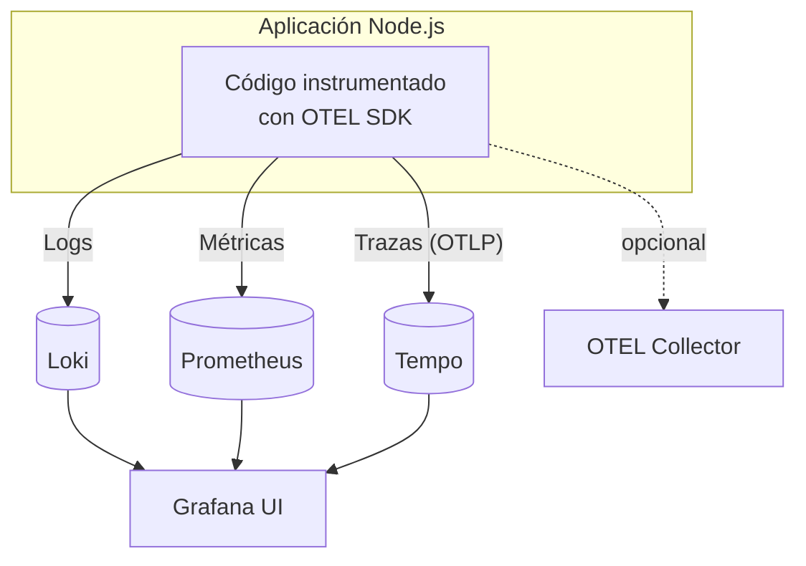
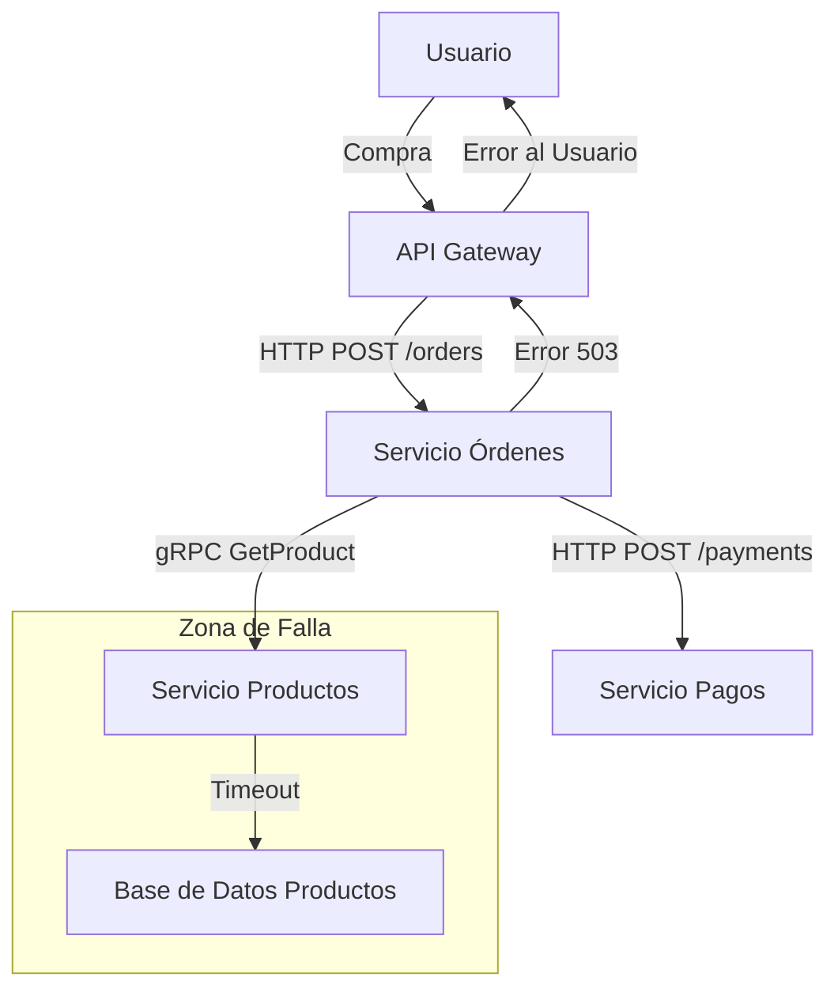
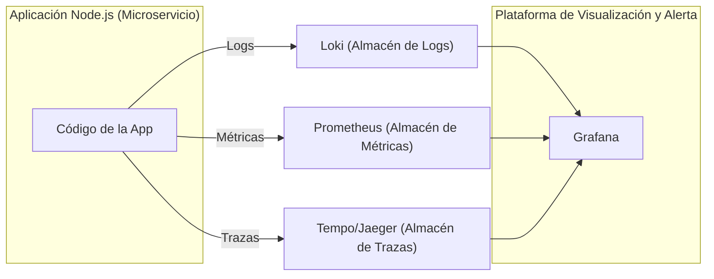
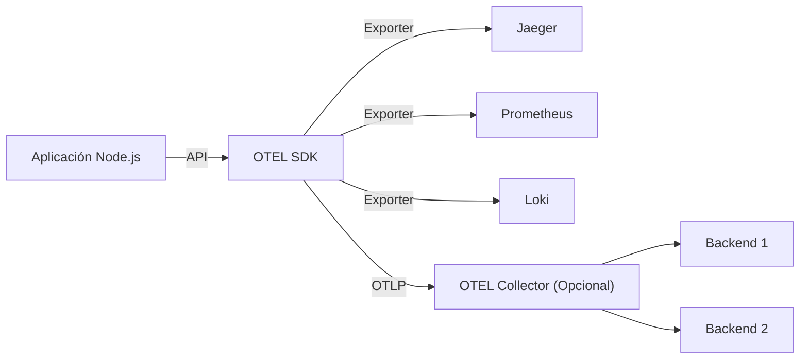
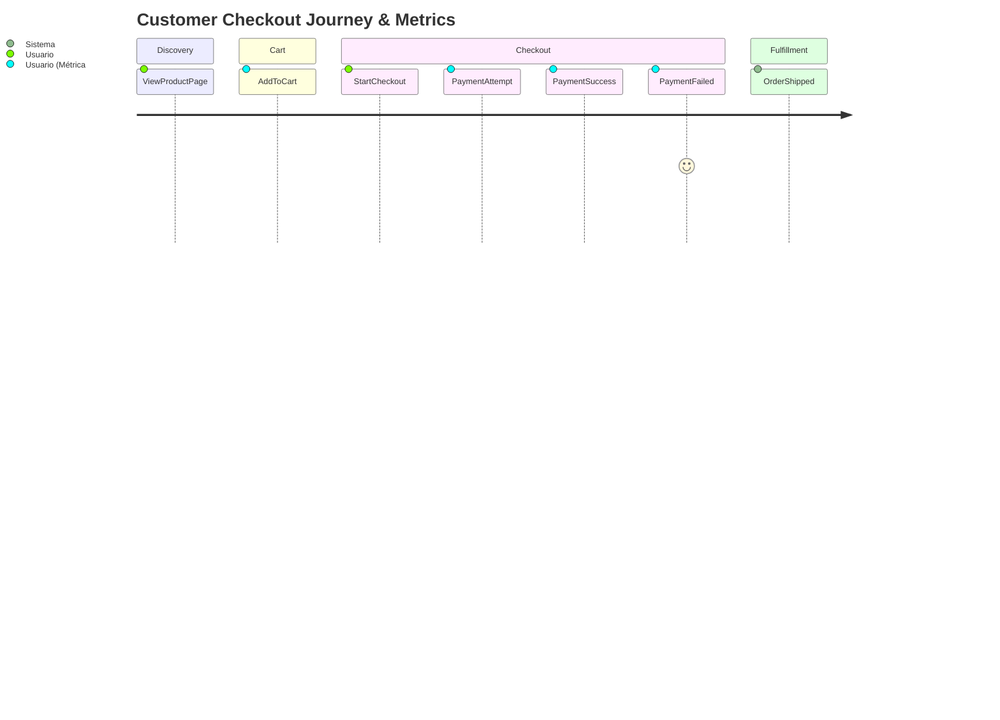

# Clase: Observabilidad en Node.js y Microservicios

Mapa rápido del tool‑chain (¿qué es cada cosa y para qué sirve?)

| Herramienta                     | Rol en el stack                                                                                                           | ¿Por qué la elegimos en 2025?                                                                            |
| ------------------------------- | ------------------------------------------------------------------------------------------------------------------------- | -------------------------------------------------------------------------------------------------------- |
| **Prometheus**                  | Base de datos de series temporales (TSDB). *Scrapea* métricas vía HTTP y da un potente lenguaje de consulta (**PromQL**). | Estándar CNCF, pull‑based → menos *overhead*, enorme ecosistema de *exporters* y *rules* reutilizables.  |
| **Grafana**                     | UI unificada: dashboards, alertas, exploración de métricas/logs/trazas.                                                   | Abstrae múltiples *back‑ends*; paneles listos, alertas visuales y enlaces cruzados.                      |
| **Loki**                        | Almacén de logs indexados por etiquetas en vez de por texto completo.                                                     | Consumir logs baratos (S3, local), mismo modelo de etiquetas que Prometheus ⇒ consultas coherentes.      |
| **Tempo**                       | Almacén de trazas distribuido y altamente escalable (sucesor de Jaeger/Zipkin).                                           | Soporta OTLP nativo, sin necesidad de índices costosos; se integra directo en Grafana.                   |
| **OpenTelemetry (OTEL)**        | Estándar vendor‑neutral para instrumentar aplicaciones (API + SDK + *spec*).                                              | "Instrumenta una vez, exporta a cualquiera"; comunidad activa, versión 1.0 estable.                      |
| **Promtail**                    | Agente *daemon* que lee ficheros de log y los envía a Loki con etiquetas.                                                 | Config YAML sencilla, sin *sidecar* pesado (a diferencia de Logstash o Fluend).                          |
| **OTEL Collector** *(opcional)* | Proxy/roteador que recibe telemetría, transforma y re‑exporta a uno o varios *back‑ends*.                                 | Desacopla tu app de la infraestructura de observabilidad; centraliza *sampling*, *batching* y seguridad. |
| **Docker Compose**              | Orquestador local para levantar todo el stack rápidamente.                                                                | Nada de instalar cada pieza a mano; reproducible por los alumnos en cualquier OS.                        |

### 0.1 Cómo se relacionan entre sí



* Prometheus *tira* de las métricas cada N segundos; Loki y Tempo **reciben** push desde los agentes/SDK.
* Grafana no almacena datos; sólo los visualiza y correlaciona.


**Objetivo General:** Al finalizar esta clase queremos comprender los conceptos fundamentales de la observabilidad, cómo instrumentar aplicaciones Node.js con OpenTelemetry y utilizar herramientas como Grafana, Loki y Prometheus para monitorear, depurar y analizar el comportamiento de microservicios.

## Parte 1: Fundamentos de la Observabilidad

### 1. Introducción a la Observabilidad

**¿Qué es la Observabilidad y por qué es crucial?**

- Diferencias clave entre **Monitoreo Clásico vs. Observabilidad Moderna**.
  - Monitoreo: Sabemos qué preguntas hacer (¿Está el servidor arriba?).
  - Observabilidad: Capacidad de hacer preguntas nuevas y desconocidas sobre el sistema sin necesidad de redeployar código (¿Por qué este usuario específico experimenta latencia solo en este endpoint?).
  - Desafíos en arquitecturas de microservicios: Complejidad, debugging distribuido, fallos en cascada, "unknown unknowns".
  - Beneficios: Reducción del MTTR (Mean Time To Resolution), mejora de la fiabilidad, comprensión proactiva del sistema.
- Caso real de estudio: El E-commerce en Black Friday.
  - Escenario: Picos de tráfico, errores intermitentes en el checkout, quejas de usuarios.
  - Pregunta: ¿Cómo correlacionamos un aumento en `http_server_requests_seconds_count{status="500"}` con las trazas específicas que fallaron y los logs detallados del error para identificar que un servicio de inventario aguas abajo estaba fallando por timeouts?



Explicación: Un timeout en la BD de Productos causa que el Servicio de Productos falle, lo que a su vez hace que el Servicio de Órdenes falle, impactando al usuario. Sin observabilidad, encontrar la causa raíz (D) es un desafío.

- Discusión Rápida:
  - ¿Habeis enfrentado problemas similares y cómo los resolvieron?
  - ¿Qué herramientas usan actualmente para monitorear sus aplicaciones?

### 2. Los Pilares de la Observabilidad: Logs, Métricas y Trazas

Introducción a los 3 Pilares: La base para entender el comportamiento del sistema.

**Logs (Registros):**

- ¿Qué son? Eventos discretos, inmutables y con marca de tiempo. Útiles para información detallada y errores específicos.
- Buenas prácticas: Logs estructurados (JSON), niveles de log (INFO, WARN, ERROR), incluir contexto relevante (IDs de correlación, IDs de usuario).
- Herramientas Comunes: Loki, ELK Stack (Elasticsearch, Logstash, Kibana).

**Métricas:**

- ¿Qué son? Agregaciones numéricas medibles en el tiempo (contadores, medidores, histogramas). Útiles para dashboards, alertas y entender tendencias.
- Tipos comunes: Tasa de errores, latencia (percentiles P95, P99), throughput (RPS), uso de CPU/memoria.
- Herramientas Comunes: Prometheus, DataDog, Dynatrace.

**Trazas (Tracing Distribuido):**

- ¿Qué son? Representan el flujo de una solicitud a través de múltiples servicios. Compuestas por "spans" (unidades de trabajo).
- Beneficios: Identificar cuellos de botella, entender dependencias entre servicios, depurar errores en sistemas distribuidos.
- Conceptos Clave: `traceId`, `spanId
- Herramientas Comunes: Jaeger, Tempo (parte de Grafana Stack), Zipkin, DataDog APM, Dynatrace.
- Correlación entre Pilares: La magia ocurre cuando se usan juntos. Ejemplo: Una alerta de **métrica** (alta latencia P99) te lleva a una **traza** específica, donde un span anómalo te permite ver los **logs** de ese servicio y span particular para encontrar el error.



_Explicación:_ La aplicación emite los tres tipos de señales, que son recolectadas por sus respectivos backends y luego visualizadas y correlacionadas en Grafana.

### Ejercicio Práctico: Preparando el Entorno con Docker

`docker-compose.yml`:

```yaml
version: "3.8"
services:
  loki:
    image: grafana/loki:2.9.0
    ports:
      - "3100:3100"
    command: -config.file=/etc/loki/local-config.yaml
  promtail: # Agente para enviar logs a Loki
    image: grafana/promtail:2.9.0
    volumes:
      - /var/log:/var/log # O el path de logs de tus contenedores
      - ./promtail-config.yml:/etc/promtail/config.yml
    command: -config.file=/etc/promtail/config.yml
  prometheus:
    image: prom/prometheus:v2.47.0
    ports:
      - "9090:9090"
    volumes:
      - ./prometheus.yml:/etc/prometheus/prometheus.yml
  grafana:
    image: grafana/grafana:12.0.0
    ports:
      - "3000:3000"
    environment:
      - GF_AUTH_ANONYMOUS_ENABLED=true
      - GF_AUTH_ANONYMOUS_ORG_ROLE=Admin
    volumes: # Para persistir dashboards y datasources
      - grafana-data:/var/lib/grafana

volumes:
  grafana-data:
```

`promtail-local-config.yml`:

```yaml
server:
  http_listen_port: 9080
  grpc_listen_port: 0

positions:
  filename: /tmp/positions.yaml

clients:
  - url: http://loki:3100/loki/api/v1/push

scrape_configs:
  - job_name: system
    static_configs:
      - targets:
          - localhost
        labels:
          job: varlogs
          __path__: /var/log/*.log
```

`prometheus.yml`:

```yaml
global:
  scrape_interval: 15s
  evaluation_interval: 15s

scrape_configs:
  - job_name: prometheus
    static_configs:
      - targets: ["localhost:9090"]

  - job_name: loki
    static_configs:
      - targets: ["loki:3100"]

  - job_name: promtail
    static_configs:
      - targets: ["promtail:9080"]
```

1. Levantar el Stack:

```bash
docker-compose up -d
```

2.  Verificar Servicios:

- Grafana: `http://localhost:3000`
- Prometheus: `http://localhost:9090`
- Loki (API, no UI por defecto): `http://localhost:3100/ready` (debería dar "ready"). Puede tardar hasta 15 segundos en estar listo. Probar con `curl -i http://localhost:3100/ready`

3.  Generar Logs de Ejemplo:

Crear un archivo `example-log-generator.ts`:

```ts
import fs from "fs";
import path from "path";

const logFile = path.join(__dirname, "app.log");

function log(message: string) {
  const timestamp = new Date().toISOString();
  fs.appendFileSync(logFile, `[${timestamp}] ${message}\n`);
}

setInterval(() => {
  log("Mensaje de log de ejemplo generado por TypeScript");
}, 5000);
```

Configurar promtail para que recolecte logs de `app.log`:

```yaml
scrape_configs:
  - job_name: typescript-logger
    static_configs:
      - targets: ["localhost"]
        labels:
          job: typescript_logger
          __path__: /app/app.log
```

4.  Explorar Logs en Grafana:

- Ir a Grafana (`http://localhost:3000`).
- Sección "Explore".
- Seleccionar "Loki" como datasource (puede requerir configuración inicial si no está auto-detectado: URL `http://loki:3100`).
  - Probar query: `filename = "app.log"` o similar.

---

### 3. OpenTelemetry: El Estándar de la Trazabilidad Moderna

**¿Qué es OpenTelemetry (OTEL)?**

- Un conjunto de APIs, SDKs, herramientas y especificaciones **agnósticas al proveedor**.
- Objetivo: Estandarizar la forma en que se recolecta y exporta la telemetría (logs, métricas, trazas).
- Incubado por la CNCF (Cloud Native Computing Foundation).

**Componentes Clave de OTEL:**

- **API (Application Programming Interface):** Define cómo instrumentar el código (crear spans, registrar métricas). Tu código interactúa con la API.
- **SDK (Software Development Kit):** Implementación concreta de la API. Gestiona el muestreo (sampling), procesamiento y exportación de datos.
- **Exporters:** Envían datos a diferentes backends (Jaeger, Prometheus, Loki, OTLP Collector, DataDog, etc.).
- **Collector (Opcional pero recomendado):** Un proxy que recibe telemetría, la procesa/filtra y la reenvía a uno o más backends. Desacopla la app del backend.



**Instrumentación en Node.js:**

- **Automática:** Librerías que "parchean" módulos comunes (HTTP, Express, gRPC, clientes de BD) para generar spans y métricas automáticamente.
  - Ej: `@opentelemetry/auto-instrumentations-node`
- **Manual:** Crear spans y métricas explícitamente en tu código para lógica de negocio específica.
- **Demo en vivo (conceptual):** Mostrar una traza compleja en Jaeger o Tempo, explicando la jerarquía de spans, tags, logs en spans, y cómo ayuda a identificar cuellos de botella.

**Ejercicio Práctico: Instrumentación Básica con OTEL en Node.js (15m):**

_(Asumir una app Express simple en `ejercicio2-otel-node/app.js` dentro del repo clonado)._

1.  Navegar al directorio del ejercicio:

```bash
cd ../ejercicio2-otel-node
```

2.  Instalar dependencias de OTEL:

```bash
npm install @opentelemetry/api @opentelemetry/sdk-node \
@opentelemetry/auto-instrumentations-node \
@opentelemetry/exporter-trace-otlp-http \
# Opcional para exportar a Jaeger directamente: @opentelemetry/exporter-jaeger
# Opcional para exportar métricas a Prometheus: @opentelemetry/exporter-prometheus
```

3.  Crear archivo `tracing.ts` (o similar) para configurar el SDK:

```typescript
// tracing.ts
import { NodeSDK } from "@opentelemetry/sdk-node";
import { OTLPTraceExporter } from "@opentelemetry/exporter-trace-otlp-http";
import { OTLPMetricExporter } from "@opentelemetry/exporter-metrics-otlp-http";
import { getNodeAutoInstrumentations } from "@opentelemetry/auto-instrumentations-node";
import { resourceFromAttributes } from "@opentelemetry/resources";
import { SemanticResourceAttributes } from "@opentelemetry/semantic-conventions";
import { BatchSpanProcessor } from "@opentelemetry/sdk-trace-base";
import { PeriodicExportingMetricReader } from "@opentelemetry/sdk-metrics";

// Allow customization via env vars
const serviceName = process.env.OTEL_SERVICE_NAME || "my-node-app-typescript";
const otlpEndpoint =
  process.env.OTEL_EXPORTER_OTLP_ENDPOINT || "http://localhost:4318";

// Setup OTLP exporters
const traceExporter = new OTLPTraceExporter({
  url: `${otlpEndpoint}/v1/traces`,
});
const metricExporter = new OTLPMetricExporter({
  url: `${otlpEndpoint}/v1/metrics`,
});

// Initialize SDK with batching and auto-instrumentation
export const sdk = new NodeSDK({
  resource: resourceFromAttributes({
    [SemanticResourceAttributes.SERVICE_NAME]: serviceName,
  }),
  traceExporter,
  metricReader: new PeriodicExportingMetricReader({
    exporter: metricExporter,
    exportIntervalMillis: 60_000, // export metrics every minute
  }),
  instrumentations: [getNodeAutoInstrumentations()],
  spanProcessor: new BatchSpanProcessor(traceExporter),
});

try {
  sdk.start();
  console.log("OpenTelemetry SDK started...");
} catch (error) {
  console.error("Error starting OpenTelemetry SDK:", error);
}

// Graceful shutdown
process.on("SIGTERM", () => {
  sdk
    .shutdown()
    .then(() => console.log("Tracing and metrics terminated"))
    .catch((err) => console.error("Error terminating OTEL SDK", err))
    .finally(() => process.exit(0));
});
```

4.  Crear `app.ts` para cargar `tracing.ts` al inicio:

```typescript
import "./tracing"; // ensure OTEL SDK is initialized
import Fastify, { FastifyRequest, FastifyReply } from "fastify";
import { trace, SpanStatusCode } from "@opentelemetry/api";

const app = Fastify({ logger: true });
const port = Number(process.env.PORT) || 3002;

// Helper for manual traced operations
async function manualTraceOperation(reply: FastifyReply) {
  const tracer = trace.getTracer("app-tracer");
  const span = tracer.startSpan("complex-operation", {
    attributes: { "custom.attribute": "exampleValue" },
  });

  try {
    // simulate work
    await new Promise((r) => setTimeout(r, 100));
    span.addEvent("sub-operation-A-complete");
    await new Promise((r) => setTimeout(r, 150));

    // random error simulation
    if (Math.random() < 0.2) {
      throw new Error("Simulated internal error");
    }

    span.setStatus({ code: SpanStatusCode.OK });
    reply.send({ message: "Response after manual traced operation" });
  } catch (err: any) {
    span.recordException(err);
    span.setStatus({ code: SpanStatusCode.ERROR, message: err.message });
    reply.status(500).send({ error: err.message });
  } finally {
    span.end();
  }
}

// Routes
app.get("/", async (_req, reply) => {
  reply.send({ message: "Hello World with OTEL!" });
});

app.get("/fast", async (_req, reply) => {
  reply.send({ message: "Fast response!" });
});

app.get("/slow", async (_req, reply) => {
  await manualTraceOperation(reply);
});

app
  .listen({ port, host: "0.0.0.0" })
  .then(() => app.log.info(`Server listening on port ${port}`))
  .catch((err) => {
    app.log.error(err);
    process.exit(1);
  });
```

5.  Añadir Tempo al `docker-compose.yml` (si no estaba):

```yaml
# ... (otros servicios)
tempo:
  image: grafana/tempo:2.7.2
  command: ["-config.file=/etc/tempo.yaml"]
  volumes:
    - ./tempo-config.yaml:/etc/tempo.yaml # Configuración básica de Tempo
  ports:
    - "3200:3200" # Tempo UI & API
    - "4317:4317" # OTLP gRPC
    - "4318:4318" # OTLP HTTP
    # - "14268:14268" # Jaeger HTTP (si se usa)
```

_Y un `tempo-config.yaml` simple:_

```yaml
server:
  http_listen_port: 3200
distributor:
  receivers:
    otlp:
      protocols:
        http:
          endpoint: 0.0.0.0:4318
        grpc:
          endpoint: 0.0.0.0:4317
ingester:
  trace_idle_period: 10s
storage:
  trace:
    backend: local
    local:
      path: /tmp/tempo/traces
```

6.  Reiniciar Docker Compose:

`docker compose up -d --force-recreate`

7.  Ejecutar la app Node.js:

`node app.ts` (o configurar para que corra en Docker).

8.  Ver Trazas en Grafana/Tempo:

- En Grafana, ir a "Explore".
- Seleccionar "Tempo" como datasource (URL `http://tempo:3200`).
- En la pestaña "Search", buscar trazas (puede tardar unos segundos en aparecer). Puedes filtrar por `service.name="my-node-app"`.
- Analizar una traza, especialmente la de `/slow`.

---

## Parte 2: Implementación Práctica y Casos de Uso

### 4. Métricas de Aplicación y Negocio + Dashboards

**Más allá de las Métricas de Infraestructura:** No solo CPU/Memoria. Necesitamos métricas que reflejen la salud de la aplicación y el impacto en el negocio.

**Métricas GOLD (Google SRE):** Latency, Errors, Traffic, Saturation. Aplicables a servicios.

**Métricas de Negocio (KPIs):**

- Derivadas de eventos del dominio: `UserSignedUp`, `OrderCreated`, `PaymentProcessed`, `PaymentFailed`.
- Ejemplos: Tasa de conversión (ej. `PaymentSuccess / PaymentAttempt`), número de carritos abandonados, valor promedio de orden (AOV).
- ¿Cómo instrumentarlas? Contadores, Gauges.

**Diagrama Mermaid: Customer Journey y Métricas Relevantes**



_Explicación:_ Cada paso del journey puede generar métricas que ayudan a entender el embudo y los puntos de fricción.

**Ejercicio Práctico: Instrumentar Métricas Custom y Crear Dashboard (20m):**

1.  Instalar exportador de Prometheus para OTEL (si no se hizo):

```bash
npm install @opentelemetry/exporter-prometheus @opentelemetry/sdk-metrics
```

2.  Modificar `tracing.ts` para añadir el exportador de métricas:

```typescript
// tracing.ts
import { NodeSDK } from "@opentelemetry/sdk-node";
import { OTLPTraceExporter } from "@opentelemetry/exporter-trace-otlp-http";
import { OTLPMetricExporter } from "@opentelemetry/exporter-metrics-otlp-http";
import { getNodeAutoInstrumentations } from "@opentelemetry/auto-instrumentations-node";
import { resourceFromAttributes } from "@opentelemetry/resources";
import { SemanticResourceAttributes } from "@opentelemetry/semantic-conventions";
import { BatchSpanProcessor } from "@opentelemetry/sdk-trace-base";
// import { PeriodicExportingMetricReader } from "@opentelemetry/sdk-metrics";
import { PrometheusExporter } from "@opentelemetry/exporter-prometheus";

// Environment-based configuration
const SERVICE_NAME = process.env.OTEL_SERVICE_NAME || "my-node-app-typescript";
const OTLP_ENDPOINT =
  process.env.OTEL_EXPORTER_OTLP_ENDPOINT || "http://localhost:4318";

// Trace exporter and processor
const traceExporter = new OTLPTraceExporter({
  url: `${OTLP_ENDPOINT}/v1/traces`,
});
const spanProcessor = new BatchSpanProcessor(traceExporter);

// Metric exporter and reader
const metricExporter = new OTLPMetricExporter({
  url: `${OTLP_ENDPOINT}/v1/metrics`,
});

// Metric reader
// const metricReader = new PeriodicExportingMetricReader({
//   exporter: metricExporter,
//   exportIntervalMillis: 60_000, // export metrics every minute
// });

// Prometheus Exporter
const prometheusExporter = new PrometheusExporter(
  { port: 9464, endpoint: "/metrics" },
  () => console.log(`Metrics available at http://localhost:9464/metrics`)
);

// Initialize the SDK with both tracing and metrics
export const sdk = new NodeSDK({
  resource: resourceFromAttributes({
    [SemanticResourceAttributes.SERVICE_NAME]: SERVICE_NAME,
  }),
  traceExporter,
  spanProcessor,
  metricReader: prometheusExporter,
  instrumentations: [getNodeAutoInstrumentations()],
});

try {
  sdk.start();
  console.log("OpenTelemetry SDK started...");
} catch (error) {
  console.error("Error starting OpenTelemetry SDK:", error);
}

// Graceful shutdown
process.on("SIGTERM", () => {
  sdk
    .shutdown()
    .then(() => console.log("Tracing and metrics terminated"))
    .catch((err) => console.error("Error terminating OTEL SDK", err))
    .finally(() => process.exit(0));
});
```

_Nota:_ La configuración de métricas con OTEL puede ser un poco más compleja de integrar con `NodeSDK` que las trazas. Para el ejercicio, la configuración del `PrometheusExporter` y `MeterProvider` es clave. El `NodeSDK` debería idealmente manejar la inicialización del `MeterProvider`. Si no, el `MeterProvider` debe ser configurado y sus `Meter`s usados explícitamente.

1.  Instrumentar una métrica de negocio en `app.js`:

```javascript
import "./tracing"; // ensure OTEL SDK is initialized
import Fastify, { FastifyRequest, FastifyReply } from "fastify";
import { trace, SpanStatusCode } from "@opentelemetry/api";

// NEW: metrics API
import { metrics, MetricAttributes } from "@opentelemetry/api";

// create a Meter (namespaces your metrics)
const meter = metrics.getMeter("my-node-app-business");

// define a Counter for “successful operations”
const successCounter = meter.createCounter("complex_operation_success_total", {
  description: "Total number of successfully completed complex operations",
});

// define a Histogram for operation durations (in milliseconds)
const latencyHistogram = meter.createHistogram(
  "complex_operation_duration_ms",
  {
    description: "Duration of complex-operation in milliseconds",
  }
);

const app = Fastify({ logger: true });
const port = Number(process.env.PORT) || 3002;

// Helper for manual traced operations
async function manualTraceOperation(reply: FastifyReply) {
  const tracer = trace.getTracer("app-tracer");
  const span = tracer.startSpan("complex-operation", {
    attributes: { "custom.attribute": "exampleValue" },
  });

  const start = Date.now();

  try {
    // simulate work
    await new Promise((r) => setTimeout(r, 100));
    span.addEvent("sub-operation-A-complete");
    await new Promise((r) => setTimeout(r, 150));

    // random error simulation
    if (Math.random() < 0.2) {
      throw new Error("Simulated internal error");
    }

    // ✅ business metric: count one success
    successCounter.add(1, { outcome: "success" } as MetricAttributes);

    span.setStatus({ code: SpanStatusCode.OK });
    reply.send({ message: "Response after manual traced operation" });
  } catch (err: any) {
    successCounter.add(0, { outcome: "failure" } as MetricAttributes);

    span.recordException(err);
    span.setStatus({ code: SpanStatusCode.ERROR, message: err.message });
    reply.status(500).send({ error: err.message });
  } finally {
    const duration = Date.now() - start;
    latencyHistogram.record(duration, { route: "/slow" } as MetricAttributes);

    span.end();
  }
}

// Routes
app.get("/", async (_req, reply) => {
  reply.send({ message: "Hello World with OTEL!" });
});

app.get("/fast", async (_req, reply) => {
  reply.send({ message: "Fast response!" });
});

app.get("/slow", async (_req, reply) => {
  await manualTraceOperation(reply);
});

app
  .listen({ port, host: "0.0.0.0" })
  .then(() => app.log.info(`Server listening on port ${port}`))
  .catch((err) => {
    app.log.error(err);
    process.exit(1);
  });

```

1.  Configurar Prometheus para scrapear la app Node.js:

- Añadir un nuevo job a `prometheus.yml` (del `ejercicio1-docker-stack` o crear uno nuevo). Asumiendo que la app Node.js está en la misma red Docker que Prometheus y se llama `my_node_app`:

```yaml
# prometheus.yml
# ... (global config, alertmanager config)
- job_name: 'node-app'
    metrics_path: '/metrics'
    static_configs:
      # - targets: ['localhost:9464']
      # use host.docker.internal on Docker Desktop (Mac/Windows)
      - targets: ['host.docker.internal:9464']
```

- **Importante:** Si la app Node.js corre fuera de Docker (ej. `node app.js` en tu host), y Prometheus dentro de Docker, `host.docker.internal` es el DNS para acceder al host desde un contenedor Docker (en Mac/Windows). Para Linux, sería la IP del `docker0` bridge o la IP principal del host. Si Node.js también está en un contenedor, usa el nombre del servicio y puerto interno.

3.  Reiniciar `docker-compose` y la app Node.js.

4.  Generar algunas órdenes:

```bash
curl -X POST "http://localhost:3002/checkout?success=true"
curl -X POST "http://localhost:3002/checkout?success=true"
curl -X POST "http://localhost:3002/checkout?success=false"
```

```bash
$ curl http://localhost:9464/metrics | grep complex_operation
complex_operation_success_total{outcome="success"} 42
complex_operation_duration_ms_bucket{…}
```

5.  Crear un Dashboard Básico en Grafana:

- Ir a Grafana (`http://localhost:3000`).
- Asegurar que Prometheus es un datasource (URL `http://prometheus:9090`).
  - Crear un nuevo Dashboard.
  - Añadir panel \> "Time series" o "Stat".
  - Query (Total Órdenes): `sum(orders_total)` o `sum(rate(complex_operation_success_total[5m])) by (outcome)` para tasa.

---

### 5. Alertas Automatizadas y Notificaciones

**¿Por qué Alertas?** Notificación proactiva de problemas antes de que los usuarios los reporten (o a gran escala).

**Tipos de Alertas:**

- **Basadas en Métricas:** Umbrales (CPU \> 80%), tasas de error (errores 5xx \> 5%), anomalías. (Prometheus + Alertmanager).
- **Basadas en Logs:** Patrones de error específicos en logs (Loki puede generar alertas o Grafana sobre Loki).
- **Basadas en Trazas (Menos común para alertas directas):** Más para investigación, pero se pueden derivar métricas de trazas (ej. % de trazas con error).

**Buenas Prácticas para Alertas:**

- **Accionables:** Cada alerta debe llevar a una acción o investigación clara.
- **Evitar Fatiga por Alertas ("Alert Fatigue"):** No alertar por todo. Agrupar, usar severidades, definir bien los umbrales y duraciones (`for:` en Prometheus).
- **Documentación (Runbooks):** ¿Qué hacer cuando salta esta alerta?
- **Canales de Notificación:** Slack, PagerDuty, email, etc.

**Ejercicio Práctico: Configurar Alerta en Prometheus y Notificación:**

1.  Configurar Alertmanager (si no está en `docker-compose.yml`):

```yaml
# docker-compose.yml
# ...
alertmanager:
  image: prom/alertmanager:v0.25.0
  ports:
    - "9093:9093"
  volumes:
    - ./alertmanager.yml:/etc/alertmanager/alertmanager.yml
  command: --config.file=/etc/alertmanager/alertmanager.yml
```

_Y un `alertmanager.yml` básico (para Slack, necesitarás un webhook URL real):_

```yaml
# alertmanager.yml
global:
  resolve_timeout: 5m
  slack_api_url: "<TU_SLACK_WEBHOOK_URL>" # ¡Reemplazar!

route:
  group_by: ["alertname", "job"]
  group_wait: 30s
  group_interval: 5m
  repeat_interval: 1h
  receiver: "slack-notifications"
receivers:
  - name: "slack-notifications"
    slack_configs:
      - channel: "#tu-canal-de-alertas" # ¡Reemplazar!
        send_resolved: true
        title: '[{{ .Status | toUpper }}{{ if eq .Status "firing" }}:{{ .Alerts.Firing | len }}{{ end }}] {{ .CommonLabels.alertname }} for {{ .CommonLabels.job }}'
        text: >-
          {{ range .Alerts }}
            *Alert:* {{ .Annotations.summary }} - `{{ .Labels.alertname }}`
            *Description:* {{ .Annotations.description }}
            *Details:*
            {{ range .Labels.SortedPairs }} • *{{ .Name }}:* `{{ .Value }}`
            {{ end }}
          {{ end }}
```

1.  Indicar a Prometheus dónde está Alertmanager (`prometheus.yml`):

```yaml
# prometheus.yml
# ...
alerting:
  alertmanagers:
    - static_configs:
        - targets: ["alertmanager:9093"] # Si está en la misma red Docker

rule_files:
  - "alert.rules.yml" # Archivo donde definiremos las alertas
```

3.  Crear archivo `alert.rules.yml`:

```yaml
# alert.rules.yml
groups:
  - name: NodeAppAlerts
    rules:
      - alert: HighErrorRateMyNodeApp
        expr: sum(rate(http_server_requests_seconds_count{job="my-node-app", status=~"5.."}[1m])) / sum(rate(http_server_requests_seconds_count{job="my-node-app"}[1m])) > 0.1
        for: 1m # Duración para que la condición sea verdadera antes de disparar
        labels:
              severity: critical
            annotations:
              summary: "Alta tasa de errores HTTP ({{ $labels.job }})"
              description: "El servicio {{ $labels.job }} está experimentando más del 10% de errores 5xx en el último minuto. Valor actual: {{ $value | humanizePercentage }}."
          # Alerta de ejemplo para la métrica custom de "orders.total"
          - alert: TooFewOrders
            expr: sum(increase(orders_total{job="my-node-app"}[5m])) < 1
            for: 5m
            labels:
              severity: warning
            annotations:
              summary: "Pocas órdenes procesadas ({{ $labels.job }})"
              description: "El servicio {{ $labels.job }} ha procesado menos de 1 orden en los últimos 5 minutos."
```

_(Nota: `http_server_requests_seconds_count` es una métrica estándar que OTEL podría generar para instrumentación HTTP. Asegúrate que los nombres de métricas y labels coincidan con lo que tu app exporta)._

1.  Reiniciar `docker-compose` (Prometheus y Alertmanager).

2.  Simular Errores para Disparar la Alerta:

- Generar varias peticiones que fallen al endpoint `/checkout` de tu app Node.js:

```bash
curl -X POST "http://localhost:3002/checkout?success=false"
# Repetir varias veces en un minuto
```

- O si tienes un endpoint `/error` que siempre da 500:

```bash
curl http://localhost:3002/error # (Asegúrate que este endpoint existe y es instrumentado)
```

3.  Verificar Alertas:

- En Prometheus UI (`http://localhost:9090/alerts`). Debería pasar de PENDING a FIRING.
- En Alertmanager UI (`http://localhost:9093`).
- En tu canal de Slack (si lo configuraste).

---

### 6. Ejercicio Integrado: Debugging Distribuido de un Problema Real

**Escenario del Problema (Guiado por el instructor):**

- "Los usuarios reportan que el endpoint `/api/v1/user/:id/profile` está extremadamente lento a veces, e incluso da timeouts."
  - Este endpoint en el `ServicioA` (Node.js) internamente llama a:
    - `ServicioB` (Node.js) para obtener datos básicos del usuario (`/users/:id`).
    - `ServicioC` (Node.js) para obtener el historial de compras (`/users/:id/orders`).
    - `ServicioD` (externo, legacy) para obtener preferencias de marketing (`/marketing/:email/prefs`).
      - Todos los servicios están instrumentados con OpenTelemetry y envían trazas a Tempo, métricas a Prometheus y logs a Loki.

**Pasos para los Alumnos (trabajando juntos o individualmente):**

1.  Identificar la Métrica Afectada (Grafana/Prometheus):

- ¿Qué métrica buscarían? (Ej: `http_server_requests_seconds_bucket{path="/api/v1/user/:id/profile", service_name="servicio-a"}`).
- Visualizar P95 o P99 de latencia. Confirmar el problema.
- Buscar correlación con tasas de error si las hay.

2.  Encontrar Trazas Relevantes (Grafana/Tempo):

- Desde el dashboard de métricas, ¿cómo pivotarían a trazas? (Idealmente, un dashboard que linkee traceIDs o permita filtrar por tiempo y servicio).
- Si no hay link directo, usar el explorador de Tempo. Buscar trazas para `service_name="servicio-a"` con `http.target="/api/v1/user/:id/profile"` que sean lentas (ordenar por duración) o tengan errores.

3.  Analizar la Traza (Grafana/Tempo):

- Identificar el "critical path" de la traza.
- ¿Qué `span` está tomando más tiempo? ¿Es en `ServicioA`, `B`, `C` o `D`?
- ¿Hay errores marcados en algún span? ¿Atributos (`tags`) útiles?
- _Suposición para el ejercicio:_ El `span` de la llamada a `ServicioD` (externo) es el que muestra una latencia muy alta y variable.

4.  Correlacionar con Logs (Grafana/Loki):

- De la traza/span problemático, obtener el `trace_id` (y `span_id` si es útil).
- Ir a Loki en Grafana y buscar logs con ese `trace_id`: `{service_name="servicio-a", trace_id="<valor_del_trace_id>"}`.
- ¿Qué dicen los logs del `ServicioA` justo antes y después de llamar a `ServicioD`? (Ej: "INFO: Calling Marketing Service D", "WARN: Marketing Service D call took 3500ms").
- ¿Hay logs de timeout o de reintentos?

5.  Crear un Dashboard Ad-Hoc (Opcional, si hay tiempo):

- Un dashboard rápido en Grafana que muestre:
  - Latencia P99 del endpoint `/api/v1/user/:id/profile`.
  - Latencia P99 de la llamada externa a `ServicioD` (si se tiene una métrica específica para ello, ej. `http_client_requests_seconds_bucket{peer_service="servicio-d"}`).
  - Logs filtrados por `trace_id` para investigaciones rápidas.

6.  Proponer un Fix o Mitigación (Discusión):

- Basado en el hallazgo (ej. `ServicioD` es lento):
  - **Corto plazo:** Implementar un timeout más agresivo y un circuit breaker para `ServicioD`. Cachear respuestas de `ServicioD` si los datos no son ultra-críticos en tiempo real. ¿Carga condicional de datos de marketing?
  - **Largo plazo:** Hablar con el equipo de `ServicioD` para que mejoren su rendimiento o provean una API más eficiente. ¿Reemplazar `ServicioD`?
