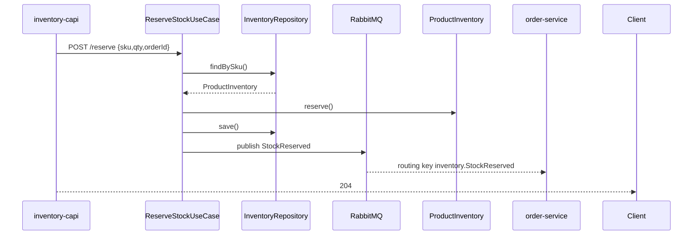
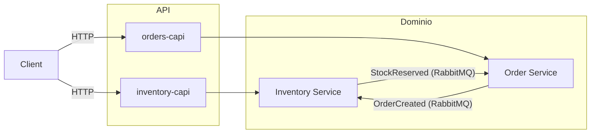

# Avance proyecto

Intentar dejar el inventory-service totalmente operativo, observable y emitiendo eventos de negocio.

## Tareas

1. Crear el esquema Postgres
   - Copia el prisma/schema.prisma de abajo y ejecuta npx prisma migrate dev --name init_inventory
2. Codificar el núcleo de dominio
   - Crea ProductInventory.ts, Quantity.ts, InventoryRepositoryPort.ts
3. Escribir adaptadores
   - Repositorio Postgres + adaptador de eventos RabbitMQ – ver código; registra ambos en el contenedor Awilix
4. Exponer API HTTP
   - Handlers Fastify (`/inventory/:sku/reserve` y `release`)
5. Conectar OpenTelemetry
   - Generar un `tracing.ts` en la raíz; impórtalo primero en `main.ts`; verifica la UI de Jaeger

Fin de las dos horas: el servicio puede reservar/liberar/reponer stock, registra trazas en Jaeger y publica un evento StockReserved que el order-service podrá consumir.

⸻

## Caso de negocio – Inventory Service (bounded-context único)

### 1.1 Problema que resuelve

La empresa debe garantizar la reservación atómica de stock mientras permite miles de lecturas por segundo, dispara órdenes de compra cuando cae el stock de seguridad y proporciona una trazabilidad completa de movimientos.

### 1.2 Lenguaje ubicuo

Término	Significado
SKU: Código único de producto
Stock Disponible: Unidades aún prometibles
Reserva: Bloquea unidades para un pedido, reversible
Movimiento: Evento inmutable de auditoría (reserve, release, replenish)

### 1.3 A completar
- Value objects
- Agreggates
- Esquema de base de datos (Prisma)
- Puertos y adaptadores
- Eventos de dominio
- Contrato HTTP (inventory-capi)
- Secuencia – Reserva
- Integración OpenTelemetry
- Seteo de docker con PG, Prometheus, y Grafana y OTEL
- Tests unitarios y de Integración, con TestContainers

Ejemplo de secuencia:

⸻

## Qué harán los otros servicios

### 2.1 Contexto de sistema

Ambos servicios de dominio sólo hablan vía eventos; las APIs cliente permanecen como fachadas síncronas.

### 2.2 Saga cross-service (camino feliz)

1.	orders-capi recibe POST /checkout
2.	Llama a inventory-capi para reservar cada SKU
3.	Cuando todas las reservas tienen éxito llama a order-service → OrderCreated
4.	order-service publica OrderConfirmed tras el pago
5.	inventory-service escucha; ante OrderCancelled libera stock.

Mañana codificarás dos orquestadores de saga: uno dentro de orders-capi (HTTP primero), otro dentro de order-service (event-driven fallback).

### 2.3 Topología RabbitMQ

Exchange	Tipo	Routing-keys ejemplo
inventory.events	topic	StockReserved, StockReleased
order.events	topic	OrderCreated, OrderCancelled

Cada servicio posee exactamente un exchange y nunca publica en exchanges ajenos – así la propiedad queda cristalina.

### 2.4 Números de flujo de datos

Paso	SLA	Propietario
Reservar stock	< 50 ms	inventory-service
Crear pedido	< 80 ms	order-service
Propagación de eventos	P99 < 30 ms	clúster RabbitMQ

⸻

## Checklist de calidad y buenas prácticas

•	Aplica las reglas hexagonales: puertos delgados, adaptadores finos, DI con scopes (Prisma singleton, repos por scope) 
•	Testea el dominio en memoria (ejemplo ya escrito) 
•	Nunca loguees/traces desde entidades – instrumenta a nivel de adaptador (evita el anti-patrón “Domain HUD”) 
•	Utiliza el patrón Outbox cuando introduzcas la base de datos de pagos más adelante.
