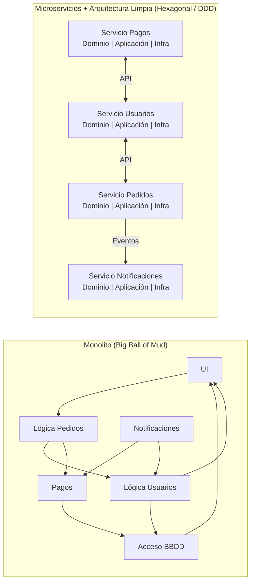

# Sesión 1 · Conceptos — Introducción a DDD, Arquitectura Hexagonal, CQRS y EDA

## El Desafío: Complejidad en las Aplicaciones Modernas



La realidad duele: el 80 % del tiempo en un monolito grande se gasta *leyendo* código para no romperlo. La velocidad de features despenca a medida que la bola crece. Refactorizar se vuelve riesgo político, no técnico.

---

## La Solución: Un Enfoque Arquitectónico Estratégico

A continuación, *sin vender humo*, los cuatro pilares que usaremos durante el curso.

### 1. Arquitectura Hexagonal (*Ports & Adapters*)

> **Meta‑objetivo:** aislar la lógica de negocio del ecosistema cambiante.

| Beneficio | Con qué se paga |
|-----------|-----------------|
| Código del dominio libre de frameworks | Más “plumbing” al inicio |
| Test unitarios que no tocan I/O | Disciplina estricta de dependencias |
| Sustituir Mongo→Postgres en un sprint | Necesidad de buenos contratos de puerto |

**Ejemplo mínimo (TypeScript):**

```ts
// domain/order.ts
export interface OrderRepositoryPort {
  save(order: Order): Promise<void>;
  byId(id: OrderId): Promise<Order | null>;
}

export class Order {
  constructor(readonly id: OrderId, readonly items: OrderItem[]) {}
  total(): number {
    return this.items.reduce((acc, it) => acc + it.price * it.qty, 0);
  }
}
```

```ts
// infra/postgres/order-repository.postgres.ts
import { OrderRepositoryPort, Order } from '../../domain/order';
import { prisma } from '../prisma';

export class PostgresOrderRepository implements OrderRepositoryPort {
  async save(order: Order): Promise<void> {
    await prisma.order.upsert(/* … */);
  }
  async byId(id: string) {
    return prisma.order.findUnique({ where: { id } });
  }
}
```

El dominio **no** sabe que existe Postgres; mañana sería DynamoDB o un mock en tests.

---

### 2. Domain‑Driven Design (DDD)

- **Bounded Contexts** como muros de contención de la complejidad.
- **Lenguaje Ubicuo** escrito en el código (no en Confluence).
- **Aggregates** para garantizar invariantes con transacciones locales.

> **Caveat:** DDD *no* es obligatorio para todo. Para un formulario CRUD pequeño, es sobre‑ingeniería.

```ts
// domain/order.ts (continuación)
export class OrderItem {
  constructor(
    readonly sku: string,
    readonly qty: number,
    readonly price: number,
  ) {
    if (qty <= 0) throw new Error('Cantidad inválida');
  }
}
```

---

### 3. CQRS (Command Query Responsibility Segregation)

- **Command → cambia estado**, devuelve *void* o *Id*.  
- **Query → lee estado**, *no* produce efectos secundarios.

```ts
// application/commands/create-order.ts
export interface Command<R = void> {}
export class CreateOrder implements Command<OrderId> {
  constructor(readonly items: ItemDTO[]) {}
}

// application/queries/get-order.ts
export interface Query<R> {}
export class GetOrder implements Query<OrderDTO> {
  constructor(readonly id: OrderId) {}
}
```

> **Regla de oro:** si tu sistema no sufre por mezclar lecturas y escrituras, **NO uses CQRS**. La complejidad añadida no se justifica.

---

### 4. Event‑Driven Architecture (EDA)

- Los servicios se comunican publicando **eventos de dominio**.  
- Broker (RabbitMQ hoy, Kafka mañana) garantiza desac acoplamiento.

```ts
// domain/events/order-created.ts
export interface OrderCreated {
  type: 'OrderCreated';
  payload: { orderId: OrderId; total: number };
}
```

```ts
// application/event-bus.ts
export interface EventBus {
  publish(events: DomainEvent[]): Promise<void>;
}
```

> **Anti‑patrón frecuente:** usar eventos como *RPC camuflado* (“call & wait”). Eso viola la premisa asíncrona y termina en un hell de timeouts.

---

## ¿Por Qué Estas Arquitecturas en Node.js?

1. **I/O async nativo** – perfecto para event streaming.  
2. **TypeScript** – tipado fuerte => dominio expresivo.  
3. **Ecosistema npm** – librerías para todo, desde otel hasta adapters Postgres.  
4. **Coste operacional bajo** – contenedores ligeros, escalan horizontal.

---

## Beneficios Clave (TL;DR)

- Mantenibilidad ↗  
- Escalabilidad ↗  
- Time‑to‑market ↘ (una vez pagado el setup)  
- Riesgo operacional ↘ gracias a pruebas más baratas

---

### Próximos pasos

Mañana diseccionaremos *puertos* y *adaptadores* escribiendo la primera prueba de contrato para `UserRepositoryPort`.